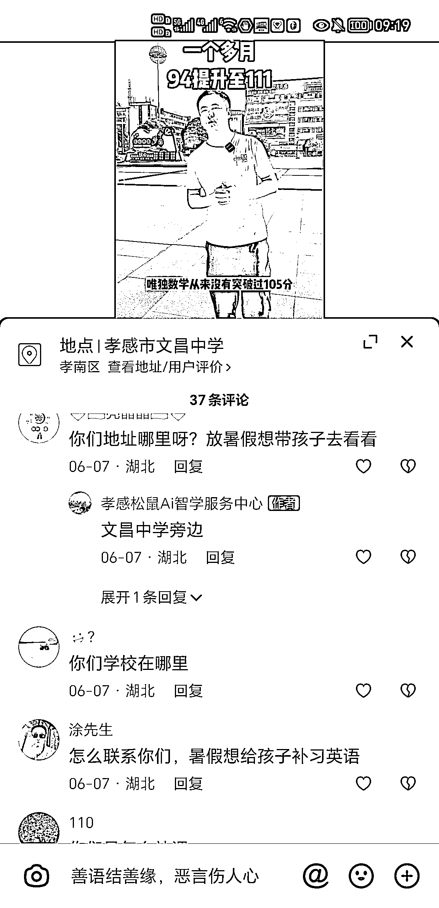
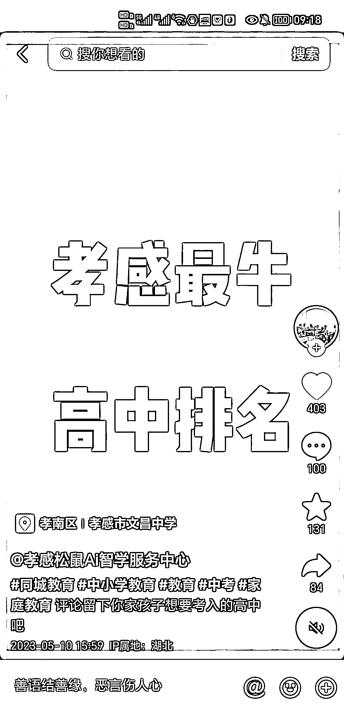
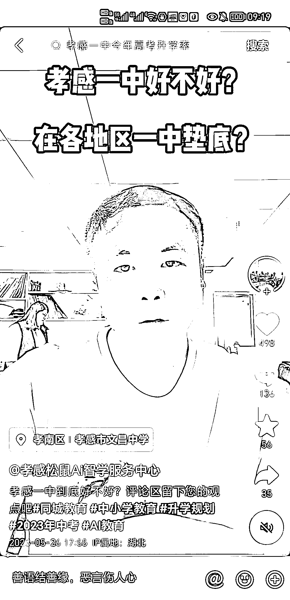

# AI 智能教育方面的商家同城抖音号，每天咨询量超过 20 组

> 原文：[`www.yuque.com/for_lazy/xkrm14/kzuhauihhn1his80`](https://www.yuque.com/for_lazy/xkrm14/kzuhauihhn1his80)

<ne-p id="u6990bd0b" data-lake-id="u6990bd0b"><ne-text id="u793c4b3f">作者： 星星之火</ne-text></ne-p> <ne-p id="u92055bdc" data-lake-id="u92055bdc"><ne-text id="u0b527313">日期：2023-06-26</ne-text></ne-p> <ne-p id="u6555c270" data-lake-id="u6555c270"><ne-text id="uf7144a07">点赞数：</ne-text><ne-text id="u567f27fe" ne-bold="true">45</ne-text></ne-p> <ne-hole id="ud6bbcde7" data-lake-id="ud6bbcde7"><ne-card data-card-name="hr" data-card-type="block" id="pcqkI" data-event-boundary="card"><ne-p id="u4cb2977a" data-lake-id="u4cb2977a"><ne-text id="u9955d830">正文：</ne-text></ne-p> <ne-p id="u0936b5a9" data-lake-id="u0936b5a9"><ne-text id="udcb73d9b">分享一个我近期帮商家起的一个商家同城抖音号，AI 智能教育方面，16 条作品，每天客户咨询 20 多组。操作方法很简单，首先用教育热点话题提升账号活跃度和传播范围，后面真人出镜讲学生学习之后的效果，信任度还是挺好的。适合教育机构做宣传和以及个人做引流中介。</ne-text></ne-p> <ne-p id="u8892e43c" data-lake-id="u8892e43c"><ne-card data-card-name="image" data-card-type="inline" id="dv8ox" data-event-boundary="card"></ne-card></ne-p> <ne-p id="u773d1319" data-lake-id="u773d1319"><ne-card data-card-name="image" data-card-type="inline" id="lU2rN" data-event-boundary="card"></ne-card></ne-p> <ne-p id="ub0d8c9a1" data-lake-id="ub0d8c9a1"><ne-card data-card-name="image" data-card-type="inline" id="Dc441" data-event-boundary="card"></ne-card></ne-p> <ne-p id="u11a552e6" data-lake-id="u11a552e6"><ne-card data-card-name="image" data-card-type="inline" id="ckCvS" data-event-boundary="card"></ne-card></ne-p> <ne-p id="u8bef1ff8" data-lake-id="u8bef1ff8"><ne-card data-card-name="image" data-card-type="inline" id="UTEIW" data-event-boundary="card"></ne-card></ne-p> <ne-p id="u1c5e8639" data-lake-id="u1c5e8639"><ne-card data-card-name="image" data-card-type="inline" id="Wg7ge" data-event-boundary="card"></ne-card></ne-p> <ne-hole id="u6b293715" data-lake-id="u6b293715"><ne-card data-card-name="hr" data-card-type="block" id="uwaLa" data-event-boundary="card"><ne-p id="ud00f9571" data-lake-id="ud00f9571"><ne-text id="ub5e6bbc9">评论区：</ne-text></ne-p> <ne-p id="u30fc3fde" data-lake-id="u30fc3fde"><ne-text id="u13bc8e36">教育圈-斯蒂芬周 : 国内还是可以，国外卷飞</ne-text></ne-p> <ne-p id="u6d3f5046" data-lake-id="u6d3f5046"><ne-text id="ub5d9a053">悦佬 : 兄弟，可以的</ne-text></ne-p> <ne-hole id="u56444f24" data-lake-id="u56444f24"><ne-card data-card-name="hr" data-card-type="block" id="Y5i03" data-event-boundary="card"><ne-p id="u1e237c1e" data-lake-id="u1e237c1e"><ne-text id="ueb85102f">公众号懒人找资源，懒人专属群分享</ne-text></ne-p></ne-card></ne-hole></ne-card></ne-hole></ne-card></ne-hole>