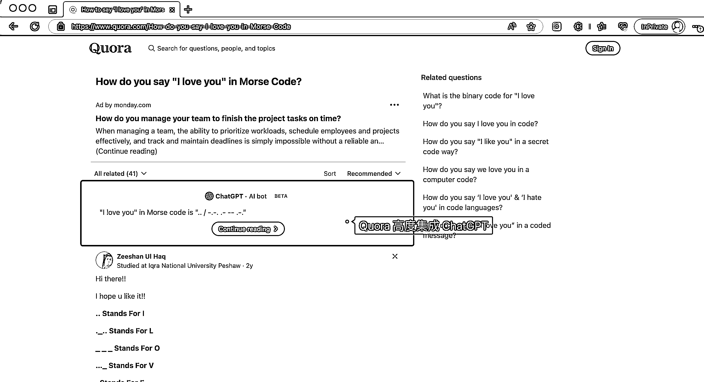
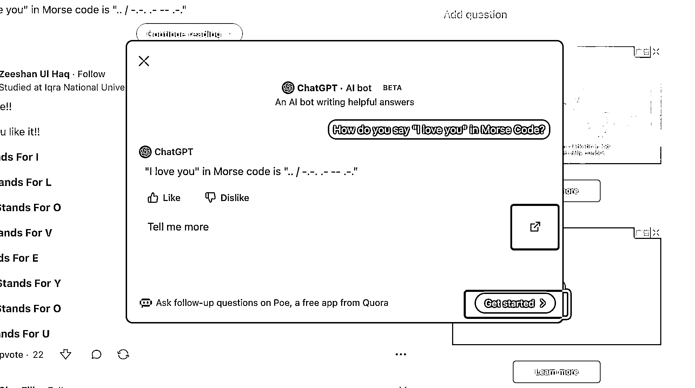

# Quora 网页版集成 ChatGPT，提升用户体验和社区质量

> 原文：[`www.yuque.com/for_lazy/xkrm14/uox0u6iluk9ozc1n`](https://www.yuque.com/for_lazy/xkrm14/uox0u6iluk9ozc1n)

作者： 三林

日期：2023-06-29

点赞数：44

正文：

Quora 网页版已高度集成 ChatGPT，比如在一个问题下方直接展示 ChatGPT 的结果，展示位置比用户回答的要高。 而在弹窗里引导用户进一步对话，引导去 Poe.com 能够接着继续对话。 请注意，该内测功能开放的范围不是全部问题，智能判断了是否应该出现这个 ChatGPT 的 AI Bot，比如一些能够得到确切性答案的问题。 我认为有两个核心点： 1）Quora 站在用户的视角，引入 ChatGPT 会提升社区质量，用户体验得到了提升。知乎会这样做吗？应该不会，核心原因是内容不可控。 2）Poe.com 作为 Quora 的 AI Chat 产品，增长势头相当好，相当于是第二曲线了。

  

  

评论区：

倪大胖 : 如果 Poe 能以每个问题为基础展开问答，是不是可以理解为做了一定基础的调教和背景理解，对话起来会更丝滑

三林 : 是的，现在 quora 还是只覆盖了部分问题，而你说的要针对一些类型问题，用 AI 做内容补充，真是好主意

倪大胖 : 我刚试了一下，针对已经覆盖的问题，对话开始前就会引导你可能感兴趣的点。感觉比自己直接切入问 ai 明朗些。不过感觉和 newbing 对话类似。

三林 : 嗯嗯，这里是 GPT3.5

Frank 老师 : 理解：Quora 通过高度集成 ChatGPT，利用 AI 增强用户体验和社区质量，同时通过引导用户至 Poe.com 实现产品生态的扩展与增长。

公众号懒人找资源，懒人专属群分享

