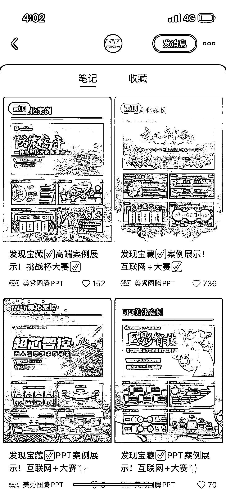

# B 端高质量 ppt 缺口大，案例参考有限，差异化高端模板可提高客单价

> 原文：[`www.yuque.com/for_lazy/xkrm14/kppktttrlrg1cmgy`](https://www.yuque.com/for_lazy/xkrm14/kppktttrlrg1cmgy)

<ne-text id="ub9a00a16">作者： 张大蒜</ne-text>

<ne-text id="ua1cee4a4">日期：2023-06-28</ne-text>

<ne-text id="u795f89a5">点赞数：</ne-text><ne-text id="uc8ab4ede" ne-bold="true">60</ne-text>

<ne-hole id="u6236f912" data-lake-id="u6236f912"><ne-card data-card-name="hr" data-card-type="block" id="V8lXU" data-event-boundary="card">

<ne-text id="uce9b73d9">正文：</ne-text>

<ne-text id="uf50cec03">B 端高质量 ppt 缺口大，但实际可参考案例很少。目前很卷的 ppt 模板赛道都是没设计感，就素材简单堆砌的模版，这种高端的可以打出差异化，且客单价可以拉的比较高。</ne-text>

<ne-card data-card-name="image" data-card-type="inline" id="vjPJH" data-event-boundary="card"></ne-card>

<ne-card data-card-name="image" data-card-type="inline" id="Y9gcd" data-event-boundary="card"></ne-card>

<ne-hole id="u6f84c0a7" data-lake-id="u6f84c0a7"><ne-card data-card-name="hr" data-card-type="block" id="Psf0D" data-event-boundary="card">

<ne-text id="u032ced13">评论区：</ne-text>

<ne-text id="u89da4b8e">张云金 _GISer : 高级定制，目前 2500 左右一页</ne-text>

<ne-text id="ud9376fac">Alex : [强][强]</ne-text>

<ne-text id="ua4a5d374">万简 : 一页做多久</ne-text>

<ne-text id="udc862dd8">张云金 _GISer : 搜索下全屏本事，武超</ne-text>

<ne-hole id="u6646628f" data-lake-id="u6646628f"><ne-card data-card-name="hr" data-card-type="block" id="VDrjB" data-event-boundary="card">

<ne-text id="u4091e71b">公众号懒人找资源，懒人专属群分享</ne-text>

</ne-card></ne-hole></ne-card></ne-hole></ne-card></ne-hole>