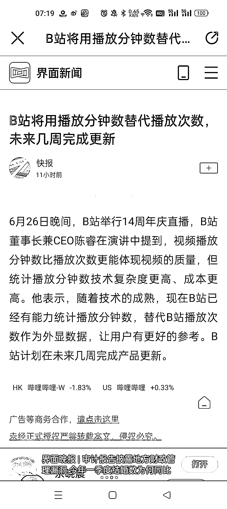

# B 站 14 周年庆，播放分钟数取代播放次数

> 原文：[`www.yuque.com/for_lazy/xkrm14/uuxlb15ku6nkgptq`](https://www.yuque.com/for_lazy/xkrm14/uuxlb15ku6nkgptq)

<ne-text id="u5d4d383e">作者： 施霖终生学习者-链接</ne-text>

<ne-text id="ud25f615c">日期：2023-06-27</ne-text>

<ne-text id="ub24708e8">点赞数：</ne-text><ne-text id="u116c6a26" ne-bold="true">48</ne-text>

<ne-hole id="uf52f2724" data-lake-id="uf52f2724"><ne-card data-card-name="hr" data-card-type="block" id="o5JAR" data-event-boundary="card">

<ne-text id="u9708aa34">正文：</ne-text>

<ne-text id="ue16c7380">B 站 14 周年昨天结束了， 未来 B 站也将用播放分钟数代替播放次数， 对于这个小小的改变， 其实关系还是很大， 至少有几块圈友们可以关注下：</ne-text> <ne-text id="u7753880f">1.做 B 站视频教学的，时长优势出来了，学习还是要看完吧，当然说可以直接下载下来看的，除外，不要抬杠哈[呲牙]</ne-text> <ne-text id="u3550f5dc">2.做 B 站 SEO 的需要调整下思路了，如何把权重提高，标题党增加打开次数至少需要优化了，毕竟内容很重要</ne-text> <ne-text id="u71a2f78f">3.B 站应该会更多元，对于圈友们来说，尽快布局 B 站，用 AI 生成内容，持续分享，会是下一个小红书的，平台绝对会轮流转的 祝生财有术啊，</ne-text>

<ne-card data-card-name="image" data-card-type="inline" id="q74yZ" data-event-boundary="card">  <ne-hole id="u5a44df5e" data-lake-id="u5a44df5e"><ne-card data-card-name="hr" data-card-type="block" id="RKDak" data-event-boundary="card"><ne-p id="u8788ef7b" data-lake-id="u8788ef7b"><ne-text id="ue45d56ce">评论区：</ne-text>

<ne-text id="u5fc588e3">胖大魔 : 之前看公众号，都在骂 b 站变现难，还有用爱发电难持久</ne-text>

<ne-text id="uea92dce6">施霖终生学习者-链接 : 所以有变化，肯定有政策啊，</ne-text>

<ne-text id="u0142f60a">胖大魔 : 不看好，因为付费意识太差，白嫖粉多</ne-text>

<ne-text id="u4bea2207">施霖终生学习者-链接 : 谢谢亦仁大佬，</ne-text>

<ne-text id="u75986f7e">yetu 耳 : 还是值得做的。苍蝇肉也是钱…[发呆]</ne-text>

<ne-text id="u4df2ce04">施霖终生学习者-链接 : 一鱼多吃，[呲牙][强]</ne-text>

<ne-text id="ud36e88d9">剪刀刀 : 不可能会成为小红书，平台基因就是白嫖免费</ne-text>

<ne-hole id="u1ed3e789" data-lake-id="u1ed3e789"><ne-card data-card-name="hr" data-card-type="block" id="Xk6z8" data-event-boundary="card">

<ne-text id="ue1308c9f">公众号懒人找资源，懒人专属群分享</ne-text>

</ne-card></ne-hole></ne-card></ne-hole></ne-card></ne-p></ne-card></ne-hole>