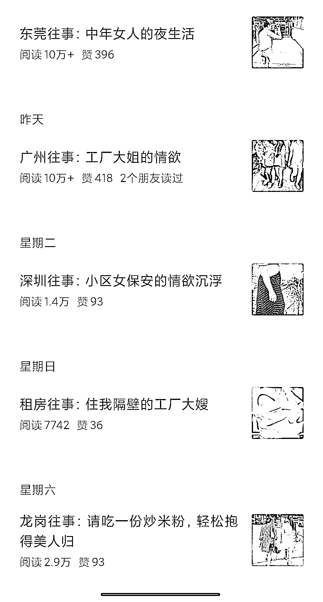

# 公众号分享打工故事，探讨流量变现和情感文的逻辑

> 原文：[`www.yuque.com/for_lazy/xkrm14/bsbke9b4fs6qpl73`](https://www.yuque.com/for_lazy/xkrm14/bsbke9b4fs6qpl73)

<ne-p id="ud7785c44" data-lake-id="ud7785c44"><ne-text id="u79db5a2c">作者： 韬晦</ne-text></ne-p> <ne-p id="u238a1c25" data-lake-id="u238a1c25"><ne-text id="u3142b326">日期：2023-07-27</ne-text></ne-p> <ne-p id="ucafb6e72" data-lake-id="ucafb6e72"><ne-text id="ue200939a">点赞数：</ne-text><ne-text id="u24e2447d" ne-bold="true">109</ne-text></ne-p> <ne-hole id="uc478e640" data-lake-id="uc478e640"><ne-card data-card-name="hr" data-card-type="block" id="ke4Ho" data-event-boundary="card"><ne-p id="u398674d4" data-lake-id="u398674d4"><ne-text id="u72901bea">正文：</ne-text></ne-p> <ne-p id="u5614d0e5" data-lake-id="u5614d0e5"><ne-text id="u120f542d">公众号写打工故事，流量主变现 还是情感文的逻辑，起一个暧昧的标题，内容用 chatgap 生成，语言风格需要调整一下。</ne-text> <ne-text id="uc1d8b5c1">我自己测试是用鲁迅和余华的风格写，反正怎么接地气怎么来。 图二是我测试的号，就是阅读量上来了但收益有点低，不知道这个收益是怎么算的</ne-text></ne-p> <ne-p id="ue1355105" data-lake-id="ue1355105"><ne-card data-card-name="image" data-card-type="inline" id="gBc9R" data-event-boundary="card"></ne-card></ne-p> <ne-p id="ube05ee67" data-lake-id="ube05ee67"><ne-card data-card-name="image" data-card-type="inline" id="ybEgg" data-event-boundary="card"></ne-card></ne-p> <ne-hole id="u6c458beb" data-lake-id="u6c458beb"><ne-card data-card-name="hr" data-card-type="block" id="QsJBo" data-event-boundary="card"><ne-p id="ua9829201" data-lake-id="ua9829201"><ne-text id="uf4c273c0">评论区：</ne-text></ne-p> <ne-p id="ud6bcae33" data-lake-id="ud6bcae33"><ne-text id="u75875a35">米斯特 LIu : 收益每天在多少呢？</ne-text></ne-p> <ne-p id="u71ac1d18" data-lake-id="u71ac1d18"><ne-text id="u9067e460">韬晦 : 按一万阅读算，有时候一百左右，有时候三四十</ne-text></ne-p> <ne-p id="ue65c7957" data-lake-id="ue65c7957"><ne-text id="ufff4c3df">青空明月 : 有启发，感谢分享[爱心]</ne-text></ne-p> <ne-p id="uc0a2b118" data-lake-id="uc0a2b118"><ne-text id="uec0fcea8">zcl : 号已经挂了[捂脸]</ne-text></ne-p> <ne-p id="uf688d71d" data-lake-id="uf688d71d"><ne-text id="u4e614a16">金九渊 : 还可以了</ne-text></ne-p> <ne-p id="ub3f7cf48" data-lake-id="ub3f7cf48"><ne-text id="u70a88571">一恒 : 这，十万那条，岂不是几千块。</ne-text></ne-p> <ne-p id="u832e3172" data-lake-id="u832e3172"><ne-text id="u554166d3">剪刀刀 : 文章已经搜不到了，目测号已经被封号</ne-text></ne-p> <ne-hole id="u637797be" data-lake-id="u637797be"><ne-card data-card-name="hr" data-card-type="block" id="QKOU7" data-event-boundary="card"><ne-p id="ubcf9bbc3" data-lake-id="ubcf9bbc3"><ne-text id="u49aa8dcc">公众号懒人找资源，懒人专属群分享</ne-text></ne-p></ne-card></ne-hole></ne-card></ne-hole></ne-card></ne-hole>