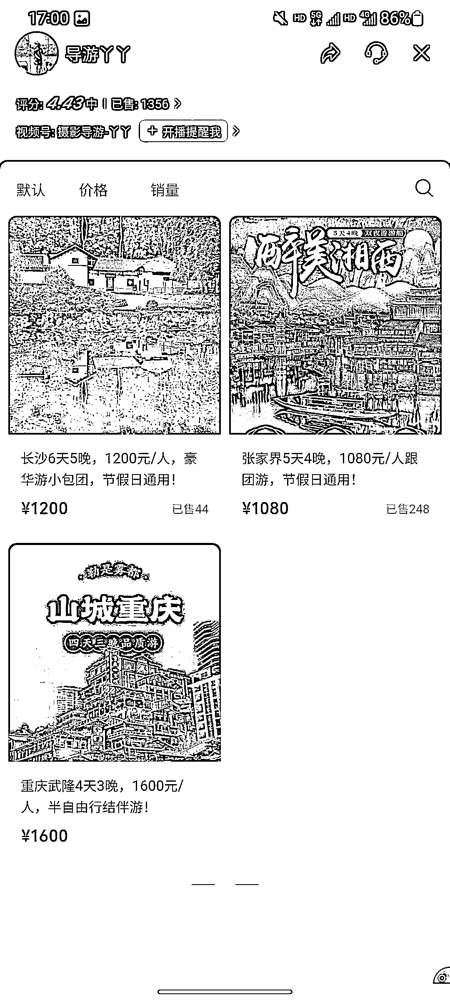

# 视频号旅游业务潜力巨大，值得关注和投资

> 原文：[`www.yuque.com/for_lazy/xkrm14/hai8yhi8hz2elvyk`](https://www.yuque.com/for_lazy/xkrm14/hai8yhi8hz2elvyk)

作者： 是十三幺啊

日期：2023-07-25

点赞数：66

正文：

生财朋友圈 视频号上的旅游跟团产品或者旅游相关业务，确实不容小觑。 咨询转化都非常丝滑直接，重要的事情是，从一开始就要引导到私域或者直接促销。 高客单价的产品，在精不在多。 能够为客户提供什么样的体验，服务的水准和实力直接影响后续的客户复购和平台的流量推送 认证企业号的好处在于，塑造了权威、可信度高的人设，降低了用内容包装的成本，一定程度上能更直接触达交易 换个角度，不是企业号的话，也可以铺矩阵，提高产品的曝光。 几个新的思考，个人拙见，望多指正交流： 1.该博主打造的人设是旅游从业人员，带货也集中于高客单价的旅游包团业务。普通人如果直接模仿复刻，成本有多高，可行性如何？ 2.视频号上的客群，中老年人居多，转化效率相比其他平台，效果如何？ 3.同样是旅游，如果做个人旅游 cps（飞猪或携程等），以分销的形式在视频号铺开，盘子能铺多大？ 4.如果根据图上这一类客群，锁定这类账号的粉丝，推送酒店 cps，是不是也能比较形成比较好的业务闭环和旅游生态？ 总之，23 年的旅游业务，绝对值得重视

评论区：

是十三幺啊 : 感谢大佬[色][色][色]

公众号懒人找资源，懒人专属群分享

