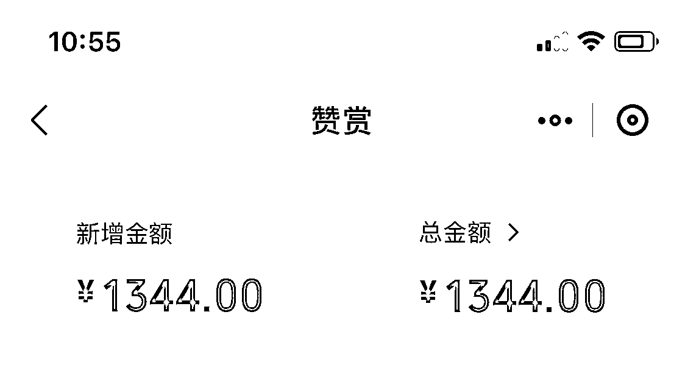

# 公众号中老年人情感项目，不到 1 周收益 1344

> 原文：[`www.yuque.com/for_lazy/xkrm14/cp4imw9gmcwgcscg`](https://www.yuque.com/for_lazy/xkrm14/cp4imw9gmcwgcscg)

作者： 嘉嘉 Swimming

日期：2023-07-28

点赞数：98

<ne-hole id="u356e3f37" data-lake-id="u356e3f37"><ne-card data-card-name="hr" data-card-type="block" id="BGnvz" data-event-boundary="card">

正文：

公众号中老年人情感项目，新号不到 1 周的打赏收益 1344，单日最高收益 800➕，适合细水长流睡后收益 通过视频号引流到公众号，公众号发布情感文章，获取用户打赏的形式变现

<ne-card data-card-name="image" data-card-type="inline" id="FuHOS" data-event-boundary="card"></ne-card>

<ne-card data-card-name="image" data-card-type="inline" id="yHuXz" data-event-boundary="card"></ne-card>

<ne-hole id="uffb0d801" data-lake-id="uffb0d801"><ne-card data-card-name="hr" data-card-type="block" id="uniLn" data-event-boundary="card">

评论区：

马秋涛 : 用户打赏的目的是什么?文章提供了什么价值

胖大魔 : 情感关怀与八卦

Mr. : 请问视频号是用哪种类型的内容来引流呢？

鞭炮 : 为什么是 256 这数字有特别之处

龙猫 : 老年人打赏都是这个级别的吗

猫哥 : 这个我之前发过，这种就是类似欺骗感情，文章写的都是告白信，然后打赏金额设置的很大。好多公众号做的这种打赏似乎都封了。跳转的第三方。

Pep : 自己设置金额

<ne-hole id="u20382ab6" data-lake-id="u20382ab6"><ne-card data-card-name="hr" data-card-type="block" id="RpKHA" data-event-boundary="card">

公众号懒人找资源，懒人专属群分享

</ne-card></ne-hole></ne-card></ne-hole></ne-card></ne-hole>