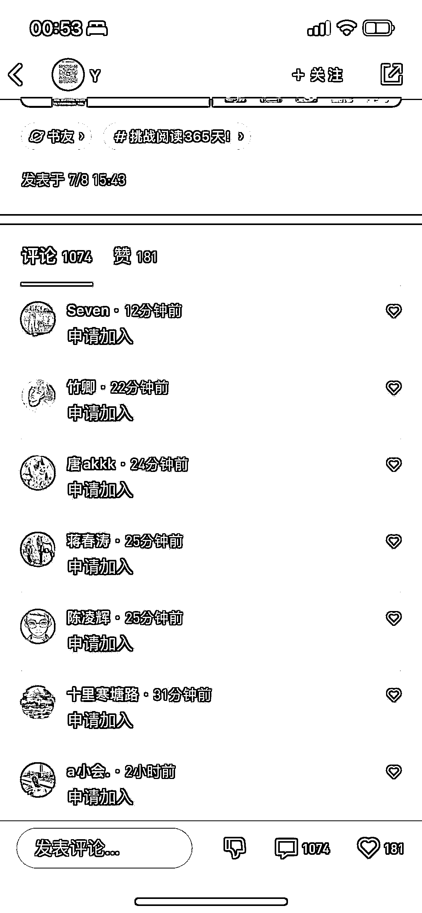
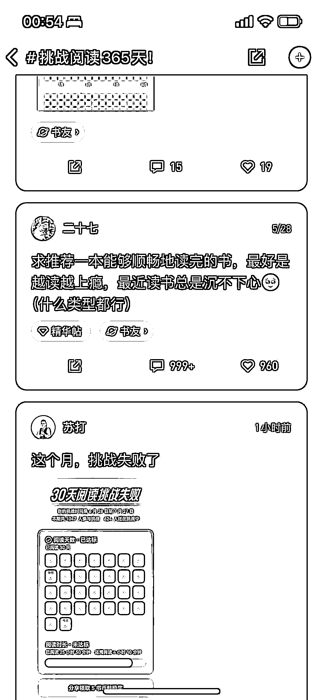

# 微信读书打卡营：精准用户流量池，持续变现的机会

> 原文：[`www.yuque.com/for_lazy/xkrm14/sfdq3qu3gewkviw3`](https://www.yuque.com/for_lazy/xkrm14/sfdq3qu3gewkviw3)

作者： 高杰

日期：2023-07-28

点赞数：165

<ne-hole id="uc80340eb" data-lake-id="uc80340eb">

正文：

做读书打卡营，共读营，微信读书真是个好的流量池，一群用户求加入，太精准了，而且针对这类用户，引导到私域以后，还可以通过其他相关性产品持续变现

<ne-hole id="ue99fa81c" data-lake-id="ue99fa81c">

评论区：

终身成长者 : 圈友，你这个截图，是微信读书 app 上的截图吗？

高杰 : 是的

张日 : 之前小圈子刚出来的时候，可以直接放二维码上去的，那个时候加了很多群，后来不让放码上去了[捂脸]

许帅 : 微信读书的运营逻辑导致白嫖用户太多，付费教育成本极高，但确实是读书粉流量洼地。

高杰 : 自从上线了阅读挑战以后应该还好吧，一方面通过挑战加奖励的形式激励用户，再通过交流话题让大家自由交流，只是这种是比较弱用户运营的方式，读书打卡营会更有氛围感，所以大家还是愿意加入这种强运营的社群

许帅 : 是的，这个加入也是微读疯狂商业化的尝试，有相关产品逻辑是通的。只是白嫖粉的威力真的很大[呲牙]

九歌 : 有意思

<ne-hole id="ub5109d4c" data-lake-id="ub5109d4c">

公众号懒人找资源，懒人专属群分享

</ne-hole></ne-hole></ne-hole>