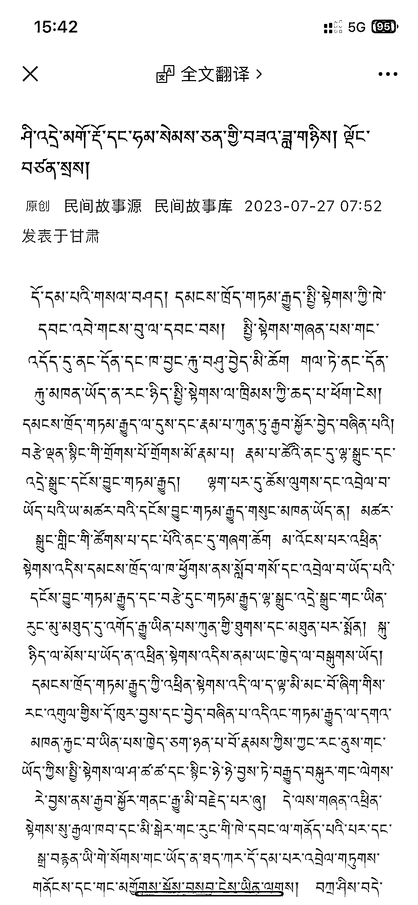

# 用小众语言做公众号流量主项目

> 原文：[`www.yuque.com/for_lazy/xkrm14/pklx0hs2fmflm5g7`](https://www.yuque.com/for_lazy/xkrm14/pklx0hs2fmflm5g7)

作者： 不记年

日期：2023-07-28

点赞数：105

<ne-hole id="ufa112b54" data-lake-id="ufa112b54">

正文：

用小众语言，做公众号流量主项目，应该也不错。

<ne-hole id="u765c6fc6" data-lake-id="u765c6fc6">

评论区：

浪久 : 这个受众群体是哪里人？我们都看不懂[抓狂]

天花板讲武德 : 我也好奇，看这个公众号还挺久了

如也 : IP 甘肃 甘南藏语？

山禾 : 问了 gpt，这是藏语，gpt4 也不会翻译

草木青｜灵魂核聚变版 : 藏语这是，

小不点 : 应该勾起别人的好奇心

黑来古 : 我好奇的是这些字是怎么打出来的

<ne-hole id="u51912d7c" data-lake-id="u51912d7c">

公众号懒人找资源，懒人专属群分享

</ne-hole></ne-hole></ne-hole>