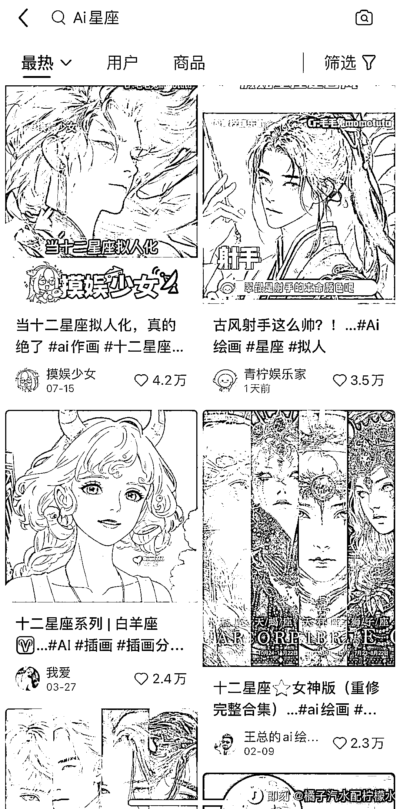

# AI 绘画星座账号：精准人群、高互动率、封面吸引力

> 原文：[`www.yuque.com/for_lazy/xkrm14/rgv3iw0qckecw5iy`](https://www.yuque.com/for_lazy/xkrm14/rgv3iw0qckecw5iy)

<ne-p id="u78c8af7a" data-lake-id="u78c8af7a"><ne-text id="u921afbe4">作者： 纳兰乘风</ne-text></ne-p> <ne-p id="u06be5fc2" data-lake-id="u06be5fc2"><ne-text id="u8edbe517">日期：2023-07-24</ne-text></ne-p> <ne-p id="u1e52bb79" data-lake-id="u1e52bb79"><ne-text id="u3d256384">点赞数：</ne-text><ne-text id="uf4dc4113" ne-bold="true">57</ne-text></ne-p> <ne-hole id="uea4a7de8" data-lake-id="uea4a7de8"><ne-card data-card-name="hr" data-card-type="block" id="im0I0" data-event-boundary="card"><ne-p id="uc5790652" data-lake-id="uc5790652"><ne-text id="u1c651908">正文：</ne-text></ne-p> <ne-p id="u7e94d3a6" data-lake-id="u7e94d3a6"><ne-text id="ua27a74dd">AI 绘画星座类账号，现在在小红书上已经算是单独的赛道了。 它的核心就是将十二星座拟人化，代表性的帐号有 女性十二星座的@爱吃豆腐炸鸡蛋。</ne-text> <ne-text id="u4cab7c6e">男性十二星座@王总的 ai 绘画世界。 这种账号主要是接定制和课程、以及广告。 这类帐号爆款的原因其实也很简单。</ne-text> <ne-text id="ud051d096">1.赛道垂直，人群比较精准。相比其他的 AI 绘画账号，星座类的内容人群是非常好找的。</ne-text> <ne-text id="u299433b2">2.互动率高。由于人群精准，加上这类型的文案，对用户性格的描写会比较精准，所以很容易激发用户的评论和点赞。</ne-text> <ne-text id="u9b038ae8">3.封面一般会做会汇总化的展示，这种类似电视剧人物的海报，极易引起用户点击和收藏的欲望。</ne-text> <ne-text id="u795ad6d6">如果只是做单篇的星座拟人图片，其实不容易爆（一般在 5000 赞以内），原因是 12 星座的合集更加容易有爽点，会大爆（10000 赞以上）。</ne-text> <ne-text id="u6fa255d9">这类账号已经能单独撑起一个类别了，但是同样爆款之后面临流量下降的困境。</ne-text></ne-p> <ne-p id="ue1f6f2b4" data-lake-id="ue1f6f2b4"><ne-card data-card-name="image" data-card-type="inline" id="iZQBo" data-event-boundary="card"></ne-card></ne-p> <ne-p id="uebd0bfa3" data-lake-id="uebd0bfa3"><ne-card data-card-name="image" data-card-type="inline" id="K4bso" data-event-boundary="card"></ne-card></ne-p> <ne-p id="u831c1221" data-lake-id="u831c1221"><ne-card data-card-name="image" data-card-type="inline" id="S1uy0" data-event-boundary="card"></ne-card></ne-p> <ne-p id="ucc69e728" data-lake-id="ucc69e728"><ne-card data-card-name="image" data-card-type="inline" id="dQUfA" data-event-boundary="card"></ne-card></ne-p> <ne-hole id="ue5163fe4" data-lake-id="ue5163fe4"><ne-card data-card-name="hr" data-card-type="block" id="RDPPC" data-event-boundary="card"><ne-p id="u96efebb8" data-lake-id="u96efebb8"><ne-text id="u445db41d">评论区：</ne-text></ne-p> <ne-hole id="u20e0bd98" data-lake-id="u20e0bd98"><ne-card data-card-name="hr" data-card-type="block" id="i9sK6" data-event-boundary="card"><ne-p id="u9d86001a" data-lake-id="u9d86001a"><ne-text id="u0f31c198">公众号懒人找资源，懒人专属群分享</ne-text></ne-p></ne-card></ne-hole></ne-card></ne-hole></ne-card></ne-hole>