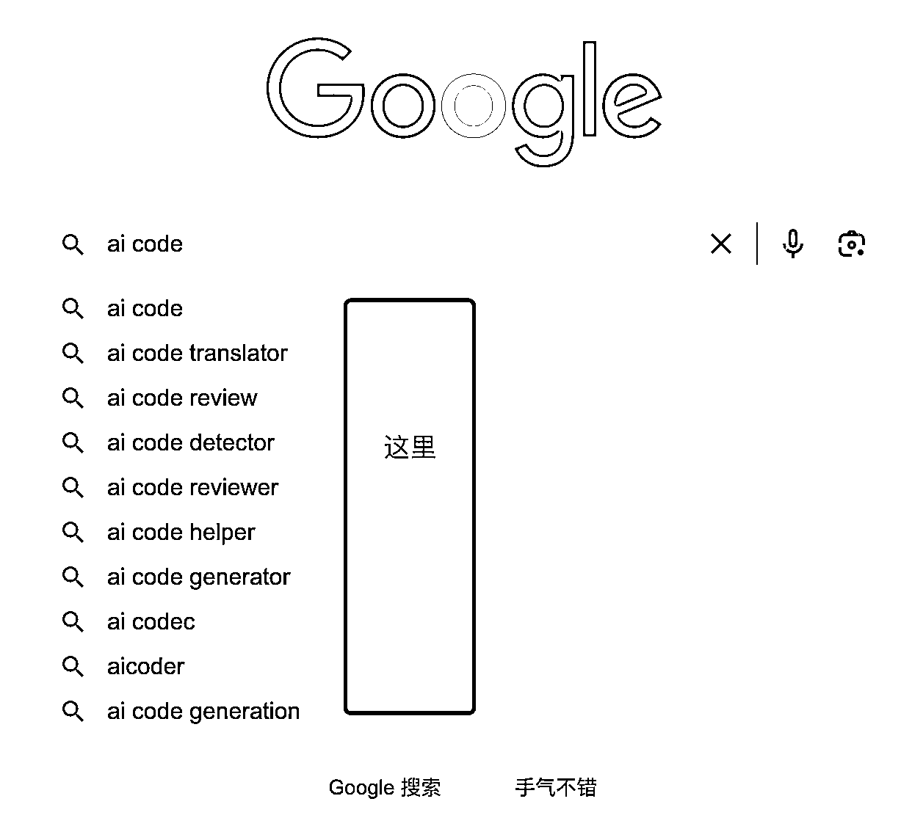

# MVP 思路分享：AI 代码转换器开源项目验证及数据分析

> 原文：[`www.yuque.com/for_lazy/xkrm14/ah5rgprfgr7w72e8`](https://www.yuque.com/for_lazy/xkrm14/ah5rgprfgr7w72e8)

作者： AUDI

日期：2023-07-26

点赞数：63

<ne-hole id="u48a83ada" data-lake-id="u48a83ada">

正文：

MVP 思路分享 这是我另个一个之前周六 6.24 开始验证思路的项目，验证的感觉差不多，不做主动推广到现在一个月，访问了 9.8K。 源码开源了， 网址： 启发来源：有两个 1.社群聊过的 producthunt 提交 AI 作品，那么就静静的等待其他导航站来爬就行 2\. vercel.ai 的开源模板市场。 当天快速根据源码改造上线后，我就及时提交了 producthunt，然后基本是验证不做推广的情况下的数据。 看图一，都是其他导航站自己爬取的应该，并且从结果来看，可以自己去主动提交。 看图二，外链来源占用了一半的比例，还有一半的是直接来源，应该是留存流量。 可以做的： ①如果有 AI 产品，可以去图中的那几个主动提交下。 ②看下开源源码，然后结合数据，自己发现词，业余时间验证下，总结经验。 我的选词是 Ai code convert ,目前来看选的不太好，在 google 下拉框，更多是 ai code translator 或其他。如图三。 ③要做那种用了后能有利于留存，传播或好记的产品，不一定多难，先做 MVP 试错。 GitHub+-+JustAIGithub/AI-Code- Convert:+AI+Code+Tra... Convert)[AI+Code+Converter](https://aicodeconvert.com/) [GitHub+-+JustAIGithub/AI-Code- Convert:+AI+Code+Tra...](https://github.com/JustAIGithub/AI-Code-Convert)

  <ne-p id="ue0e24f14" data-lake-id="ue0e24f14">

<ne-hole id="u7b813460" data-lake-id="u7b813460">

评论区：

AUDI : 目前网站的 key 被封了，看不了演示效果了，大家可以自己 clone，部署起来试一下

AUDI : 谢亦仁大佬

胡二虎🐯 : [强]，怎么不从 GA 看详细数据

AUDI : 这个当时验证时候，源码不是我擅长的语言，加统计没成功

胡二虎🐯 : 嗯嗯呢，因为据我的经验，similarweb 的后台数据和真实流量差距还是挺大的

AUDI : 对，最近在看看找个周六研究加上 ga 对比下

<ne-hole id="u30edb573" data-lake-id="u30edb573">

公众号懒人找资源，懒人专属群分享

</ne-hole></ne-hole></ne-p></ne-hole>