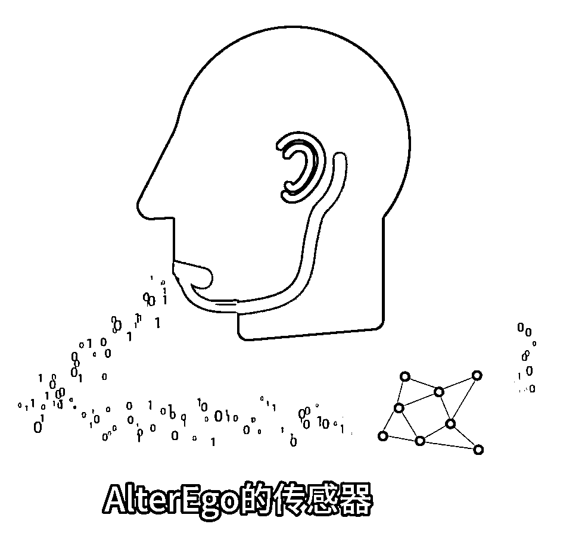

# 麻省理工学院发明非侵入式 AI 设备，通过意念与 AI 交流

> 原文：[`www.yuque.com/for_lazy/xkrm14/tgqtqnyey3kwr0qr`](https://www.yuque.com/for_lazy/xkrm14/tgqtqnyey3kwr0qr)

<ne-p id="u081d9a67" data-lake-id="u081d9a67"><ne-text id="u385efbc8">作者： Dreamland</ne-text></ne-p> <ne-p id="udc418b8b" data-lake-id="udc418b8b"><ne-text id="uc74cc629">日期：2023-07-25</ne-text></ne-p> <ne-p id="uac54f5c1" data-lake-id="uac54f5c1"><ne-text id="u39f85cf4">点赞数：</ne-text><ne-text id="uaae3b009" ne-bold="true">55</ne-text></ne-p> <ne-hole id="u68e0ce0a" data-lake-id="u68e0ce0a"><ne-card data-card-name="hr" data-card-type="block" id="L9mrf" data-event-boundary="card"><ne-p id="u05f7f56b" data-lake-id="u05f7f56b"><ne-text id="ufef91337">正文：</ne-text></ne-p> <ne-p id="u3ecd72ca" data-lake-id="u3ecd72ca"><ne-text id="u1151ae0e">【AlterEgo 最新非侵入式 Ai】 麻省理工学院的 Arnav Kapur 发明了一个名为 AlterEgo 的 AI 可穿戴设备，能让你通过意念与 AI 交流。</ne-text> <ne-text id="u647b15e3">你不需要张嘴，也不需要做出任何发声动作，只需在内心中清晰地表达出词语，AlterEgo 的传感器能捕捉到人体的神经信号，再由 AI</ne-text> <ne-text id="u058ce012">解析你的意图，最后通过骨传导音频将答案传回给你。</ne-text></ne-p> <ne-p id="u069b66c3" data-lake-id="u069b66c3"><ne-card data-card-name="image" data-card-type="inline" id="Fmq5f" data-event-boundary="card"></ne-card></ne-p> <ne-hole id="u59d5c696" data-lake-id="u59d5c696"><ne-card data-card-name="hr" data-card-type="block" id="eVJRn" data-event-boundary="card"><ne-p id="u7e9cdb6d" data-lake-id="u7e9cdb6d"><ne-text id="ueabbe0c8">评论区：</ne-text></ne-p> <ne-p id="u9cea7f97" data-lake-id="u9cea7f97"><ne-text id="u1d276c95">Dreamland : 感觉好强，感觉比脑机接口要厉害的多[发呆]</ne-text></ne-p> <ne-p id="u3b5505fd" data-lake-id="u3b5505fd"><ne-text id="u661aa22d">竹影 : 感觉应该是 GPT1.0-2.0 水平吧</ne-text></ne-p> <ne-p id="u16a15b6e" data-lake-id="u16a15b6e"><ne-text id="ue6088523">易 : 那说话有障碍的人是不是也可以用这个方式发生了[微笑]</ne-text></ne-p> <ne-p id="u4b7b8df7" data-lake-id="u4b7b8df7"><ne-text id="u40baaba2">帅 : 非侵入式最大问题是不精准</ne-text></ne-p> <ne-hole id="u2c846454" data-lake-id="u2c846454"><ne-card data-card-name="hr" data-card-type="block" id="raB3I" data-event-boundary="card"><ne-p id="udd41c13b" data-lake-id="udd41c13b"><ne-text id="uc5aa1a71">公众号懒人找资源，懒人专属群分享</ne-text></ne-p></ne-card></ne-hole></ne-card></ne-hole></ne-card></ne-hole>