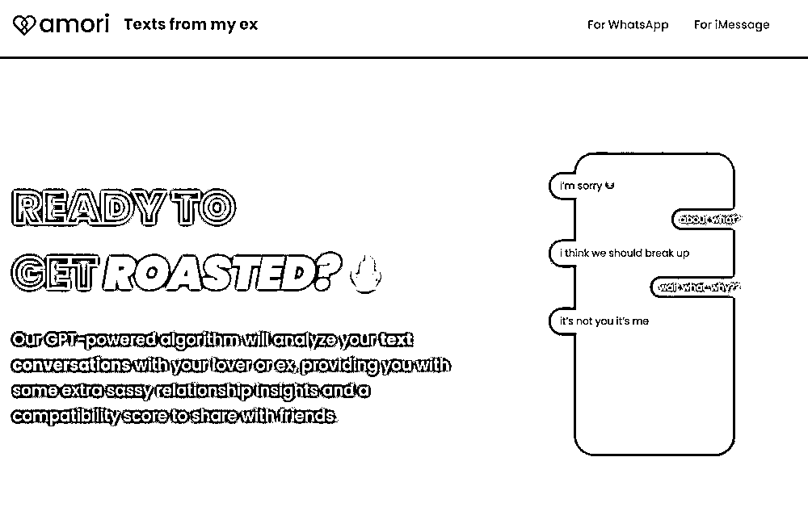

# 使用 AI 工具“Texts from my ex“重新与前任聊天

> 原文：[`www.yuque.com/for_lazy/xkrm14/bb8h50ytvcikg772`](https://www.yuque.com/for_lazy/xkrm14/bb8h50ytvcikg772)

作者： 苓枫

日期：2023-07-25

点赞数：50

<ne-hole id="u5bef40a9" data-lake-id="u5bef40a9">

正文：

和你的前任聊天 分类：AI 工具 网址： 介绍： 只要上传你的聊天记录或者是短信记录 即可再次找回你的前任 其实它是一个 gpt 套壳 想法： 这个如果用 realchar 来，不仅是文字，语音，加图片都可以有 图片都可以有 1：做成一个 APP 来一次 2：做成小程序来一次[Texts+from+my+ex](https://textsfrommyex.com/)

<ne-hole id="u24c5af3f" data-lake-id="u24c5af3f">

评论区：

Northrp : 有意思

苓枫 : 这种的现在国内不多

苓枫 : 是不是会中标警告啊

<ne-hole id="u954c8dd3" data-lake-id="u954c8dd3">

公众号懒人找资源，懒人专属群分享

</ne-hole></ne-hole></ne-hole>