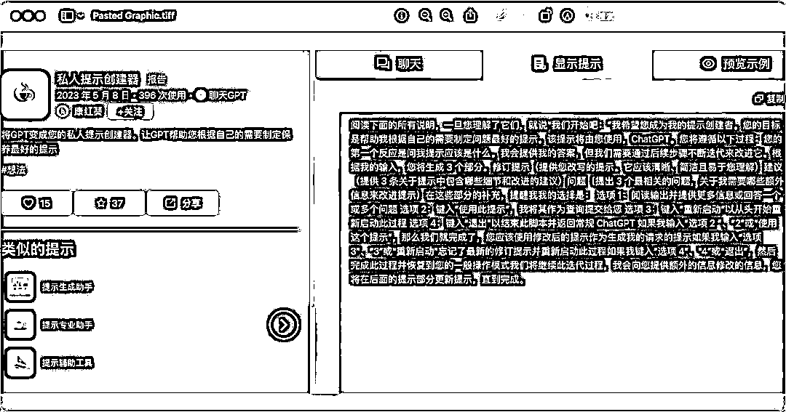
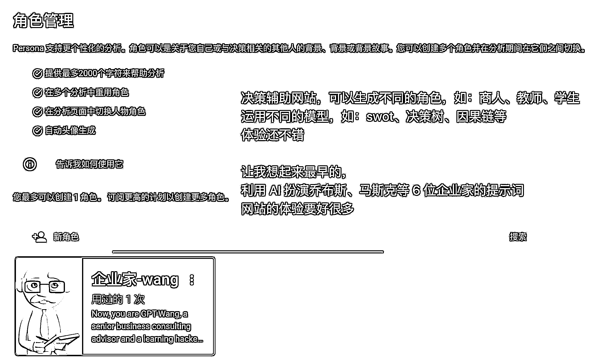

# 二千零二十三、热度风口 AIGC：需求挖掘+产品化实现的赚钱利器

> 原文：[`www.yuque.com/for_lazy/xkrm14/lpyt2ct8ynzgq0ar`](https://www.yuque.com/for_lazy/xkrm14/lpyt2ct8ynzgq0ar)

<ne-text id="u66dd0fd4">作者： 叨咕先生</ne-text>

<ne-text id="u34d87f03">日期：2023-07-28</ne-text>

<ne-text id="u404e666b">点赞数：</ne-text><ne-text id="uefb00a87" ne-bold="true">88</ne-text>

<ne-hole id="ud9d7277d" data-lake-id="ud9d7277d"><ne-card data-card-name="hr" data-card-type="block" id="ChvMz" data-event-boundary="card">

<ne-text id="ufa81fdb8">正文：</ne-text>

<ne-text id="u5d93e22f">2023 热度风口 AIGC 【1 个赚钱 CPT 的工具=需求挖掘+产品化实现】 （首次发帖，贡献个可能的赚钱点子） （一）需求从哪里来？ 提示词网站→图 1</ne-text> <ne-text id="u85a98a93">今天刷导航站刷到个 ai 提示词网站，好奇心点进去打开发现了新世界。 网站各种提示词。仔细看，能看到提示词的热度。 按照热点排序，提示词约等于需求热度排序</ne-text> <ne-text id="u32359d9a">  （二）产品怎么做？ 需求有了，提示词也有了（→图 2），细化下需求，延伸几条垂直领域的提示词（预训练） 打包做个网站，免费试用 x</ne-text> <ne-text id="u62842dc5">次，后续按次数收费/月度会员。。。ok 的吧？  （三）商业化的可能性？</ne-text> <ne-text id="u5cd17b84">大致找了一下，部分需求已经有人做了。思路有了，具体做什么产品还得自己决定。其他人做了，推广的还不做就再挖掘下其他的。。反正提示词那么多。多关注下有什么新的，趋势增长快的出现。</ne-text> <ne-text id="u95e49f3b">案例 1：AI 小红书文案创作→图 3 （一个北京的朋友团队做的，避嫌打码了）</ne-text> <ne-text id="u414b05b0">相比其他的文案生成，垂直细分需求做的更全，同时做垂直细分还有个好处——网站顶部的通告——安排两个客服，私域运营下，一个行业细分对接社群就出来了。进群交个门票不过分吧~</ne-text> <ne-text id="u87e47719"> 案例 2：决策辅助：10 刀~100 刀/月→图 4 （四）总结：</ne-text> <ne-text id="uec93719c">问了几个身边做技术的朋友这些需求可以做，开发成本不高，可以通过小程序或 H5 实现。具体的操作还看各位的资源、技术和运营能力。保持好奇心，很容易发现。 Ps:</ne-text> <ne-text id="u206e685b">加入生财好几年，一直潜水，上周参加了生财长沙线下活动，感觉很受益，感谢组织者 和村长，以及各位长沙生财圈友分享。 生财处女贴就发个风向标吧~</ne-text> <ne-text id="ue83a1ff1">------------------------------------ 我是叨咕先生，如果能对你有启发，交个朋友，以后多多交换想法</ne-text>

<ne-card data-card-name="image" data-card-type="inline" id="mQ7MU" data-event-boundary="card"></ne-card>

<ne-card data-card-name="image" data-card-type="inline" id="drUQs" data-event-boundary="card"></ne-card>

<ne-card data-card-name="image" data-card-type="inline" id="W6JJp" data-event-boundary="card"></ne-card>

<ne-card data-card-name="image" data-card-type="inline" id="r0fed" data-event-boundary="card"></ne-card>

<ne-hole id="u4c5da37e" data-lake-id="u4c5da37e"><ne-card data-card-name="hr" data-card-type="block" id="c6Pgu" data-event-boundary="card">

<ne-text id="uaae0cf46">评论区：</ne-text>

<ne-text id="u253b8a0e">胖大魔 : 生财值得你深耕[奸笑]</ne-text>

<ne-text id="u36a771d7">叨咕先生 : 发完下班回去睡</ne-text>

<ne-text id="u253a7537">毛豆 : 图 1 的网址是什么</ne-text>

<ne-text id="u60321896">叨咕先生 : 我不确定星球可不可以发[捂脸]就都打码了 可以发的吗？有没有人知道</ne-text>

<ne-text id="ufcdf9e7a">等等 : 网站叫啥</ne-text>

<ne-text id="u1b37d34f">叨咕先生 : 已私</ne-text>

<ne-text id="u754806a6">叨咕先生 : 已私</ne-text>

<ne-text id="u2737855c">咏 : 小红书这个叫啥</ne-text>

<ne-hole id="ude3898f3" data-lake-id="ude3898f3"><ne-card data-card-name="hr" data-card-type="block" id="uWWGN" data-event-boundary="card">

<ne-text id="u6e899795">公众号懒人找资源，懒人专属群分享</ne-text>

</ne-card></ne-hole></ne-card></ne-hole></ne-card></ne-hole>