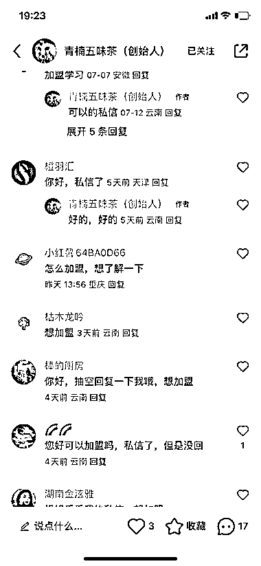
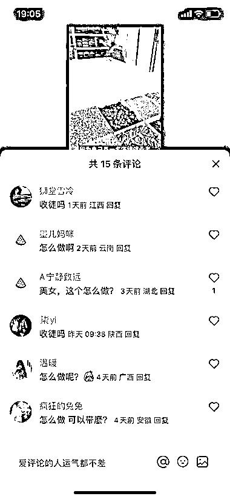
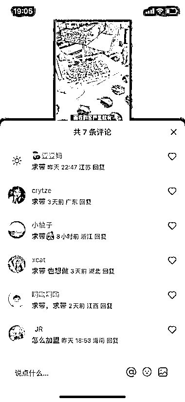

# 小红书养生食疗领域引发热潮，评论区涌现加盟热情

> 原文：[`www.yuque.com/for_lazy/xkrm14/mtqbm1znpd2dte35`](https://www.yuque.com/for_lazy/xkrm14/mtqbm1znpd2dte35)

作者： 摇啊摇，摇到

日期：2023-07-24

点赞数：76

正文：

小红书养生食疗领域这么热么，沾上中医食养的，评论区都是要加盟的

评论区：

饭饭 : 这种 很大部分是托，但是只需要精准引流两三个都不错

张小厨 : 市场确实存在，但是这样的评论毫无疑问托比较多，好比 35 人理财群，34 个是托；[捂脸]

一只鸵鸟 : 赞评

大梁 : 赞评

草木青｜灵魂核聚变版 : 啊哈哈哈

惠心 : 哇，我做养生赛道的，经常刷到她们的视频，但没想到还可以发到风向标[捂脸]

公众号懒人找资源，懒人专属群分享

