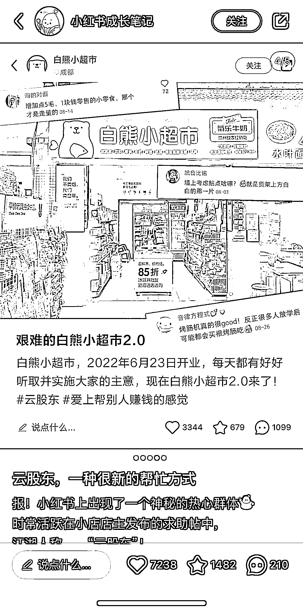

# 小红书上的云股东：记录实体店成长过程的新玩法

> 原文：[`www.yuque.com/for_lazy/xkrm14/ixm5zl5vxdn19rxz`](https://www.yuque.com/for_lazy/xkrm14/ixm5zl5vxdn19rxz)

作者： 炮爷（不睡觉）

日期：2023-07-26

点赞数：88

正文：

跟朋友聊，发现小红书上这种「云股东」还挺好玩的，养成系实体店。有种“热心网友”教我做生意，见证我的实体店的成长过程的感觉。 看了下，除了可以卖文创周边之外，后面往加盟方向去好像也是可行的。有个思路，小创业者也可以这么记录自己创业的过程，后面通过创业指导／商业咨询方面来变现，似乎也是可行的。

评论区：

九歌 : 有意思

Amy : 这可以 炮爷

公众号懒人找资源，懒人专属群分享

