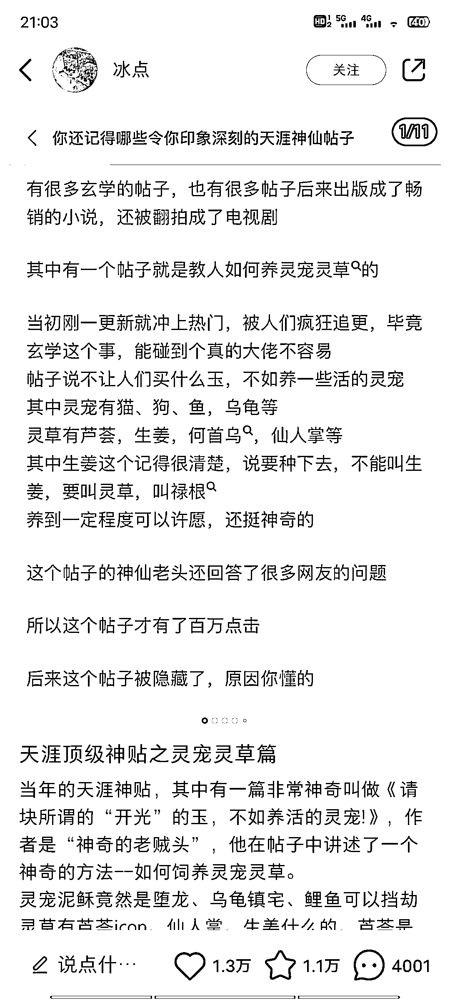

# 小红书笔记引爆热议，夸克网盘拉新链接成关键

> 原文：[`www.yuque.com/for_lazy/xkrm14/lpenlpf4mlcpitqh`](https://www.yuque.com/for_lazy/xkrm14/lpenlpf4mlcpitqh)

<ne-p id="ue64b7c9f" data-lake-id="ue64b7c9f"><ne-text id="u2be14fc3">作者： 肆零柒</ne-text></ne-p> <ne-p id="u561bac24" data-lake-id="u561bac24"><ne-text id="u7d94483c">日期：2023-07-24</ne-text></ne-p> <ne-p id="u398df7a6" data-lake-id="u398df7a6"><ne-text id="u16480a5e">点赞数：</ne-text><ne-text id="u5c5cd2a0" ne-bold="true">62</ne-text></ne-p> <ne-hole id="uf4d0556f" data-lake-id="uf4d0556f"><ne-card data-card-name="hr" data-card-type="block" id="d4bKH" data-event-boundary="card"><ne-p id="u826b8cb2" data-lake-id="u826b8cb2"><ne-text id="u452f7d06">正文：</ne-text></ne-p> <ne-p id="u9ba92598" data-lake-id="u9ba92598"><ne-text id="u0bdad67e">天涯神贴依旧很猛啊，看到一个小红书笔记三小时 1.3W 赞，配合夸克网盘拉新，最后一张笔记图直接放的夸克网盘拉新的链接</ne-text></ne-p> <ne-p id="u26fdb756" data-lake-id="u26fdb756"><ne-card data-card-name="image" data-card-type="inline" id="ssfIO" data-event-boundary="card"></ne-card></ne-p> <ne-p id="u03c74101" data-lake-id="u03c74101"><ne-card data-card-name="image" data-card-type="inline" id="zwNNe" data-event-boundary="card"></ne-card></ne-p> <ne-p id="uccaf3f38" data-lake-id="uccaf3f38"><ne-card data-card-name="image" data-card-type="inline" id="VZkET" data-event-boundary="card"></ne-card></ne-p> <ne-hole id="ue39adc6d" data-lake-id="ue39adc6d"><ne-card data-card-name="hr" data-card-type="block" id="N6Kot" data-event-boundary="card"><ne-p id="uf08e1f3d" data-lake-id="uf08e1f3d"><ne-text id="u15b5ee61">评论区：</ne-text></ne-p> <ne-p id="udadb8e31" data-lake-id="udadb8e31"><ne-text id="uc7d64e6d">肆零柒 : 感谢亦仁大大</ne-text></ne-p> <ne-hole id="uc05df8c5" data-lake-id="uc05df8c5"><ne-card data-card-name="hr" data-card-type="block" id="iHLi3" data-event-boundary="card"><ne-p id="ub84e2c54" data-lake-id="ub84e2c54"><ne-text id="uc34ed4c0">公众号懒人找资源，懒人专属群分享</ne-text></ne-p></ne-card></ne-hole></ne-card></ne-hole></ne-card></ne-hole>