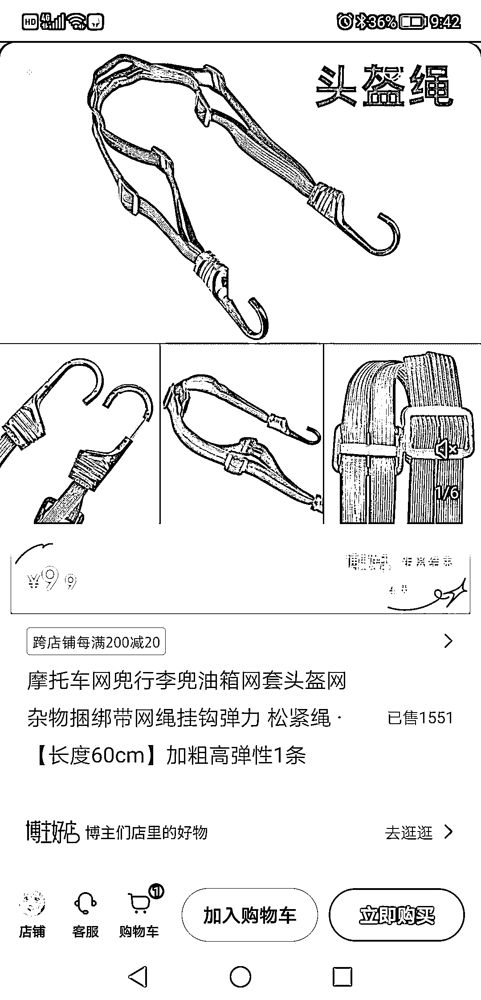
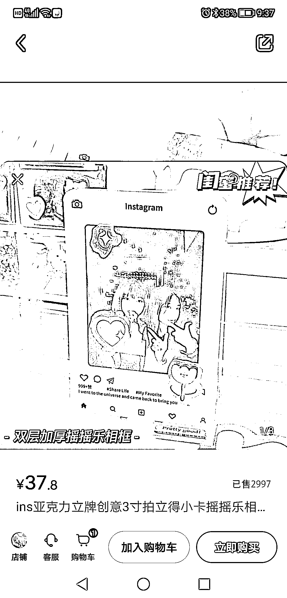
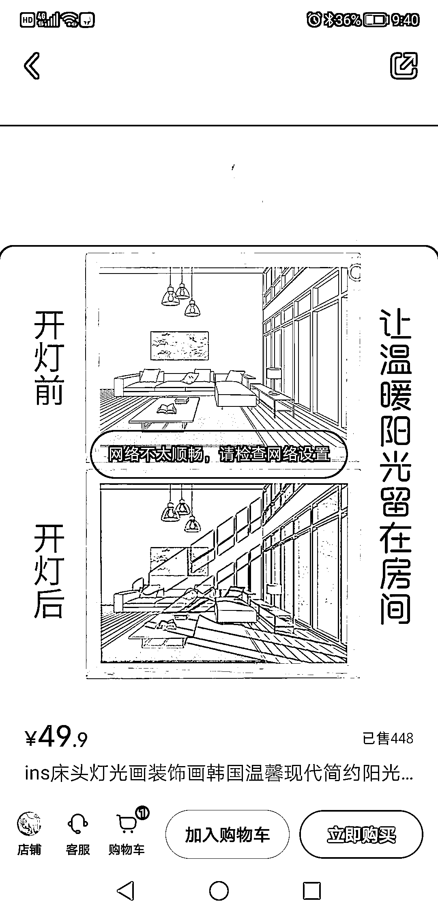
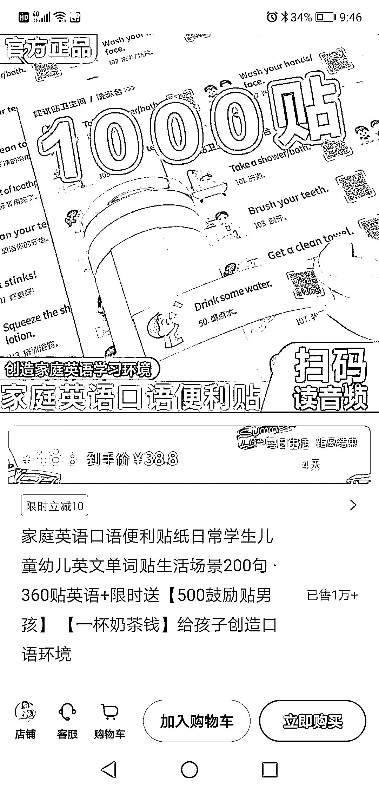
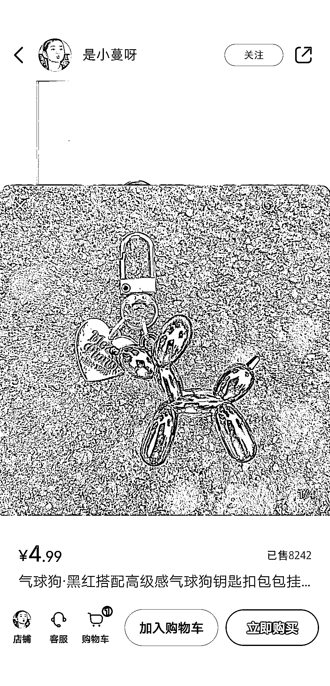
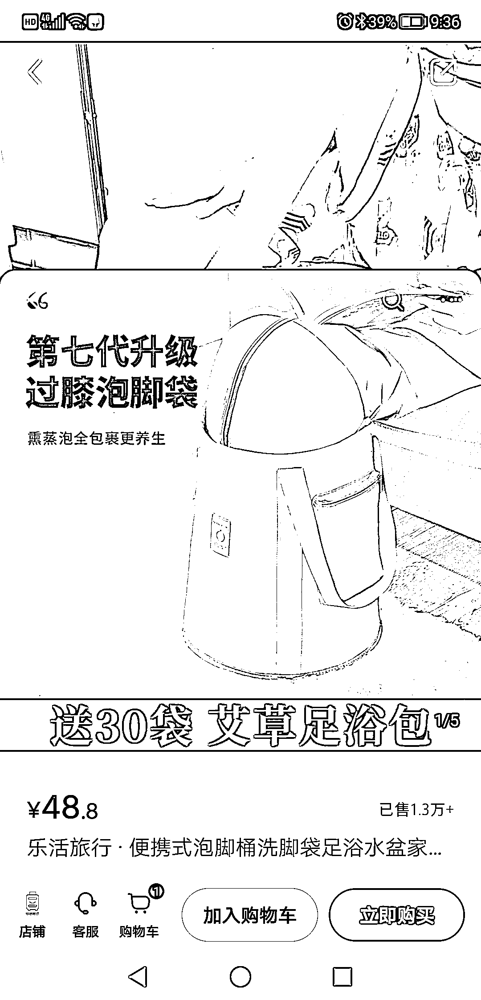

# 小红书电商的单品思维：选择热门或小众产品

> 原文：[`www.yuque.com/for_lazy/xkrm14/zam2gn5kqdn06pwl`](https://www.yuque.com/for_lazy/xkrm14/zam2gn5kqdn06pwl)

<ne-p id="u538d2637" data-lake-id="u538d2637"><ne-text id="u086d848f">作者： GS</ne-text></ne-p> <ne-p id="ua208c264" data-lake-id="ua208c264"><ne-text id="ud80f56f2">日期：2023-07-26</ne-text></ne-p> <ne-p id="ubf2dbc4f" data-lake-id="ubf2dbc4f"><ne-text id="ufffafce1">点赞数：</ne-text><ne-text id="ubc8ab394" ne-bold="true">75</ne-text></ne-p> <ne-hole id="u67e4e29b" data-lake-id="u67e4e29b"><ne-card data-card-name="hr" data-card-type="block" id="TaO6C" data-event-boundary="card"><ne-p id="u466df035" data-lake-id="u466df035"><ne-text id="ude513a1e">正文：</ne-text></ne-p> <ne-p id="uc22f6e61" data-lake-id="uc22f6e61"><ne-text id="u93212a82">做小红书电商，可以试试单品思维，筛选电商平台热门或小众销量还可以的产品，产品能解决用户某一个小需求。在小红书一个账号就做一个产品，持续输出视频或笔记（视频更容易转化），用量来提高爆款概率，一个视频爆了，就不断重复该视频模板。</ne-text> <ne-text id="u1b88e35d">原创产品更容易做爆，小红书用户对原创产品更愿意付费，产品利润空间也大，红利周期也长，别人模仿也要时间。如：小众挂件，饰品，手链手串。纯原创产品有点难度，伪原创也可以，主要是好看，可爱，特别。</ne-text></ne-p> <ne-p id="ud92c8f2c" data-lake-id="ud92c8f2c"><ne-card data-card-name="image" data-card-type="inline" id="coHSD" data-event-boundary="card"></ne-card></ne-p> <ne-p id="ud34d3262" data-lake-id="ud34d3262"><ne-card data-card-name="image" data-card-type="inline" id="VdzkU" data-event-boundary="card"></ne-card></ne-p> <ne-p id="uf8f8f96f" data-lake-id="uf8f8f96f"><ne-card data-card-name="image" data-card-type="inline" id="cMsEx" data-event-boundary="card"></ne-card></ne-p> <ne-p id="ub43ed078" data-lake-id="ub43ed078"><ne-card data-card-name="image" data-card-type="inline" id="WbFap" data-event-boundary="card"></ne-card></ne-p> <ne-p id="u2f0643ca" data-lake-id="u2f0643ca"><ne-card data-card-name="image" data-card-type="inline" id="v4ZGG" data-event-boundary="card"></ne-card></ne-p> <ne-p id="u4bab9263" data-lake-id="u4bab9263"><ne-card data-card-name="image" data-card-type="inline" id="IF47V" data-event-boundary="card"></ne-card></ne-p> <ne-p id="uf145dbe6" data-lake-id="uf145dbe6"><ne-card data-card-name="image" data-card-type="inline" id="UefjZ" data-event-boundary="card"></ne-card></ne-p> <ne-hole id="u3681e1b2" data-lake-id="u3681e1b2"><ne-card data-card-name="hr" data-card-type="block" id="aW5ZO" data-event-boundary="card"><ne-p id="ua7a28cae" data-lake-id="ua7a28cae"><ne-text id="u5ec1213d">评论区：</ne-text></ne-p> <ne-p id="u540de28d" data-lake-id="u540de28d"><ne-text id="ue3a09660">FF_23531 : 这个卖洗脚袋的我关了的，是那个小学老师吧？2 万粉了，她其他养生用品都是几万销量。但是她是做珍珠饰品的😂也卖的很好</ne-text></ne-p> <ne-p id="uba5b2417" data-lake-id="uba5b2417"><ne-text id="u511f0057">GS : 不少闷声赚钱的，销量也夸张</ne-text></ne-p> <ne-p id="u48afca55" data-lake-id="u48afca55"><ne-text id="u4d214055">安俊 : 不懂就问，什么叫原创产品[发呆]</ne-text></ne-p> <ne-p id="u6410e9a7" data-lake-id="u6410e9a7"><ne-text id="udf4d4faf">草木青｜灵魂核聚变版 : 说的应该是发的小红书帖子，或者视频，做二创，去重。</ne-text></ne-p> <ne-p id="ud8d2dbbb" data-lake-id="ud8d2dbbb"><ne-text id="ubfd27cde">哆米科技 : 应该是 diy 之类的，自己设计出来的原创产品</ne-text></ne-p> <ne-p id="u58a43163" data-lake-id="u58a43163"><ne-text id="u0e09222e">哆米科技 : 应该是 diy 之类的，自己设计出来的原创产品</ne-text></ne-p> <ne-p id="uad6e9da3" data-lake-id="uad6e9da3"><ne-text id="u47ea8720">草木青｜灵魂核聚变版 : 也许是的，哈哈哈哈哈</ne-text></ne-p> <ne-hole id="u07c56e4b" data-lake-id="u07c56e4b"><ne-card data-card-name="hr" data-card-type="block" id="fAgV4" data-event-boundary="card"><ne-p id="ud5411508" data-lake-id="ud5411508"><ne-text id="u99dbe218">公众号懒人找资源，懒人专属群分享</ne-text></ne-p></ne-card></ne-hole></ne-card></ne-hole></ne-card></ne-hole>