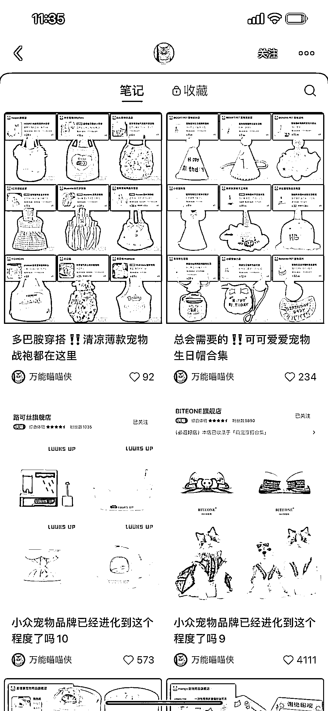
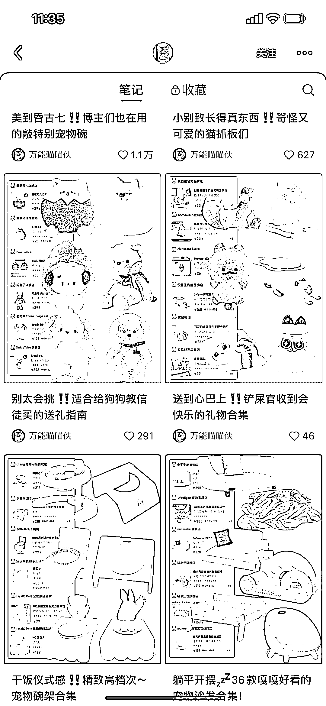

# 小红书宠物号的简单粗暴抠图带货技巧

> 原文：[`www.yuque.com/for_lazy/xkrm14/szqknpm6n6nihghk`](https://www.yuque.com/for_lazy/xkrm14/szqknpm6n6nihghk)

<ne-p id="u2d1f8fbb" data-lake-id="u2d1f8fbb"><ne-text id="u8d0b1e90">作者： W.</ne-text></ne-p> <ne-p id="u2dec2e47" data-lake-id="u2dec2e47"><ne-text id="u78a4c331">日期：2023-07-24</ne-text></ne-p> <ne-p id="u93dc0aa1" data-lake-id="u93dc0aa1"><ne-text id="u8cce32a7">点赞数：</ne-text><ne-text id="u6f979760" ne-bold="true">55</ne-text></ne-p> <ne-hole id="u157ebb88" data-lake-id="u157ebb88"><ne-card data-card-name="hr" data-card-type="block" id="F97rN" data-event-boundary="card"><ne-p id="u9ec1e551" data-lake-id="u9ec1e551"><ne-text id="u53e894d3">正文：</ne-text></ne-p> <ne-p id="u6b603ef8" data-lake-id="u6b603ef8"><ne-text id="ud01b258f">宠物号的抠图带货 制作方式简单粗暴，可批量出图 适用于别的类目别的品</ne-text></ne-p> <ne-p id="ud564005c" data-lake-id="ud564005c"><ne-card data-card-name="image" data-card-type="inline" id="wLkT9" data-event-boundary="card"></ne-card></ne-p> <ne-p id="ubb9f821b" data-lake-id="ubb9f821b"><ne-card data-card-name="image" data-card-type="inline" id="gWcH0" data-event-boundary="card"></ne-card></ne-p> <ne-p id="u9c25c3ff" data-lake-id="u9c25c3ff"><ne-card data-card-name="image" data-card-type="inline" id="pHI0C" data-event-boundary="card"></ne-card></ne-p> <ne-hole id="ubc0adff0" data-lake-id="ubc0adff0"><ne-card data-card-name="hr" data-card-type="block" id="mtoIh" data-event-boundary="card"><ne-p id="u37f4f7c4" data-lake-id="u37f4f7c4"><ne-text id="uc02eb620">评论区：</ne-text></ne-p> <ne-p id="u3397bf84" data-lake-id="u3397bf84"><ne-text id="u0aa8bc36">叁斤 : 这个类型我测过了，大约到 5000 小眼睛时，很容易触发风控而对单篇笔记限流</ne-text></ne-p> <ne-hole id="u3ae3b595" data-lake-id="u3ae3b595"><ne-card data-card-name="hr" data-card-type="block" id="TkblX" data-event-boundary="card"><ne-p id="u9a2632ab" data-lake-id="u9a2632ab"><ne-text id="u615568ab">公众号懒人找资源，懒人专属群分享</ne-text></ne-p></ne-card></ne-hole></ne-card></ne-hole></ne-card></ne-hole>