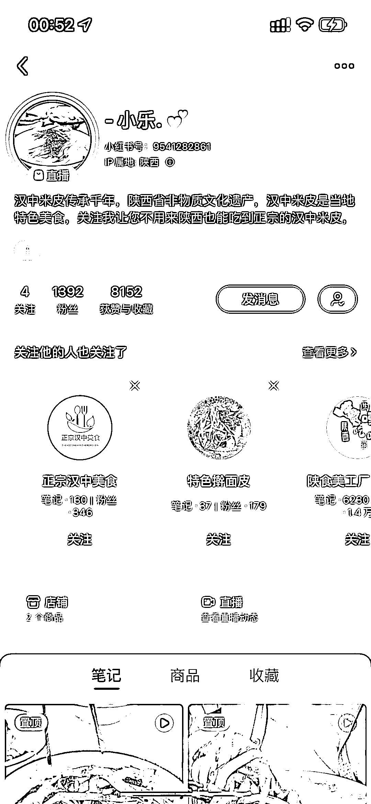
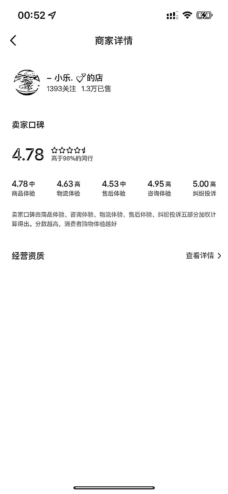

# 小红书特产美食账号卖出 1.3 万单，备受关注

> 原文：[`www.yuque.com/for_lazy/xkrm14/dzga80y09oh681xx`](https://www.yuque.com/for_lazy/xkrm14/dzga80y09oh681xx)

<ne-p id="u56f20b5b" data-lake-id="u56f20b5b"><ne-text id="uff9608e7">作者： 冰雨幻天</ne-text></ne-p> <ne-p id="u8ba4cd82" data-lake-id="u8ba4cd82"><ne-text id="u977538fc">日期：2023-07-28</ne-text></ne-p> <ne-p id="u6e6f4599" data-lake-id="u6e6f4599"><ne-text id="u6ee7aaf2">点赞数：</ne-text><ne-text id="u625ba502" ne-bold="true">73</ne-text></ne-p> <ne-hole id="ub6afb60f" data-lake-id="ub6afb60f"><ne-card data-card-name="hr" data-card-type="block" id="pHIh0" data-event-boundary="card"><ne-p id="u37d4bece" data-lake-id="u37d4bece"><ne-text id="ue46144a6">正文：</ne-text></ne-p> <ne-p id="u60c6661f" data-lake-id="u60c6661f"><ne-text id="uec7e6e8c">小红书做特产美食方面，1300 个粉丝，卖了 1.3 万单了</ne-text><ne-text id="u3915ae56" ne-sub="true">无人直播也看的人问的人特别多，做特产美食可能是一个很不错的方向</ne-text></ne-p> <ne-p id="ubb6302a2" data-lake-id="ubb6302a2"><ne-card data-card-name="image" data-card-type="inline" id="A0P4R" data-event-boundary="card"></ne-card></ne-p> <ne-p id="ua0d91098" data-lake-id="ua0d91098"><ne-card data-card-name="image" data-card-type="inline" id="ucWBo" data-event-boundary="card"></ne-card></ne-p> <ne-p id="ub5d4e587" data-lake-id="ub5d4e587"><ne-card data-card-name="image" data-card-type="inline" id="lBNBR" data-event-boundary="card"></ne-card></ne-p> <ne-hole id="uffc16e94" data-lake-id="uffc16e94"><ne-card data-card-name="hr" data-card-type="block" id="gtNm7" data-event-boundary="card"><ne-p id="u20fd961d" data-lake-id="u20fd961d"><ne-text id="ue0072982">评论区：</ne-text></ne-p> <ne-hole id="u321f3b8b" data-lake-id="u321f3b8b"><ne-card data-card-name="hr" data-card-type="block" id="lJt98" data-event-boundary="card"><ne-p id="u8f2366dd" data-lake-id="u8f2366dd"><ne-text id="uba44f6c7">公众号懒人找资源，懒人专属群分享</ne-text></ne-p></ne-card></ne-hole></ne-card></ne-hole></ne-card></ne-hole>