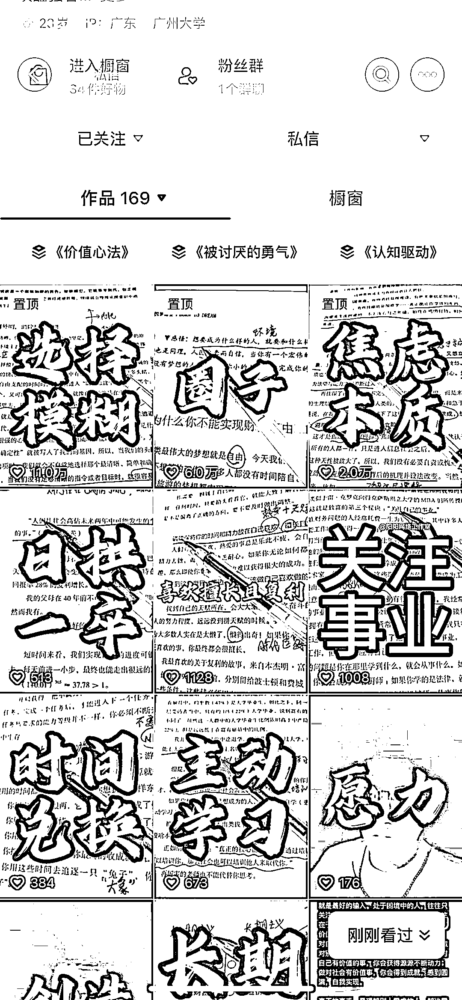

# 抖音上的读书账号吸引创业粉丝，橱窗卖书是不错的选择

> 原文：[`www.yuque.com/for_lazy/xkrm14/yvdgvsxf410k3qqi`](https://www.yuque.com/for_lazy/xkrm14/yvdgvsxf410k3qqi)

<ne-text id="u2443ca56">作者： 梦宸</ne-text>

<ne-text id="uda3a7569">日期：2023-07-24</ne-text>

<ne-text id="ub81203f2">点赞数：</ne-text><ne-text id="uf5705d07" ne-bold="true">89</ne-text>

<ne-hole id="u6d1f6a22" data-lake-id="u6d1f6a22"><ne-card data-card-name="hr" data-card-type="block" id="pTXHO" data-event-boundary="card">

<ne-text id="ub825e0fa">正文：</ne-text>

<ne-text id="ud06f311e">在抖音上这种读书账号流量很大，不单纯的照读认知性书籍的内容，也会讲解自己的思考，流量很大 引流过来的人群差不多都是创业粉，去橱窗卖书也是一种不错的选择</ne-text>

<ne-card data-card-name="image" data-card-type="inline" id="DTEej" data-event-boundary="card"></ne-card>

<ne-card data-card-name="image" data-card-type="inline" id="KlOjJ" data-event-boundary="card"></ne-card>

<ne-hole id="u4b9877ce" data-lake-id="u4b9877ce"><ne-card data-card-name="hr" data-card-type="block" id="QahEH" data-event-boundary="card">

<ne-text id="u9f2afe52">评论区：</ne-text>

<ne-text id="ua6effb71">王一焱 : 看了一下 带货能力很一般</ne-text>

<ne-hole id="u04ea5738" data-lake-id="u04ea5738"><ne-card data-card-name="hr" data-card-type="block" id="RWVLh" data-event-boundary="card">

<ne-text id="u4f1f5789">公众号懒人找资源，懒人专属群分享</ne-text>

</ne-card></ne-hole></ne-card></ne-hole></ne-card></ne-hole>