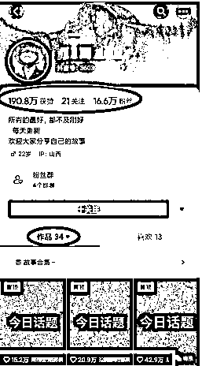

# 抖音今日话题：搬运知乎高赞回答，获取流量变现的新项目

> 原文：[`www.yuque.com/for_lazy/xkrm14/qwicwk3soaobgqi1`](https://www.yuque.com/for_lazy/xkrm14/qwicwk3soaobgqi1)

作者： 蓝色眼镜

日期：2023-07-26

点赞数：91

正文：

这应该是最近刚火起来的项目，就是“抖音今日话题” 直接搬运知乎的高赞回答，把原来是图文形式的文案制作 成视频发布到抖音上，获取流量变现 这种话题可以有很多，时事，情感类，知识类，娱乐类等等，只要选的话题让人有参与感， 能让用户产生共鸣，都会发表自己的看法以及评论 大致流程： 1 从知乎找近期热点或潜力问题，找高赞答案 2 把找到的文字直接截图，并把文字用配音软件转换成配音 变现 1.中视频计划 2.橱窗带货 3.收徒变现

评论区：

... : 信徒变现是啥

蓝色眼镜 : 收徒，笔误

张红月 : 中视频计划审核过不了 非原创

蓝色眼镜 : 有没一种可能，低成本改成原创呢 : >

安慕希姓安（大学生资* : 这个号我在某人的朋友圈好像见过，他们团队的

海阔天空 : 他这种视频是怎么做的 是剪映里的图文成片吗

蓝色眼镜 : 可以，然后不合适的，用自己的素材替换

公众号懒人找资源，懒人专属群分享

