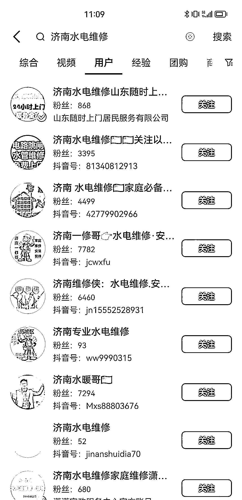

# 抖音本地同城上门维修，纯中介模式，利润可观

> 原文：[`www.yuque.com/for_lazy/xkrm14/rlr76itqafqwcx1h`](https://www.yuque.com/for_lazy/xkrm14/rlr76itqafqwcx1h)

<ne-p id="ua1ac750b" data-lake-id="ua1ac750b"><ne-text id="uce1ecd06">作者： 追风少年-付费投流</ne-text></ne-p> <ne-p id="u265ade8c" data-lake-id="u265ade8c"><ne-text id="u2b0e6662">日期：2023-07-24</ne-text></ne-p> <ne-p id="u36954243" data-lake-id="u36954243"><ne-text id="ufb9f933d">点赞数：</ne-text><ne-text id="u86872f25" ne-bold="true">71</ne-text></ne-p> <ne-hole id="u51c147c1" data-lake-id="u51c147c1"><ne-card data-card-name="hr" data-card-type="block" id="CpPYW" data-event-boundary="card"><ne-p id="u6527461d" data-lake-id="u6527461d"><ne-text id="u33029929">正文：</ne-text></ne-p> <ne-p id="u022457cd" data-lake-id="u022457cd"><ne-text id="u0fae854f">【抖音本地同城上门维修，SEO 免费流量，纯中介，客户派对给就近师傅】</ne-text> <ne-text id="ub7bcfad8">抖音上本地同城服务，这个排名第一的账号，目前每月营业额利润 10 万,纯中介对接给师傅,按模式倒推，同城上门家政服务，特别是针对师傅上门维修类型，类似搬家，开锁，家电，水电维修，电路维修，防水补漏等</ne-text> <ne-text id="u5c97f964">案例账号的短视频如图，看起来就像好物视频混剪模式，让我想起了圈友分享的批量混剪好物视频的 轻资产，纯中介，抖音免费流量池，只需要矩阵账号</ne-text> <ne-text id="uee4c4f55">正在和朋友沟通和筹备，准备一试 对这方面有了解和兴趣的，欢迎评论区一起交流讨论</ne-text></ne-p> <ne-p id="u651bed2a" data-lake-id="u651bed2a"><ne-card data-card-name="image" data-card-type="inline" id="QxoEz" data-event-boundary="card"></ne-card></ne-p> <ne-p id="u308e8a41" data-lake-id="u308e8a41"><ne-card data-card-name="image" data-card-type="inline" id="hKa67" data-event-boundary="card"></ne-card></ne-p> <ne-hole id="u57fc31e0" data-lake-id="u57fc31e0"><ne-card data-card-name="hr" data-card-type="block" id="xL4ge" data-event-boundary="card"><ne-p id="ud13b4258" data-lake-id="ud13b4258"><ne-text id="u1a588d96">评论区：</ne-text></ne-p> <ne-p id="u7da2007e" data-lake-id="u7da2007e"><ne-text id="ud764dbf2">微醺 : 怎么解决收费问题，售后问题和复购问题呢</ne-text></ne-p> <ne-p id="ub1c53659" data-lake-id="ub1c53659"><ne-text id="ucd709793">lydia : 怎么找供应链？美团？</ne-text></ne-p> <ne-p id="uea31e73a" data-lake-id="uea31e73a"><ne-text id="u81eb8710">芷蓝 : 这个其实可以自己直接在抖音上完成用户下单，抖音云家政</ne-text></ne-p> <ne-p id="udc247a23" data-lake-id="udc247a23"><ne-text id="u4f05a50c">追风少年-付费投流 : 需要整合本地同城师傅资源</ne-text></ne-p> <ne-p id="ue32e8e06" data-lake-id="ue32e8e06"><ne-text id="ucabf0048">追风少年-付费投流 : 58 上拓展整合师傅</ne-text></ne-p> <ne-p id="ud2d85a0f" data-lake-id="ud2d85a0f"><ne-text id="u1cd88602">流年 : 我做了一个月，说下感受，难点在后端，包括几个河南做的大的，获客很容易 一天 10 来个电话</ne-text></ne-p> <ne-p id="u2478d245" data-lake-id="u2478d245"><ne-text id="u4d2322dc">追风少年-付费投流 : 谢谢兄弟分享，获客容易有流量，难点就是在于如何整合更多的维修师傅和整个服务流程的时效，效果和口碑评价吗？</ne-text></ne-p> <ne-hole id="u1f8b3c78" data-lake-id="u1f8b3c78"><ne-card data-card-name="hr" data-card-type="block" id="lyScE" data-event-boundary="card"><ne-p id="udcbe5557" data-lake-id="udcbe5557"><ne-text id="u1d8e84a2">公众号懒人找资源，懒人专属群分享</ne-text></ne-p></ne-card></ne-hole></ne-card></ne-hole></ne-card></ne-hole>