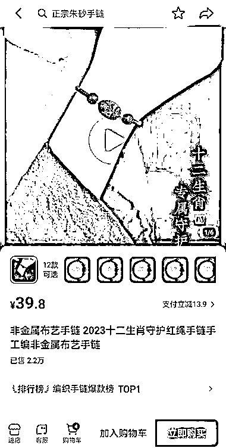

# 抖音爆款手链销量高，变现方式多样化

> 原文：[`www.yuque.com/for_lazy/xkrm14/ir6c679gc33ze4f7`](https://www.yuque.com/for_lazy/xkrm14/ir6c679gc33ze4f7)

<ne-text id="u4426ea94">作者： 流年</ne-text>

<ne-text id="ubce69aa8">日期：2023-07-26</ne-text>

<ne-text id="u78a3bea8">点赞数：</ne-text><ne-text id="u3f933099" ne-bold="true">62</ne-text>

<ne-hole id="uee63af25" data-lake-id="uee63af25"><ne-card data-card-name="hr" data-card-type="block" id="am3xG" data-event-boundary="card">

<ne-text id="u0f1f27cb">正文：</ne-text>

<ne-text id="u205c94b4">抖音有个账号为小陈在灵隐虔诚代请，该橱窗有一款非金属布艺手链，单价为 39.8 元，销量在 2.2 万件，这款手链在抖音属于爆款。</ne-text> <ne-text id="uff11b524">还有一款非金属布艺手链，单价为 19.9 元，销量有 4.7 万件。橱窗的大部分手串、手链来自多个店铺，可能和店铺有合作，帮助销售产品。 手链、手串的变现方式：</ne-text> <ne-text id="u34ed62c8">1.目前正值暑假，景区游客较多，在抖音寺庙直播杭州景区现场，卖手链、手串。 2.没有店铺的情况下，线下摆摊和直播同步卖手链、手串。</ne-text>

<ne-card data-card-name="image" data-card-type="inline" id="asZb7" data-event-boundary="card"></ne-card>

<ne-card data-card-name="image" data-card-type="inline" id="NyrTF" data-event-boundary="card"></ne-card>

<ne-card data-card-name="image" data-card-type="inline" id="oqkAG" data-event-boundary="card"></ne-card>

<ne-hole id="u3c569add" data-lake-id="u3c569add"><ne-card data-card-name="hr" data-card-type="block" id="gvcTe" data-event-boundary="card">

<ne-text id="u1c2450f5">评论区：</ne-text>

<ne-text id="u593182cb">阿凯 : 不仅仅灵隐寺。香积寺，里头做直播的，差不多十几个人。</ne-text>

<ne-hole id="u89fc6b5a" data-lake-id="u89fc6b5a"><ne-card data-card-name="hr" data-card-type="block" id="xtBf2" data-event-boundary="card">

<ne-text id="ud92b846c">公众号懒人找资源，懒人专属群分享</ne-text>

</ne-card></ne-hole></ne-card></ne-hole></ne-card></ne-hole>