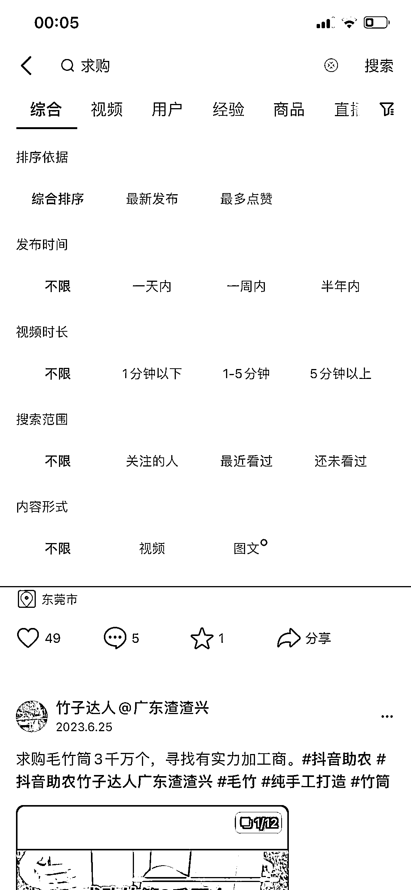

# 抖音搜索“求购”，发现伊朗二手笔记本市场需求大

> 原文：[`www.yuque.com/for_lazy/xkrm14/clq4zawgpughp5s7`](https://www.yuque.com/for_lazy/xkrm14/clq4zawgpughp5s7)

<ne-text id="u93820305">作者： 史提芬周</ne-text>

<ne-text id="u38b59ff8">日期：2023-07-26</ne-text>

<ne-text id="u8f13b19a">点赞数：</ne-text><ne-text id="ue5b7fd2a" ne-bold="true">131</ne-text>

<ne-hole id="ubeb827e8" data-lake-id="ubeb827e8"><ne-card data-card-name="hr" data-card-type="block" id="ewmP8" data-event-boundary="card">

<ne-text id="u95047c4c">正文：</ne-text>

<ne-text id="u1e2f6ce5">在抖音搜索“求购”，搜最新的排序，每一条的排查下去，会找到很多真正的刚性需求，做生意本质就是低买高卖，知道需求，就可以满足需求，甚至深挖，我从中找到一个很有价值的行业信息，“在伊朗卖二手笔记本”，因为伊朗长期受美国制裁所以进口成本高，发展过程中需要多样性二手笔记本，需求比较大，我就是搜索求购挖掘的高价值线索。</ne-text>

<ne-card data-card-name="image" data-card-type="inline" id="UYlxm" data-event-boundary="card"></ne-card>

<ne-card data-card-name="image" data-card-type="inline" id="XgZg7" data-event-boundary="card"></ne-card>

<ne-hole id="udc0c7f8c" data-lake-id="udc0c7f8c"><ne-card data-card-name="hr" data-card-type="block" id="P3J0j" data-event-boundary="card">

<ne-text id="ufd1c1249">评论区：</ne-text>

<ne-text id="u734b5a49">胖大魔 : 又学一招</ne-text>

<ne-text id="ucc32f0ab">老虎🐯 : 可以</ne-text>

<ne-text id="u5642a3b6">希平 : 谢谢你</ne-text>

<ne-text id="ueba59fc5">周宇 : 学到了</ne-text>

<ne-text id="u987136c5">九歌 : 学到了</ne-text>

<ne-text id="u41eef6fd">倪大胖 : 赞，咸鱼的求购帖子也很多</ne-text>

<ne-text id="uc38bb76c">肥仔梁 : 再加一个 出售</ne-text>

<ne-hole id="u94b4987f" data-lake-id="u94b4987f"><ne-card data-card-name="hr" data-card-type="block" id="q6O6K" data-event-boundary="card">

<ne-text id="u9a3f4792">公众号懒人找资源，懒人专属群分享</ne-text>

</ne-card></ne-hole></ne-card></ne-hole></ne-card></ne-hole>