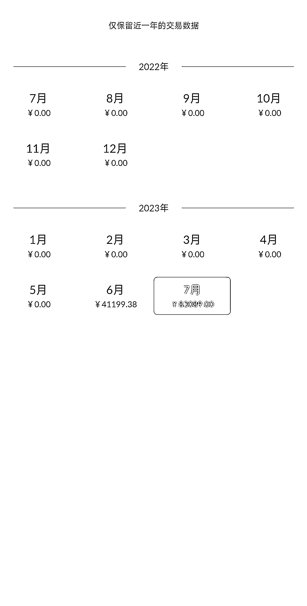
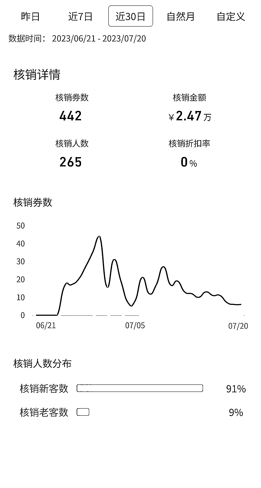

# 二线城市周边县区暑期小商场萌宠乐园店，一个月轻松实现十五万营业额

> 原文：[`www.yuque.com/for_lazy/xkrm14/brn7xhdvth80gdtg`](https://www.yuque.com/for_lazy/xkrm14/brn7xhdvth80gdtg)

作者： 辛禾

日期：2023-07-26

点赞数：87

<ne-hole id="u1c7b9f23" data-lake-id="u1c7b9f23"><ne-card data-card-name="hr" data-card-type="block" id="aSrSf" data-event-boundary="card">

正文：

二线城市周边县区暑期小商场萌宠乐园店当了一个月店长，小成本投资，预估一个月回本，线下收钱吧收款十二万多，抖音核销 2 万多，再加上部分现金收款，十五万营业额还比较轻松

<ne-card data-card-name="image" data-card-type="inline" id="eUQnC" data-event-boundary="card"></ne-card>

<ne-card data-card-name="image" data-card-type="inline" id="JBPGu" data-event-boundary="card"></ne-card>

<ne-card data-card-name="image" data-card-type="inline" id="ePBR6" data-event-boundary="card"></ne-card>

<ne-hole id="udf99a2cc" data-lake-id="udf99a2cc"><ne-card data-card-name="hr" data-card-type="block" id="PKAS7" data-event-boundary="card">

评论区：

张睿韬 Rt12 : 请问大佬，这种收益主要来源于宠物售卖吗，还是哪方面。货源成本怎么样。感谢大佬🙏

辛禾 : 门票收益，成本可控的哦，主要是动物，家具成本

上山打老虎🐯 : 无形成本大的吓人，做商城生意做好一年不能回本的打算

张睿韬 Rt12 : Get 感谢大佬回复

辛禾 : 打工人不成大佬，有兴趣可以多交流[憨笑]

辛禾 : 嗯嗯，

张睿韬 Rt12 : 多多交流，咱方便加个微信沟通吗圈友

<ne-hole id="u6f90f72f" data-lake-id="u6f90f72f"><ne-card data-card-name="hr" data-card-type="block" id="S7KwI" data-event-boundary="card">

公众号懒人找资源，懒人专属群分享

</ne-card></ne-hole></ne-card></ne-hole></ne-card></ne-hole>