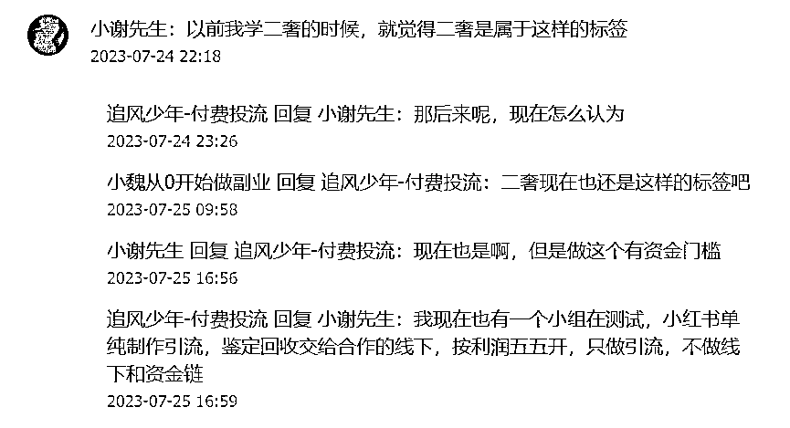
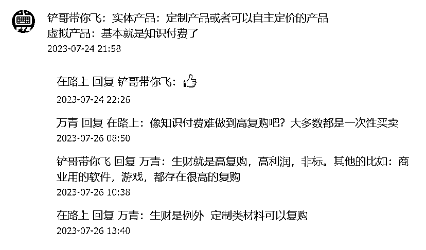
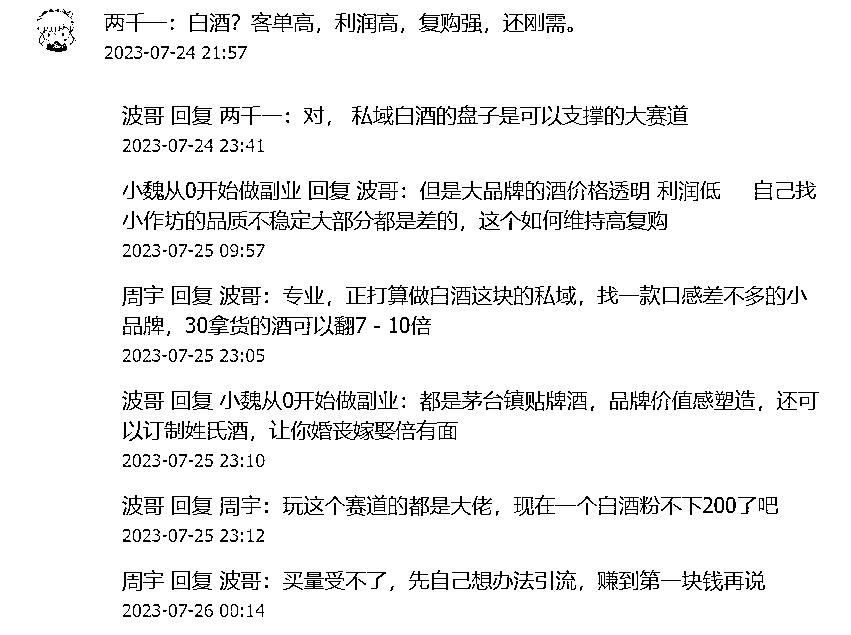
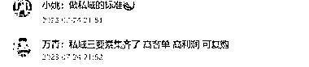
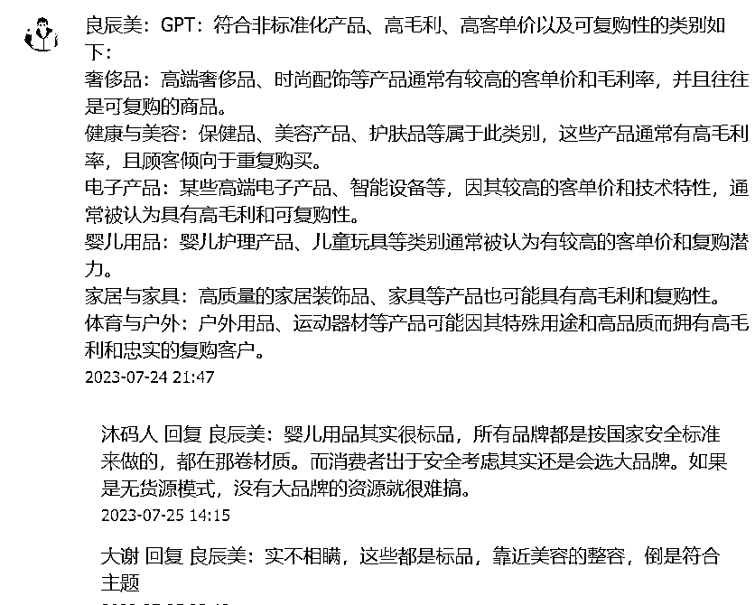

# 圈友讨论：什么是非标品？

> 原文：[`www.yuque.com/for_lazy/xkrm14/qfabf6ghtgt69ux7`](https://www.yuque.com/for_lazy/xkrm14/qfabf6ghtgt69ux7)

作者： 篮子🍀

日期：2023-07-27

点赞数：72

<ne-hole id="u26e81006" data-lake-id="u26e81006">

正文：

亦仁分享的 9 位数认知“不做标品”下面圈友的讨论，基本围绕什么是非标品展开。这个有四个标准：非标品、高毛利、高单价、复购。 圈友分享的有：GPT 分析、私域、私域白酒、知识付费、二手奢侈品、闲鱼做非标品、母婴领域、流量…等等 我感觉短剧 CPS 也算诶，虽然不满足高单价，但是其他三个以及流量渠道是比较稳定的。不过就是我搞不来流量…

  <ne-p id="uf8c14ad6" data-lake-id="uf8c14ad6">  <ne-p id="u9bf6166a" data-lake-id="u9bf6166a">  <ne-p id="ua083f0df" data-lake-id="ua083f0df">  <ne-p id="u8cf4e53b" data-lake-id="u8cf4e53b">  <ne-p id="u20a5c6ed" data-lake-id="u20a5c6ed">  <ne-p id="u16fe0956" data-lake-id="u16fe0956">  <ne-p id="u87f7fc01" data-lake-id="u87f7fc01">  <ne-p id="u5cefcc84" data-lake-id="u5cefcc84">

<ne-hole id="u70cc0b32" data-lake-id="u70cc0b32">

评论区：

篮子🍀 : 哇🎉

<ne-hole id="ufca45d08" data-lake-id="ufca45d08">

公众号懒人找资源，懒人专属群分享

</ne-hole></ne-hole></ne-p></ne-p></ne-p></ne-p></ne-p></ne-p></ne-p></ne-p></ne-hole>