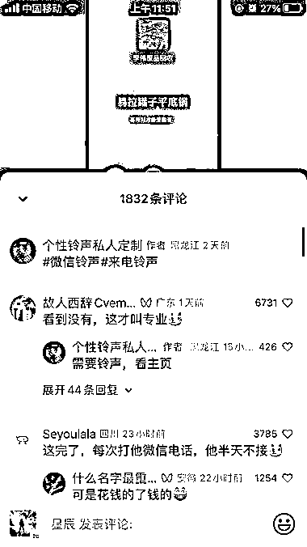
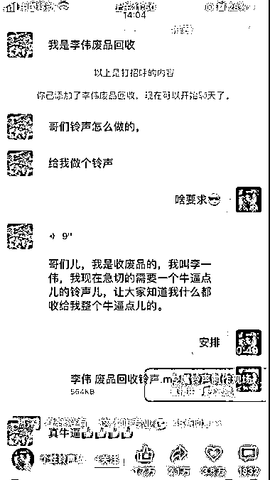
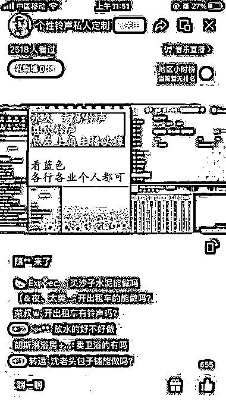

# 定制微信铃声，将广告融入铃声中，引发大量讨论和转发

> 原文：[`www.yuque.com/for_lazy/xkrm14/wkmpxe2ggsn5e3y7`](https://www.yuque.com/for_lazy/xkrm14/wkmpxe2ggsn5e3y7)

作者： 星辰

日期：2023-07-27

点赞数：94

正文：

刷视频号刷到这个，听得笑死。专门给人定制微信铃声，来电铃声，可以把你平常做的生意广告融入到铃声中，非常洗脑。 这个账号每一个短视频播放量都很大，因为铃声真的很有意思，朗朗上口，所以也非常容易引发大量的讨论，再加上音乐都很有喜感，所以特别容易引起转发[偷笑][偷笑]……然后开直播间现场展示铃声制作……私域成交 顺便说一句，刚开始我以为他这个创作音乐很复杂，但是我听了好几个才发现，他的音乐都是同一个，只是每次把歌词给换了。所以，制作成本应该不是特别高。

  

评论区：

中国融 Sky（国学国* : 短视频时代的彩铃

徐同学 : 这个好像发过

星辰 : 是嘛？我不知道啊，我自己刷到的

热心网友大表哥 : 5.15 我发过一个风向标，就是这个博主[偷笑]

星辰 : 原来如此

公众号懒人找资源，懒人专属群分享

