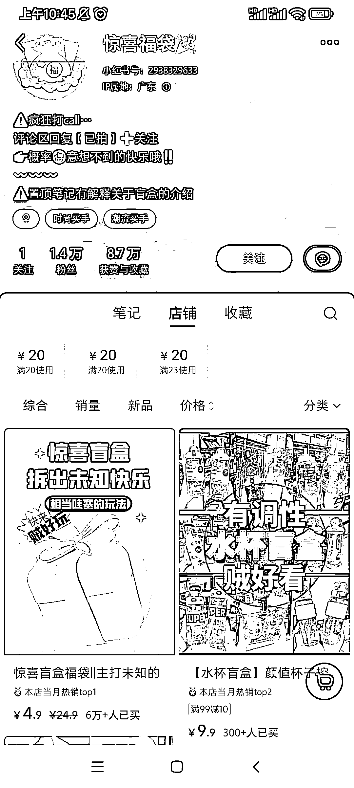

# 博主通过惊喜福袋创造了高销量和粉丝数量

> 原文：[`www.yuque.com/for_lazy/xkrm14/rvyo5gyb827iz12r`](https://www.yuque.com/for_lazy/xkrm14/rvyo5gyb827iz12r)

<ne-p id="u8585d726" data-lake-id="u8585d726"><ne-text id="u9b8aec37">作者： 转下脖子</ne-text></ne-p> <ne-p id="ube61a0fc" data-lake-id="ube61a0fc"><ne-text id="u74eab21b">日期：2023-07-25</ne-text></ne-p> <ne-p id="u5d4776f1" data-lake-id="u5d4776f1"><ne-text id="u07285a30">点赞数：</ne-text><ne-text id="uea974052" ne-bold="true">77</ne-text></ne-p> <ne-hole id="ufbd81e20" data-lake-id="ufbd81e20"><ne-card data-card-name="hr" data-card-type="block" id="ksdlJ" data-event-boundary="card"><ne-p id="u0642e796" data-lake-id="u0642e796"><ne-text id="u15cf31de">正文：</ne-text></ne-p> <ne-p id="u25df6e25" data-lake-id="u25df6e25"><ne-text id="u6328ac8b">博主：惊喜福袋 销量：6w+ 粉丝：1.4w 销售额：30w+ 商品：惊喜盲盒福袋|主打未知的</ne-text> <ne-text id="ue5e93fd3">账号今年 3 月份开始发笔记，每天发布的笔记数量 10 篇左右，每一篇的形式都是与客户的聊天记录，记录客户的盲盒商品以及顾客的反应。主打一个销售未知的惊喜，可以把这套玩法用在其他商品领域，笔记内容介绍售卖的商品类型，唯一售品就是盲盒。</ne-text></ne-p> <ne-p id="u2fb0bd67" data-lake-id="u2fb0bd67"><ne-card data-card-name="image" data-card-type="inline" id="PcdNL" data-event-boundary="card"></ne-card></ne-p> <ne-p id="u0afdeda4" data-lake-id="u0afdeda4"><ne-card data-card-name="image" data-card-type="inline" id="b2bU0" data-event-boundary="card"></ne-card></ne-p> <ne-hole id="ud534f9a4" data-lake-id="ud534f9a4"><ne-card data-card-name="hr" data-card-type="block" id="UXIbL" data-event-boundary="card"><ne-p id="u6be1edbf" data-lake-id="u6be1edbf"><ne-text id="u793e9d6d">评论区：</ne-text></ne-p> <ne-p id="u0a24c0c6" data-lake-id="u0a24c0c6"><ne-text id="u7f172ff9">豆豆 : 哈哈哈，这个可以，前期没客源的话还可以自己找人伪装下</ne-text></ne-p> <ne-hole id="ubc6b13f6" data-lake-id="ubc6b13f6"><ne-card data-card-name="hr" data-card-type="block" id="PFjkX" data-event-boundary="card"><ne-p id="ub1ba4105" data-lake-id="ub1ba4105"><ne-text id="uda437b1e">公众号懒人找资源，懒人专属群分享</ne-text></ne-p></ne-card></ne-hole></ne-card></ne-hole></ne-card></ne-hole>