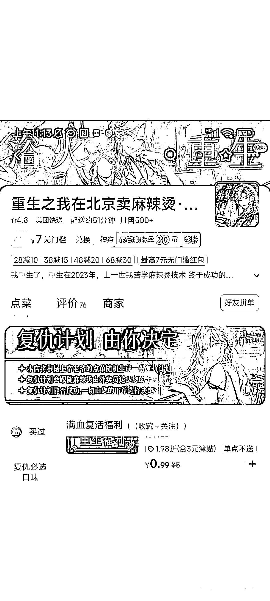

# 餐饮新玩法：外卖里的故事

> 原文：[`www.yuque.com/for_lazy/xkrm14/yseg04uk59zwf9wz`](https://www.yuque.com/for_lazy/xkrm14/yseg04uk59zwf9wz)

<ne-text id="u5b544a5d">作者： …</ne-text>

<ne-text id="u18448882">日期：2023-07-27</ne-text>

<ne-text id="u9a92866f">点赞数：</ne-text><ne-text id="u0c759d8f" ne-bold="true">88</ne-text>

<ne-hole id="u6418e091" data-lake-id="u6418e091"><ne-card data-card-name="hr" data-card-type="block" id="sSezW" data-event-boundary="card">

<ne-text id="ud85d284a">正文：</ne-text>

<ne-text id="ue3062d20">重生之我在北京卖麻辣烫 餐饮+小说，外卖里面塞故事，餐饮新玩法，自带流量</ne-text>

<ne-card data-card-name="image" data-card-type="inline" id="zqxeJ" data-event-boundary="card"></ne-card>

<ne-card data-card-name="image" data-card-type="inline" id="LNvbq" data-event-boundary="card"></ne-card>

<ne-hole id="ud8252b0a" data-lake-id="ud8252b0a"><ne-card data-card-name="hr" data-card-type="block" id="A3ylV" data-event-boundary="card">

<ne-text id="ucfeb38a3">评论区：</ne-text>

<ne-text id="uc6905b05">… : 小红书发了一篇文章，评论过千</ne-text>

<ne-text id="u62b3d31b">… : 13 一块有用的砖发布了一篇小红书笔记，快来看吧！ 😆 sUlOtfTlvAfVaL6 😆</ne-text> <ne-text id="u11fb77f1">，复制本条信息，打开【小红书】App 查看精彩内容！</ne-text>[<ne-text id="uc3360636">http://xhslink.com/WhaSIs</ne-text>](http://xhslink.com/WhaSIs)

<ne-text id="u34f7672c">与君有相逢 : 很多外卖商家也玩起了梗</ne-text>

<ne-text id="u0d66533c">北柱 : 新奇，有趣，故事讲得好，观众少不了[呲牙]</ne-text>

<ne-hole id="u8de3acb7" data-lake-id="u8de3acb7"><ne-card data-card-name="hr" data-card-type="block" id="xrXJJ" data-event-boundary="card">

<ne-text id="u93f929d1">公众号懒人找资源，懒人专属群分享</ne-text>

</ne-card></ne-hole></ne-card></ne-hole></ne-card></ne-hole>