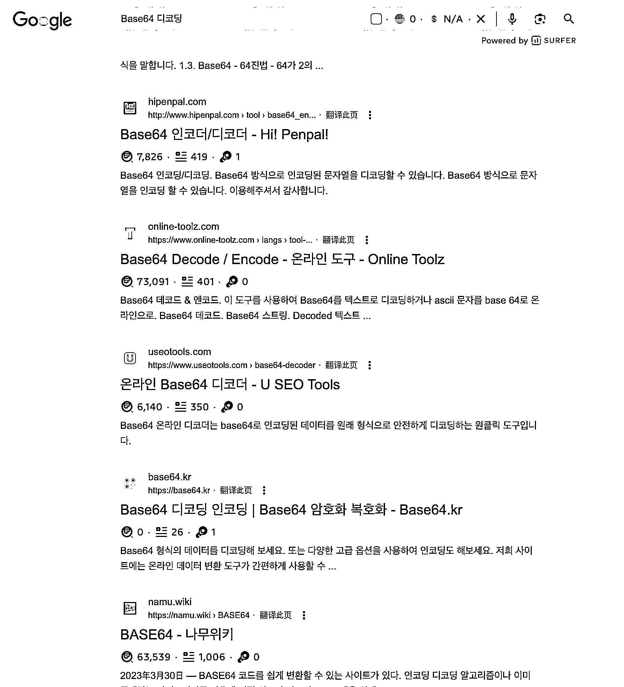

# 发现流量异常值，开发出 Base64 韩语版工具站

> 原文：[`www.yuque.com/for_lazy/xkrm14/ebtnsns2767hr8gy`](https://www.yuque.com/for_lazy/xkrm14/ebtnsns2767hr8gy)

作者： AUDI

日期：2023-07-25

点赞数：65

<ne-hole id="u32cb4158" data-lake-id="u32cb4158"><ne-card data-card-name="hr" data-card-type="block" id="zQPie" data-event-boundary="card">

正文：

很多在线工具网站，如果发现它的流量不错，可以 similar web 看下 ①-流量国家来源②-关键词分布③-竞品网站存在情况。 如果发现一个国家的来源流量很大，并且搜索词也是该国家的，那么可以关注下这个异常值。做法就是去搜索看结果页，看词的难度。 按照这个思路，我发现了 Base64 Decode 韩语版的搜索词，于是有了 这个工具站，源码是开源的。 同样的思路和方法，可以复制，只是需要重复去发现词，留意异常值。 7.23 上线，7.24 已经可以在 google 搜关键词首页出现，7.25 看流量分布，已经有韩国流量来源了。 为什么这么快，我理解就是因为词流量多，但是对应的网站相对少，所以排名容易露出。[Base64+디코딩+인코딩+|+Base64+암호화+복호화+-+Base64.kr](https://base64.kr)

<ne-card data-card-name="image" data-card-type="inline" id="lMvVS" data-event-boundary="card"></ne-card>

<ne-card data-card-name="image" data-card-type="inline" id="bayqb" data-event-boundary="card"></ne-card>

<ne-hole id="u1daba45e" data-lake-id="u1daba45e"><ne-card data-card-name="hr" data-card-type="block" id="uZqZ4" data-event-boundary="card">

评论区：

灿灿 : 这种工具站，盈利靠广告吗

AUDI : 对，主要考广告，google ads

ttxs999 : 优秀

华龙 : 对中文站不友好，工具与实际相差十万八千里

AUDI : 对，一开始出发点就是针对韩国人群做的

AUDI : 可以

AUDI : 谢亦仁大佬

<ne-hole id="u09fab2cc" data-lake-id="u09fab2cc"><ne-card data-card-name="hr" data-card-type="block" id="RtT1w" data-event-boundary="card">

公众号懒人找资源，懒人专属群分享

</ne-card></ne-hole></ne-card></ne-hole></ne-card></ne-hole>