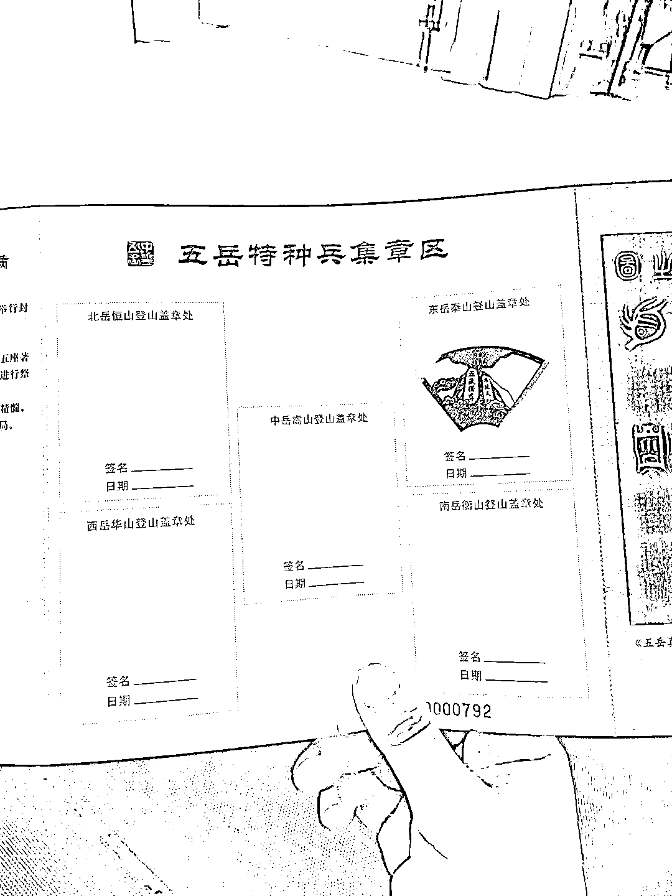
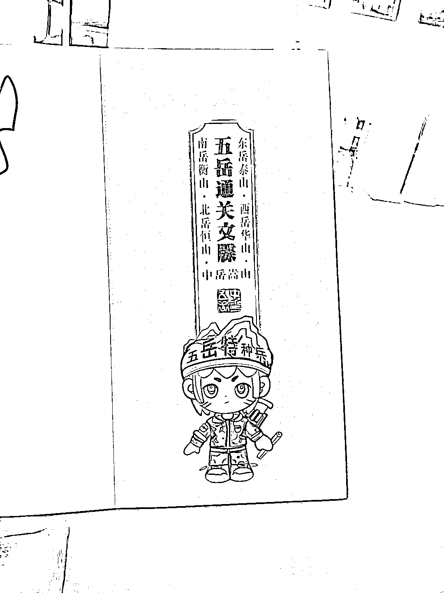

# 特种兵旅游新玩法：爬五岳集四岳免一岳门票，打卡拍照满足旅游需求

> 原文：[`www.yuque.com/for_lazy/xkrm14/ua3kaq293pr7aqig`](https://www.yuque.com/for_lazy/xkrm14/ua3kaq293pr7aqig)

<ne-p id="u7653bd84" data-lake-id="u7653bd84"><ne-text id="u08ebef3a">作者： bgz 洲洲</ne-text></ne-p> <ne-p id="ude87c4b2" data-lake-id="ude87c4b2"><ne-text id="u85938c28">日期：2023-07-25</ne-text></ne-p> <ne-p id="u5d33bdda" data-lake-id="u5d33bdda"><ne-text id="ub392fec1">点赞数：</ne-text><ne-text id="u84c2372a" ne-bold="true">59</ne-text></ne-p> <ne-hole id="uf9663afe" data-lake-id="uf9663afe"><ne-card data-card-name="hr" data-card-type="block" id="vikLS" data-event-boundary="card"><ne-p id="u7e13196e" data-lake-id="u7e13196e"><ne-text id="ufa3e9048">正文：</ne-text></ne-p> <ne-p id="uf6655c6e" data-lake-id="uf6655c6e"><ne-text id="u1750b827">爬五岳特种兵，集四岳免一岳门票，可以延伸玩法设计其他的景点特种兵打卡活动，满足特种兵旅游的拍照打卡需求，景点还能互相导流</ne-text></ne-p> <ne-p id="u12f8719c" data-lake-id="u12f8719c"><ne-card data-card-name="image" data-card-type="inline" id="RR3eS" data-event-boundary="card"></ne-card></ne-p> <ne-p id="u5850d41e" data-lake-id="u5850d41e"><ne-card data-card-name="image" data-card-type="inline" id="BwVLt" data-event-boundary="card"></ne-card></ne-p> <ne-hole id="u8d20ccae" data-lake-id="u8d20ccae"><ne-card data-card-name="hr" data-card-type="block" id="LN3ZA" data-event-boundary="card"><ne-p id="uc604c2fb" data-lake-id="uc604c2fb"><ne-text id="uf6addc7c">评论区：</ne-text></ne-p> <ne-p id="ud489fe4c" data-lake-id="ud489fe4c"><ne-text id="u725fe3c8">随想 : 人才</ne-text></ne-p> <ne-p id="ue795eb9a" data-lake-id="ue795eb9a"><ne-text id="u9d195f5d">昊东.Lee : 想到了小时候干脆面集卡片，有时会设计万能卡</ne-text></ne-p> <ne-hole id="u87de8ec5" data-lake-id="u87de8ec5"><ne-card data-card-name="hr" data-card-type="block" id="RuHuO" data-event-boundary="card"><ne-p id="u5d09ffbf" data-lake-id="u5d09ffbf"><ne-text id="u87727687">公众号懒人找资源，懒人专属群分享</ne-text></ne-p></ne-card></ne-hole></ne-card></ne-hole></ne-card></ne-hole>