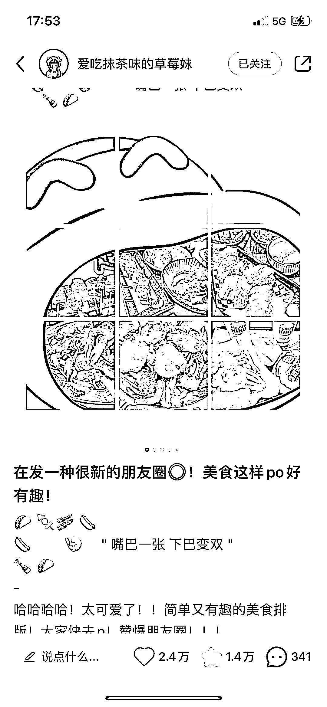

# 有趣的图片是微信朋友圈的发动机

> 原文：[`www.yuque.com/for_lazy/xkrm14/fbnzl04irwdlwive`](https://www.yuque.com/for_lazy/xkrm14/fbnzl04irwdlwive)

<ne-p id="u93ef3785" data-lake-id="u93ef3785"><ne-text id="u14e81575">作者： 蚂蚱有计</ne-text></ne-p> <ne-p id="u2293cffe" data-lake-id="u2293cffe"><ne-text id="u8a19ea6b">日期：2023-07-27</ne-text></ne-p> <ne-p id="uf89a99f9" data-lake-id="uf89a99f9"><ne-text id="ufffe3dcf">点赞数：</ne-text><ne-text id="u03ad0da5" ne-bold="true">86</ne-text></ne-p> <ne-hole id="u01be9050" data-lake-id="u01be9050"><ne-card data-card-name="hr" data-card-type="block" id="sBaqN" data-event-boundary="card"><ne-p id="uc719a3dc" data-lake-id="uc719a3dc"><ne-text id="u380d7b48">正文：</ne-text></ne-p> <ne-p id="u6d46d0f2" data-lake-id="u6d46d0f2"><ne-text id="uddb823cd">单纯好看的图片，太容易审美疲劳。 有趣的图片，才是出梗或者互动的发动机。 微信朋友圈的应用和玩法还是更直接。 数据也比较客观，复用程度也高。</ne-text></ne-p> <ne-p id="u4c7c73e0" data-lake-id="u4c7c73e0"><ne-card data-card-name="image" data-card-type="inline" id="hwSfW" data-event-boundary="card"></ne-card></ne-p> <ne-p id="u6fabe9ee" data-lake-id="u6fabe9ee"><ne-card data-card-name="image" data-card-type="inline" id="nFxFR" data-event-boundary="card"></ne-card></ne-p> <ne-p id="u4ea2b7f9" data-lake-id="u4ea2b7f9"><ne-card data-card-name="image" data-card-type="inline" id="hAH5X" data-event-boundary="card"></ne-card></ne-p> <ne-hole id="u020771fb" data-lake-id="u020771fb"><ne-card data-card-name="hr" data-card-type="block" id="lGfvr" data-event-boundary="card"><ne-p id="ud21fb18a" data-lake-id="ud21fb18a"><ne-text id="uf162a4f8">评论区：</ne-text></ne-p> <ne-p id="u3839485a" data-lake-id="u3839485a"><ne-text id="u081f7f92">蚂蚱有计 : 感谢认可🙏</ne-text></ne-p> <ne-hole id="u9b2ad1e7" data-lake-id="u9b2ad1e7"><ne-card data-card-name="hr" data-card-type="block" id="T4Z0s" data-event-boundary="card"><ne-p id="ua56e1cba" data-lake-id="ua56e1cba"><ne-text id="u51806e76">公众号懒人找资源，懒人专属群分享</ne-text></ne-p></ne-card></ne-hole></ne-card></ne-hole></ne-card></ne-hole>