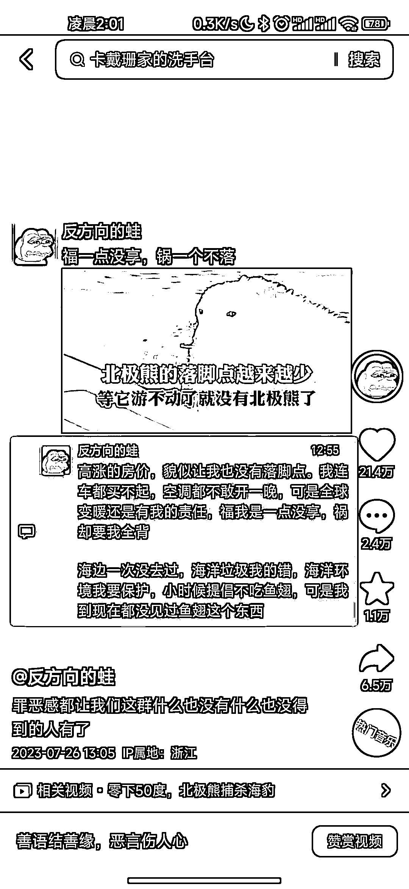

# 朋友圈形式发布的一张图，作品数据非常出色

> 原文：[`www.yuque.com/for_lazy/xkrm14/ngi7gltyfgs47e2l`](https://www.yuque.com/for_lazy/xkrm14/ngi7gltyfgs47e2l)

<ne-text id="u1d20ca16">作者： 笑兔</ne-text>

<ne-text id="uad13dac1">日期：2023-07-28</ne-text>

<ne-text id="u624e10ad">点赞数：</ne-text><ne-text id="u4696fa37" ne-bold="true">87</ne-text>

<ne-hole id="u093b2e5e" data-lake-id="u093b2e5e"><ne-card data-card-name="hr" data-card-type="block" id="um5ND" data-event-boundary="card">

<ne-text id="u7c415067">正文：</ne-text>

<ne-text id="u9798c309">一张图用朋友圈形式发布制作的，一个标题带一张图，在评论区介绍完整回答，解决了作品标题话题，一张图呈现画面更好代入，评论区做详细介绍补充，整个视频就很丰富，也很简洁明了，这个作者没加其它特效，就是单纯一张简洁的，在手机深色(暗黑)模式下的一张截图，配上比较搭配又热门的背景音乐，然后发布即可，他已经涨粉 100 万+了，作品数据都非常不错</ne-text>

<ne-card data-card-name="image" data-card-type="inline" id="n2pMM" data-event-boundary="card"></ne-card>

<ne-card data-card-name="image" data-card-type="inline" id="iAeOd" data-event-boundary="card"></ne-card>

<ne-card data-card-name="image" data-card-type="inline" id="nBsbd" data-event-boundary="card"></ne-card>

<ne-card data-card-name="image" data-card-type="inline" id="HUmdH" data-event-boundary="card"></ne-card>

<ne-hole id="ubcb51886" data-lake-id="ubcb51886"><ne-card data-card-name="hr" data-card-type="block" id="qybcF" data-event-boundary="card">

<ne-text id="u5e8190c1">评论区：</ne-text>

<ne-text id="udb2cc347">朱朱侠 : 我在视频号上搜了一下，播放量并不高，换个平台却高的离谱。这个视频形式是用什么软件做的吗？</ne-text>

<ne-text id="u1c42084b">Pep : 应该是内容受众问题，视频号中老年偏多，抖音全人群。</ne-text>

<ne-text id="u7305a079">笑兔 : 朋友圈截图就可以实现了，导入剪映调整比例和图片大小，视频时长几秒钟，导出就可以了</ne-text>

<ne-text id="u1995763b">一只鸵鸟 : 内容好，适合抖音的人群</ne-text>

<ne-text id="u6f12c7c7">草木青｜灵魂核聚变版 : 这个咋个变现噢，</ne-text>

<ne-text id="u4955586b">可爱的你。 : 同问</ne-text>

<ne-hole id="ucddb424b" data-lake-id="ucddb424b"><ne-card data-card-name="hr" data-card-type="block" id="U5CtP" data-event-boundary="card">

<ne-text id="u9e137419">公众号懒人找资源，懒人专属群分享</ne-text>

</ne-card></ne-hole></ne-card></ne-hole></ne-card></ne-hole>