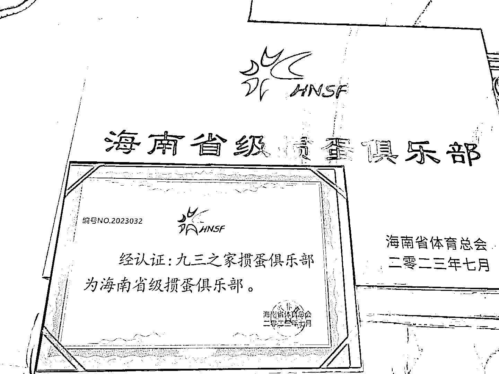

# 海南发放二十多张省级掼蛋俱乐部牌照，商业化机会浮现

> 原文：[`www.yuque.com/for_lazy/xkrm14/gk6ugn3irczgicu4`](https://www.yuque.com/for_lazy/xkrm14/gk6ugn3irczgicu4)

作者： 张五哥

日期：2023-07-28

点赞数：73

<ne-hole id="u27d059e9" data-lake-id="u27d059e9"><ne-card data-card-name="hr" data-card-type="block" id="PLFAa" data-event-boundary="card">

正文：

海南朋友说，已发了二十多张省级掼蛋俱乐部牌照，可以商业化

<ne-card data-card-name="image" data-card-type="inline" id="h9i0p" data-event-boundary="card"></ne-card>

<ne-hole id="u4254dbf7" data-lake-id="u4254dbf7"><ne-card data-card-name="hr" data-card-type="block" id="hYxDn" data-event-boundary="card">

评论区：

小范子 : 惯蛋是什么

冰雨幻天 : 一种扑克游戏哈哈

明月几时有 : 刚看见不懂顺手去百度粘贴过来 1、“安徽掼蛋”是在安徽民间广为流传的扑克游戏，牌局采用四人结对竞赛，输赢升级的方式进行。 2、由于其易学，组合和技巧性强，使牌局更富有娱乐性和刺激性，深受白领和群众的喜爱，民间盛传，“饭前不掼蛋，等于没吃饭”。

西区大表姐 : 主要是今年金融、投行业务惨淡，而 guo you 背景的出资方领导都很喜欢掼蛋这活动，于是前两月有一个挺著名的投资人公开说，现在他和团队都天天陪着玩掼蛋

周宇 : 有牌照就可以和德州一样打比赛

<ne-hole id="u75ad4626" data-lake-id="u75ad4626"><ne-card data-card-name="hr" data-card-type="block" id="jIcUc" data-event-boundary="card">

公众号懒人找资源，懒人专属群分享

</ne-card></ne-hole></ne-card></ne-hole></ne-card></ne-hole>