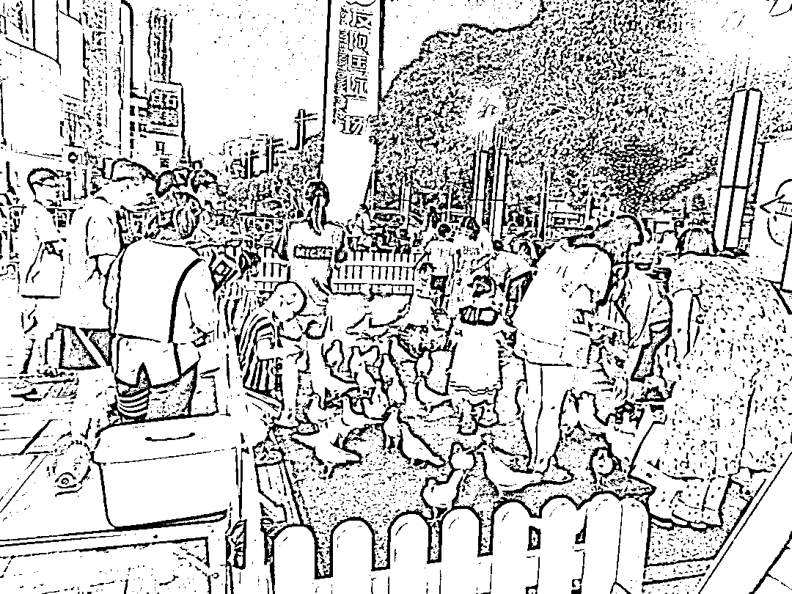

# 商场外和平鸽喂养，通过产品变现，赚取利润

> 原文：[`www.yuque.com/for_lazy/xkrm14/mblme9z9t10m5aeq`](https://www.yuque.com/for_lazy/xkrm14/mblme9z9t10m5aeq)

<ne-text id="u726eec2d">作者： AI 同行侠-文卓</ne-text>

<ne-text id="u89620890">日期：2023-07-27</ne-text>

<ne-text id="ua53dea82">点赞数：</ne-text><ne-text id="ud6766539" ne-bold="true">63</ne-text>

<ne-hole id="u728389d3" data-lake-id="u728389d3"><ne-card data-card-name="hr" data-card-type="block" id="Z7nny" data-event-boundary="card">

<ne-text id="u1ba7f267">正文：</ne-text>

<ne-text id="u65177558">商场外和平鸽喂养，跟喂养金鱼一个道理，商场流量大，通过以下产品变现： 1、 饲料喂养，10 元一包，15 元两包，20 元 3 包 2、 鸽子售卖，300</ne-text> <ne-text id="u85a1ecac">元/只 每月成本： 1、 场地费 5000 元， 2、 两个人力成本共 8000 元，1 人收费，1 人打扫卫生和管理鸽子。</ne-text> <ne-text id="u9fc3f5b6">3、购买、培训、喂养鸽子，培训鸽子不要乱飞</ne-text> <ne-text id="u0a57d353">跟工作人员闲聊了一下，他们公司是多个地方都有在做这样的项目，湖南，江西等省份，在商场、景区等人流量大的地方开展活动，所以鸽子应该都是批量培训生产的，节约成本。</ne-text>

<ne-card data-card-name="image" data-card-type="inline" id="TcUoh" data-event-boundary="card"></ne-card>

<ne-card data-card-name="image" data-card-type="inline" id="duOzT" data-event-boundary="card"></ne-card>

<ne-hole id="u9d1364c9" data-lake-id="u9d1364c9"><ne-card data-card-name="hr" data-card-type="block" id="ZV62m" data-event-boundary="card">

<ne-text id="u2e6e3b1d">评论区：</ne-text>

<ne-text id="ucdc90055">胖大魔 : 哈哈哈鸽子不要乱飞，把羽毛剪一下</ne-text>

<ne-text id="u90ab2752">AI 同行侠-文卓 : 原来把羽毛剪了就可以不乱飞吗，涨知识了，哈哈哈</ne-text>

<ne-text id="ud9add8f1">胖大魔 : 之前景区就是这样的[奸笑]</ne-text>

<ne-text id="u86043831">阿白 : 在广州也看到过</ne-text>

<ne-text id="u31a46927">AI 同行侠-文卓 : 第一次中标，谢谢亦仁老大[呲牙]</ne-text>

<ne-text id="u8ed7c1d2">AI 同行侠-文卓 : 喂鸽子比喂金鱼更容易产生互动，流量大的地方应该都可以干。</ne-text>

<ne-text id="uf6cc3995">L.须尽欢 : 这么多人喂，鸽子会不会一下就撑了</ne-text>

<ne-hole id="u9c1d6cb5" data-lake-id="u9c1d6cb5"><ne-card data-card-name="hr" data-card-type="block" id="WMQeu" data-event-boundary="card">

<ne-text id="ud31a3fba">公众号懒人找资源，懒人专属群分享</ne-text>

</ne-card></ne-hole></ne-card></ne-hole></ne-card></ne-hole>