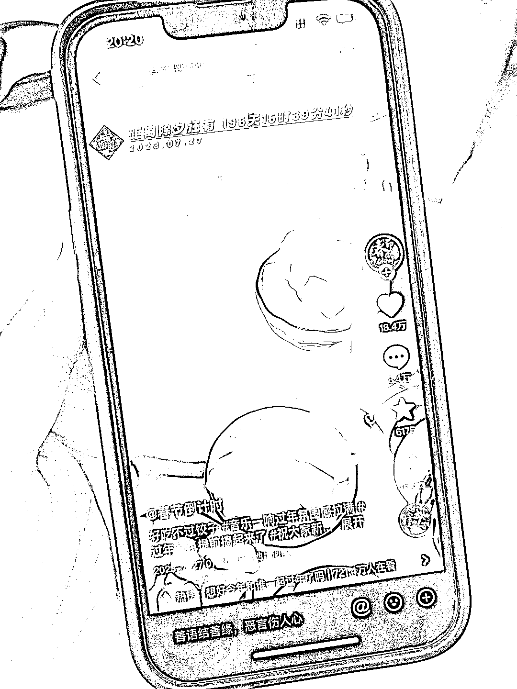

# 抖音帐号通过过年音乐和风俗吸引大量粉丝

> 原文：[`www.yuque.com/for_lazy/xkrm14/ntcspduyaigmpy51`](https://www.yuque.com/for_lazy/xkrm14/ntcspduyaigmpy51)

<ne-text id="u3de34a9a">作者： 咚咚里个沙</ne-text>

<ne-text id="u66d2874b">日期：2023-07-27</ne-text>

<ne-text id="uebe0d9ca">点赞数：</ne-text><ne-text id="ufe602c63" ne-bold="true">50</ne-text>

<ne-hole id="u54c5c79e" data-lake-id="u54c5c79e"><ne-card data-card-name="hr" data-card-type="block" id="iU8fM" data-event-boundary="card">

<ne-text id="ue62f0ec0">正文：</ne-text>

<ne-text id="u35db5c49">今天看到一个帐号 90w 的粉丝大多是配的过年的音乐，以及一些冬天过年时一些风俗，大多都是可以引起公众共鸣的一些画面和音乐</ne-text> <ne-text id="u2fc36ae7">在抖音平台可以通过中视频计划进行收益， 也可以在临近过年的时候可以预售年货 延展的思路就是同样的类型帐号，比如假期倒计时，周末倒计时，等等</ne-text>

<ne-card data-card-name="image" data-card-type="inline" id="cwuVp" data-event-boundary="card"></ne-card>

<ne-card data-card-name="image" data-card-type="inline" id="jHIp5" data-event-boundary="card"></ne-card>

<ne-card data-card-name="image" data-card-type="inline" id="e19z6" data-event-boundary="card"></ne-card>

<ne-hole id="u13273b84" data-lake-id="u13273b84"><ne-card data-card-name="hr" data-card-type="block" id="JfdUY" data-event-boundary="card">

<ne-text id="ud48da88a">评论区：</ne-text>

<ne-text id="ucda65039">咚咚里个沙 : 感谢亦仁</ne-text>

<ne-hole id="u2694f75a" data-lake-id="u2694f75a"><ne-card data-card-name="hr" data-card-type="block" id="aPfWG" data-event-boundary="card">

<ne-text id="udcf53958">公众号懒人找资源，懒人专属群分享</ne-text>

</ne-card></ne-hole></ne-card></ne-hole></ne-card></ne-hole>