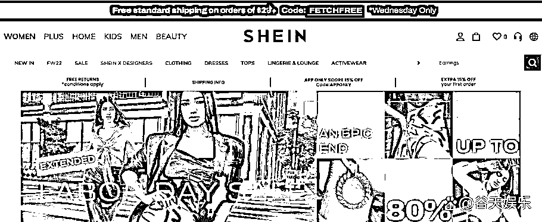
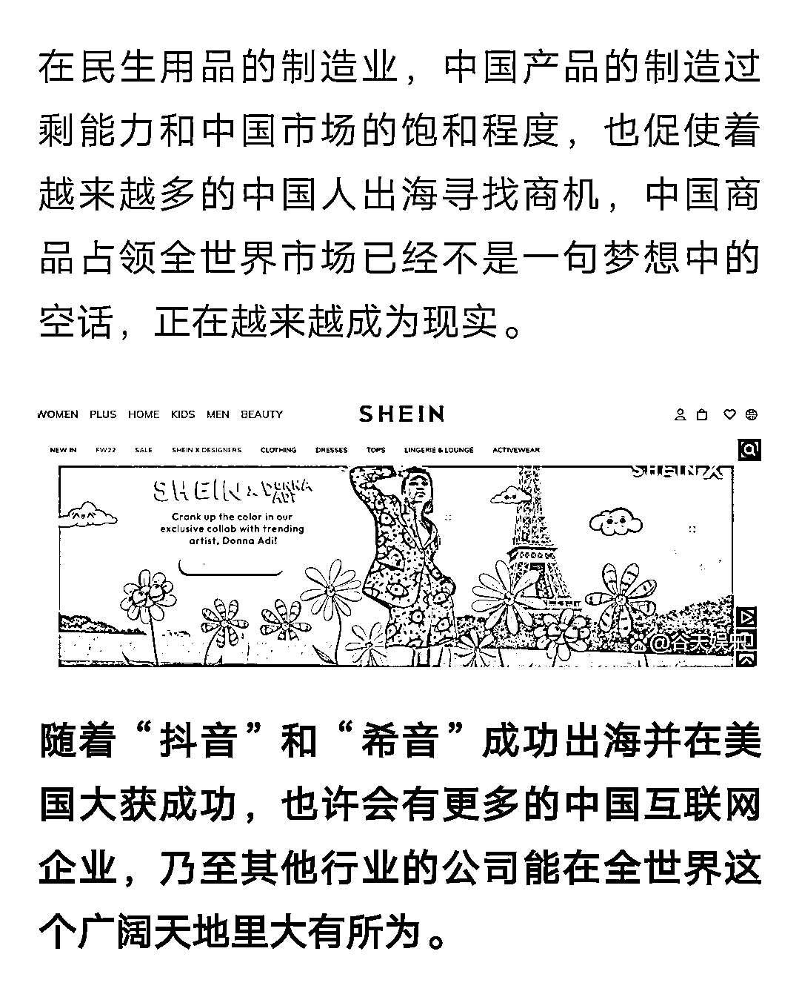

# 希音公司：国内产品竞争力走向国外市场

> 原文：[`www.yuque.com/for_lazy/xkrm14/ng8v1x7t1339z7ft`](https://www.yuque.com/for_lazy/xkrm14/ng8v1x7t1339z7ft)

<ne-p id="u22f7f0e9" data-lake-id="u22f7f0e9"><ne-text id="u24eaac40">作者： 曾崯晟</ne-text></ne-p> <ne-p id="u9c2987c3" data-lake-id="u9c2987c3"><ne-text id="u92bd6486">日期：2023-07-28</ne-text></ne-p> <ne-p id="u8d9b04d4" data-lake-id="u8d9b04d4"><ne-text id="uf98e871e">点赞数：</ne-text><ne-text id="u941adacf" ne-bold="true">66</ne-text></ne-p> <ne-hole id="u14fb3c8d" data-lake-id="u14fb3c8d"><ne-card data-card-name="hr" data-card-type="block" id="YL26P" data-event-boundary="card"><ne-p id="u98db5319" data-lake-id="u98db5319"><ne-text id="ub8673ddc">正文：</ne-text></ne-p> <ne-p id="ufe646363" data-lake-id="ufe646363"><ne-text id="u2874e1ef">介绍一个公司《希音》，内容看图。 他的成功来源于国内民生产品的竞争力，然后把国内互联网的打法搬到国外。【赚了国外平台的空间】</ne-text> <ne-text id="ua54d86cf">这种国内产能+国内模式+国外市场的打法是有足够空间的。 扩展一:国内文化产品打高端(汉服、国潮、各种影视文化作品、周边...)</ne-text> <ne-text id="u5dbda5f0">扩展二:结合民粹及当地文化，做定制。</ne-text></ne-p> <ne-p id="uabda4c3e" data-lake-id="uabda4c3e"><ne-card data-card-name="image" data-card-type="inline" id="uOGsm" data-event-boundary="card"></ne-card></ne-p> <ne-p id="u7de82e2b" data-lake-id="u7de82e2b"><ne-card data-card-name="image" data-card-type="inline" id="i8jE4" data-event-boundary="card"></ne-card></ne-p> <ne-p id="u56919560" data-lake-id="u56919560"><ne-card data-card-name="image" data-card-type="inline" id="NrCFG" data-event-boundary="card"></ne-card></ne-p> <ne-p id="u2e6c67a0" data-lake-id="u2e6c67a0"><ne-card data-card-name="image" data-card-type="inline" id="POhzc" data-event-boundary="card"></ne-card></ne-p> <ne-hole id="u53983b12" data-lake-id="u53983b12"><ne-card data-card-name="hr" data-card-type="block" id="lpcQS" data-event-boundary="card"><ne-p id="u2313bf9e" data-lake-id="u2313bf9e"><ne-text id="ud41060e6">评论区：</ne-text></ne-p> <ne-p id="ufb5b77b9" data-lake-id="ufb5b77b9"><ne-text id="uc2239e8d">无咎。 : 广州番禺</ne-text></ne-p> <ne-p id="ue04a4115" data-lake-id="ue04a4115"><ne-text id="ue5f04674">钟莹 : 他家优势在于极致的供应链模式</ne-text></ne-p> <ne-p id="u9fcc1707" data-lake-id="u9fcc1707"><ne-text id="u08d36a0b">远都浪子 : 今年开始做希音</ne-text></ne-p> <ne-p id="uf8400eba" data-lake-id="uf8400eba"><ne-text id="u48cd7230">陈钦勇 : 拼多多海外版就是照搬希音的，还从希音大量挖人。</ne-text></ne-p> <ne-hole id="ue7953668" data-lake-id="ue7953668"><ne-card data-card-name="hr" data-card-type="block" id="euila" data-event-boundary="card"><ne-p id="uddab3244" data-lake-id="uddab3244"><ne-text id="u89a8fb3a">公众号懒人找资源，懒人专属群分享</ne-text></ne-p></ne-card></ne-hole></ne-card></ne-hole></ne-card></ne-hole>