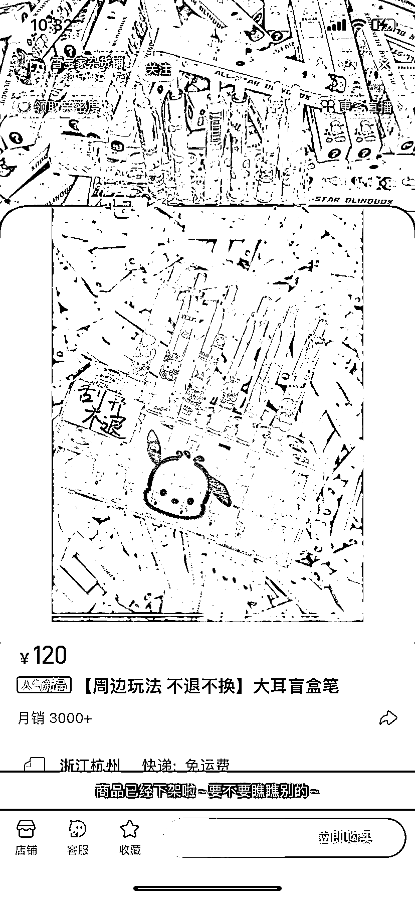
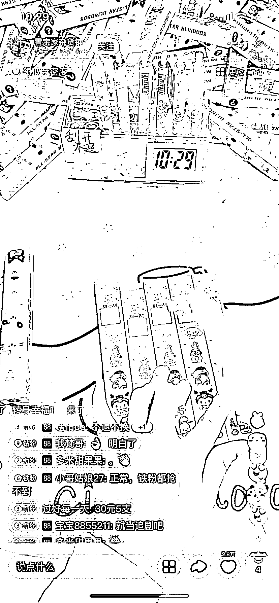
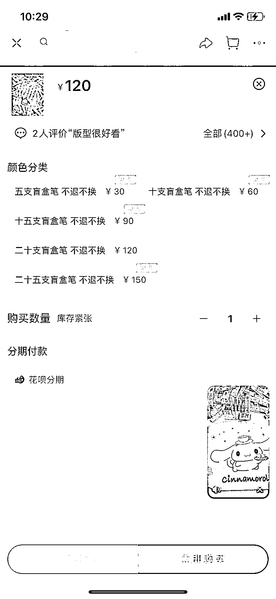
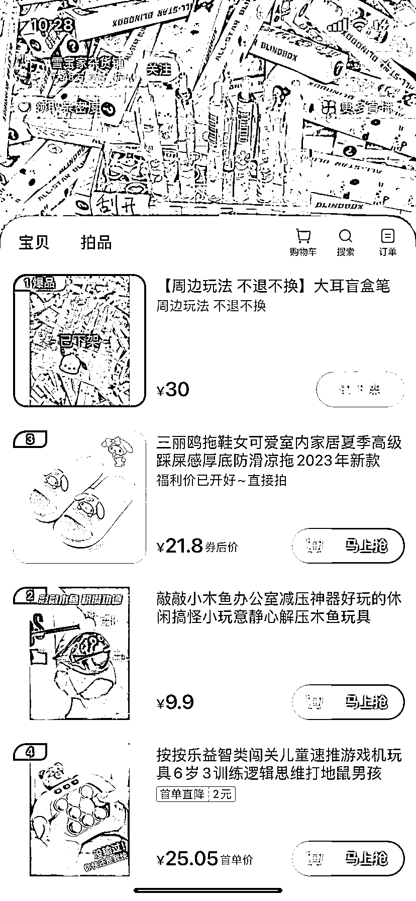

# 盲盒笔：观看人数 10W+，价格最低 30 元，中奖率 30%

> 原文：[`www.yuque.com/for_lazy/xkrm14/kovgihdqwv74ey54`](https://www.yuque.com/for_lazy/xkrm14/kovgihdqwv74ey54)

作者： Y 坚果🌰

日期：2023-07-28

点赞数：71

<ne-hole id="u7f52558f" data-lake-id="u7f52558f"><ne-card data-card-name="hr" data-card-type="block" id="j4q38" data-event-boundary="card">

正文：

盲盒笔每天观看人数在 10 万+，价格最低也要三十元，一般购买二十到二十五只的比较多，中奖率大概在 30%，刮开不退不换，中奖奖品一般在 0-50 元之间。

<ne-card data-card-name="image" data-card-type="inline" id="cJQty" data-event-boundary="card"></ne-card>

<ne-card data-card-name="image" data-card-type="inline" id="L2XpS" data-event-boundary="card"></ne-card>

<ne-card data-card-name="image" data-card-type="inline" id="MSrUE" data-event-boundary="card"></ne-card>

<ne-card data-card-name="image" data-card-type="inline" id="vaWaV" data-event-boundary="card"></ne-card>

<ne-card data-card-name="image" data-card-type="inline" id="p0pDq" data-event-boundary="card"></ne-card>

<ne-hole id="ubd1236ea" data-lake-id="ubd1236ea"><ne-card data-card-name="hr" data-card-type="block" id="tC8RB" data-event-boundary="card">

评论区：

草木青｜灵魂核聚变版 : 这是哪个平台，抖音，小红书，还是视频号

小范子 : 应该是抖音

大梁 : 这一看就是淘宝

草木青｜灵魂核聚变版 : 啊哈哈哈哈哈

九歌 : 一切皆可盲盒

<ne-hole id="u31e5da57" data-lake-id="u31e5da57"><ne-card data-card-name="hr" data-card-type="block" id="PExxG" data-event-boundary="card">

公众号懒人找资源，懒人专属群分享

</ne-card></ne-hole></ne-card></ne-hole></ne-card></ne-hole>