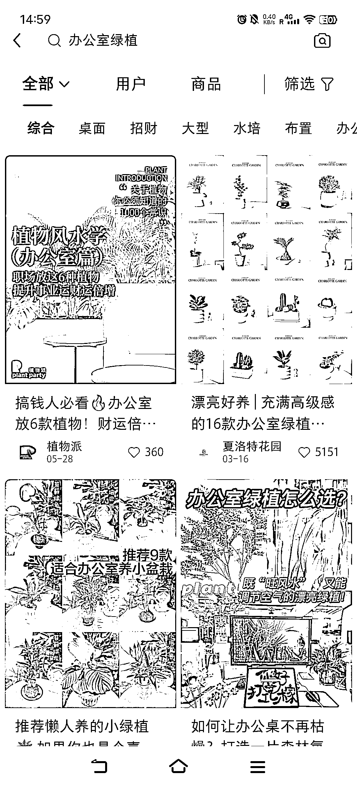

# 办公室绿植文化：提高复购率的两个方法

> 原文：[`www.yuque.com/for_lazy/xkrm14/ky5bghf9nxbdmwqr`](https://www.yuque.com/for_lazy/xkrm14/ky5bghf9nxbdmwqr)

<ne-p id="u79b9512a" data-lake-id="u79b9512a"><ne-text id="uf93aaa74">作者： 大西 CC</ne-text></ne-p> <ne-p id="u5ca517a0" data-lake-id="u5ca517a0"><ne-text id="u76ff780c">日期：2023-07-28</ne-text></ne-p> <ne-p id="u90df9f60" data-lake-id="u90df9f60"><ne-text id="uc579d434">点赞数：</ne-text><ne-text id="udd1bec07" ne-bold="true">99</ne-text></ne-p> <ne-hole id="u0f096293" data-lake-id="u0f096293"><ne-card data-card-name="hr" data-card-type="block" id="t9LTH" data-event-boundary="card"><ne-p id="u3df8096e" data-lake-id="u3df8096e"><ne-text id="u73a6ec30">正文：</ne-text></ne-p> <ne-p id="ud2ab8dcf" data-lake-id="ud2ab8dcf"><ne-text id="u68a64d63">身心灵解压的办公室绿植文化。 这两年发现绿植类的新消费挺有意思，我个人也买绿植送朋友。</ne-text> <ne-text id="ub90a49f4">而且办公室绿植非常契合现在年轻人的心理：追求猎奇、有趣、玄学，又十分贴合生活环境。</ne-text> <ne-text id="ua45691ea">我从去年就开始给朋友送桌面绿植了：放青松、没鸭梨、节节高升富贵竹。。。名头寓意好听的，我都送过。 问题在于：如何提高复购？ 我想到两点： 1.</ne-text> <ne-text id="u804587ba">人群标签，私域变现</ne-text> <ne-text id="u0907205f">比如说，店家可以可以拉进私域，建立一个北上广深社畜新农人社群，看似专门交流养花心得，其实延伸开来，可以吐槽工作、工作交流、交朋友搞对象。。</ne-text> <ne-text id="ue8a3a74c">然后链接其他的流量主和产品端。 2\. 上情绪价值</ne-text> <ne-text id="ud51ac9f8">绿植不是易耗品和刚需，本身就不贵，更换率低，是不是可以在花盆上做文章？AI 设计一下新的素材，把平平无奇的绿植卖高价；或者，可不可以做成像手机壳一样？毕竟绿植是耐用盆栽，没有三个月半年，谁会去换？但是可以设计新的盆，卖盆不卖绿植，提高复购率。</ne-text></ne-p> <ne-p id="u1f2415fc" data-lake-id="u1f2415fc"><ne-card data-card-name="image" data-card-type="inline" id="JwS4B" data-event-boundary="card"></ne-card></ne-p> <ne-p id="u5be4ea91" data-lake-id="u5be4ea91"><ne-card data-card-name="image" data-card-type="inline" id="aCt3X" data-event-boundary="card"></ne-card></ne-p> <ne-p id="uef7260f3" data-lake-id="uef7260f3"><ne-card data-card-name="image" data-card-type="inline" id="LZbFj" data-event-boundary="card"></ne-card></ne-p> <ne-p id="u735cd7b3" data-lake-id="u735cd7b3"><ne-card data-card-name="image" data-card-type="inline" id="SgJJk" data-event-boundary="card"></ne-card></ne-p> <ne-hole id="u4c459571" data-lake-id="u4c459571"><ne-card data-card-name="hr" data-card-type="block" id="YL7Si" data-event-boundary="card"><ne-p id="u23d64259" data-lake-id="u23d64259"><ne-text id="u56fa8c9f">评论区：</ne-text></ne-p> <ne-p id="ufa861192" data-lake-id="ufa861192"><ne-text id="u4a8401fd">咏 : 很有想法</ne-text></ne-p> <ne-p id="u73bb97e8" data-lake-id="u73bb97e8"><ne-text id="u43b051b4">大西 CC : [呲牙]向各位大佬学习</ne-text></ne-p> <ne-p id="u66835920" data-lake-id="u66835920"><ne-text id="ub074bb47">九歌 : 年轻人喜欢的东西</ne-text></ne-p> <ne-p id="u74b15679" data-lake-id="u74b15679"><ne-text id="u1a6da9cf">蓝大虎 : 学到了，有想法[强][强]</ne-text></ne-p> <ne-hole id="u11d5055d" data-lake-id="u11d5055d"><ne-card data-card-name="hr" data-card-type="block" id="zD6qv" data-event-boundary="card"><ne-p id="u57430260" data-lake-id="u57430260"><ne-text id="u6d6aac88">公众号懒人找资源，懒人专属群分享</ne-text></ne-p></ne-card></ne-hole></ne-card></ne-hole></ne-card></ne-hole>