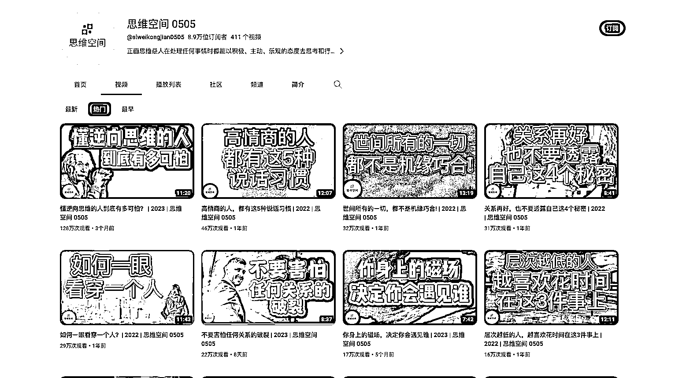
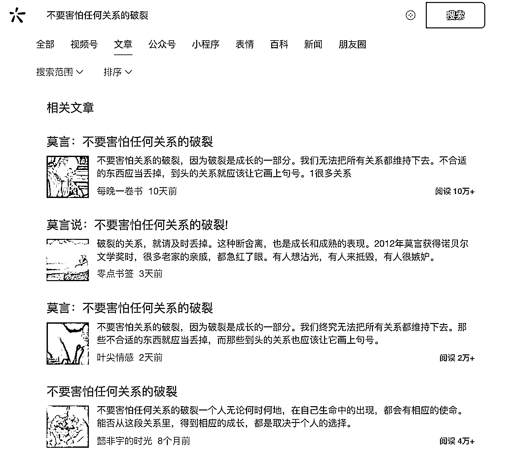

# YouTube 搬运新趋势：从公众号爆款观点文到“日式搬家”

> 原文：[`www.yuque.com/for_lazy/xkrm14/ev0g6p91tafdl6vq`](https://www.yuque.com/for_lazy/xkrm14/ev0g6p91tafdl6vq)

<ne-text id="u71cd7bac">作者： 林元陸</ne-text>

<ne-text id="uf3e07f03">日期：2023-07-25</ne-text>

<ne-text id="u5f914c8f">点赞数：</ne-text><ne-text id="u483972d9" ne-bold="true">78</ne-text>

<ne-hole id="u458490c1" data-lake-id="u458490c1"><ne-card data-card-name="hr" data-card-type="block" id="Cuog2" data-event-boundary="card">

<ne-text id="u7190cd96">正文：</ne-text>

<ne-text id="u70ea2126">YouTube 搬运在 2023 年还是可以做的，只不过过去是传统的搬家，现在是“日式搬家”。</ne-text> <ne-text id="u91e708d8">最近刷到了马来西亚的一位 YouTuber，他频道里发的都是各种鸡汤文视频，数据都很不错。有意思的是，随便复制其中一个标题搜一下，都能发现是从公众号爆款观点文搬过去的。</ne-text>

<ne-card data-card-name="image" data-card-type="inline" id="O1j7a" data-event-boundary="card"></ne-card>

<ne-card data-card-name="image" data-card-type="inline" id="fedfi" data-event-boundary="card"></ne-card>

<ne-card data-card-name="image" data-card-type="inline" id="JVzkh" data-event-boundary="card"></ne-card>

<ne-card data-card-name="image" data-card-type="inline" id="ARR8v" data-event-boundary="card"></ne-card>

<ne-card data-card-name="image" data-card-type="inline" id="yjnyq" data-event-boundary="card"></ne-card>

<ne-hole id="uf56e27c4" data-lake-id="uf56e27c4"><ne-card data-card-name="hr" data-card-type="block" id="qStIt" data-event-boundary="card">

<ne-text id="u7819b723">评论区：</ne-text>

<ne-text id="ufcea8e14">豆豆 : 啥叫“日式搬家”哇</ne-text>

<ne-text id="ud0ed9561">林元陸 : 下次不懂自己搜呀</ne-text>

<ne-text id="u13688dd6">豆豆 : 哈哈哈好🤣</ne-text>

<ne-text id="u11a3c194">毛豆 : 就是要把搬运做的更细致，多花些功夫</ne-text>

<ne-hole id="u97e6a434" data-lake-id="u97e6a434"><ne-card data-card-name="hr" data-card-type="block" id="WP8vs" data-event-boundary="card">

<ne-text id="ub53924a0">公众号懒人找资源，懒人专属群分享</ne-text>

</ne-card></ne-hole></ne-card></ne-hole></ne-card></ne-hole>