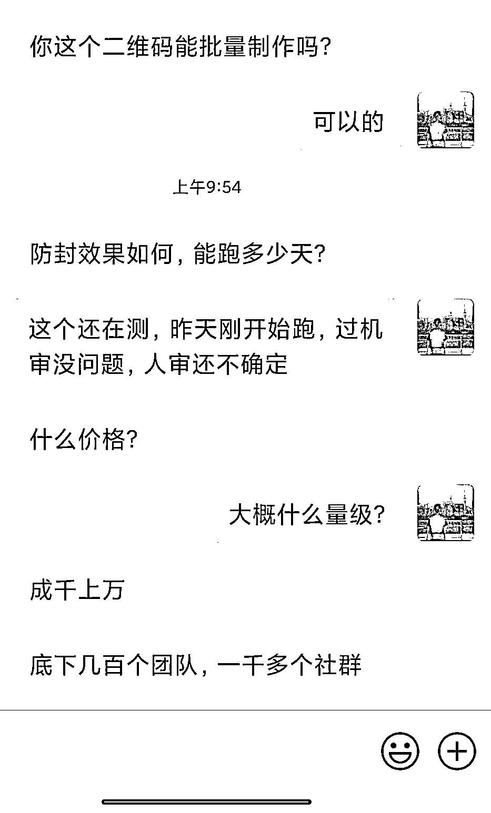
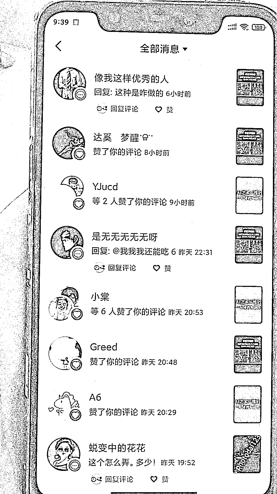

# 用 SD+Controlnet 技术引流微信号

> 原文：[`www.yuque.com/for_lazy/xkrm14/hsvy5cnggy8clsco`](https://www.yuque.com/for_lazy/xkrm14/hsvy5cnggy8clsco)

<ne-p id="ua171db94" data-lake-id="ua171db94"><ne-text id="ua9fe1329">作者： 飞天海带</ne-text></ne-p> <ne-p id="u8cc1a9df" data-lake-id="u8cc1a9df"><ne-text id="u4cd7d0e1">日期：2023-07-17</ne-text></ne-p> <ne-p id="ufa432b31" data-lake-id="ufa432b31"><ne-text id="u28765765">点赞数：</ne-text><ne-text id="u43954ccf" ne-bold="true">170</ne-text></ne-p> <ne-hole id="u7a1415f1" data-lake-id="u7a1415f1"><ne-card data-card-name="hr" data-card-type="block" id="J1KBD" data-event-boundary="card"><ne-p id="u14ce1d1f" data-lake-id="u14ce1d1f"><ne-text id="u2195eb2c">正文：</ne-text></ne-p> <ne-p id="u8eff1434" data-lake-id="u8eff1434"><ne-text id="u26046945">用 SD+Controlnet 把微信号藏入图片作为引流工具，小红书新号第一篇笔记就爆了，当天微信加了 100 多人，触发限流有好多人都没加上。</ne-text> <ne-text id="u92bd1a79">后续的变现是接单制作和课程教学，均已跑通。付费对象是自媒体人以及为自媒体提供工具的人。我这号已经跑了 3 天，目前 24 万浏览 4500 赞，无违规提醒。</ne-text> <ne-text id="ue58d9aa2">大家可以学一学这个技术，然后用截流玩法在自媒体教学的热门笔记/视频/群，去找付费用户，需求很强的。我抖音上随便发了点评论都有好几个人加我。</ne-text></ne-p> <ne-p id="ud02f5049" data-lake-id="ud02f5049"><ne-card data-card-name="image" data-card-type="inline" id="rrGcr" data-event-boundary="card"></ne-card></ne-p> <ne-p id="u75769e09" data-lake-id="u75769e09"><ne-card data-card-name="image" data-card-type="inline" id="uI4md" data-event-boundary="card"></ne-card></ne-p> <ne-p id="ua78ff269" data-lake-id="ua78ff269"><ne-card data-card-name="image" data-card-type="inline" id="nAurd" data-event-boundary="card"></ne-card></ne-p> <ne-p id="u8f621f72" data-lake-id="u8f621f72"><ne-card data-card-name="image" data-card-type="inline" id="cQZdf" data-event-boundary="card"></ne-card></ne-p> <ne-p id="uad90b149" data-lake-id="uad90b149"><ne-card data-card-name="image" data-card-type="inline" id="xNObr" data-event-boundary="card"></ne-card></ne-p> <ne-p id="ud1b6f854" data-lake-id="ud1b6f854"><ne-card data-card-name="image" data-card-type="inline" id="gbyqr" data-event-boundary="card"></ne-card></ne-p> <ne-hole id="uda8df0a0" data-lake-id="uda8df0a0"><ne-card data-card-name="hr" data-card-type="block" id="AuACp" data-event-boundary="card"><ne-p id="uc149abe7" data-lake-id="uc149abe7"><ne-text id="u5a29bc25">评论区：</ne-text></ne-p> <ne-p id="u61cd6b6c" data-lake-id="u61cd6b6c"><ne-text id="u33e55a37">李彬 : 价格还比较良心[强]</ne-text></ne-p> <ne-p id="u359eeb20" data-lake-id="u359eeb20"><ne-text id="uf08b6343">胖大魔 : 想跟海带大佬，一起组团[呲牙]</ne-text></ne-p> <ne-p id="u788013bb" data-lake-id="u788013bb"><ne-text id="u48921e49">飞天海带 : 欢迎来勾搭哈哈哈</ne-text></ne-p> <ne-p id="ud353c4c1" data-lake-id="ud353c4c1"><ne-text id="u67913a6e">Dreamland : 牛逼啊</ne-text></ne-p> <ne-p id="ucfa87e71" data-lake-id="ucfa87e71"><ne-text id="u744322d2">Dreamland : 怎么勾搭</ne-text></ne-p> <ne-p id="uc961d3ae" data-lake-id="uc961d3ae"><ne-text id="ue716e755">胖大魔 : 要不要一起来组团</ne-text></ne-p> <ne-p id="u39d82fb9" data-lake-id="u39d82fb9"><ne-text id="u2364e449">李彬 : 来</ne-text></ne-p> <ne-uli index-type="0"><ne-uli-i>●</ne-uli-i><ne-uli-c class="ne-uli-content" id="uc4bb8a44" data-lake-id="uc4bb8a44"><ne-text id="ue1136a67">葫芦哥  િ😂ી : 怎么联系</ne-text></ne-uli-c></ne-uli> <ne-hole id="ucf1950f2" data-lake-id="ucf1950f2"><ne-card data-card-name="hr" data-card-type="block" id="kDeDN" data-event-boundary="card"><ne-p id="u23ef1dcf" data-lake-id="u23ef1dcf"><ne-text id="ud986854b">公众号懒人找资源，懒人专属群分享</ne-text></ne-p></ne-card></ne-hole></ne-card></ne-hole></ne-card></ne-hole>