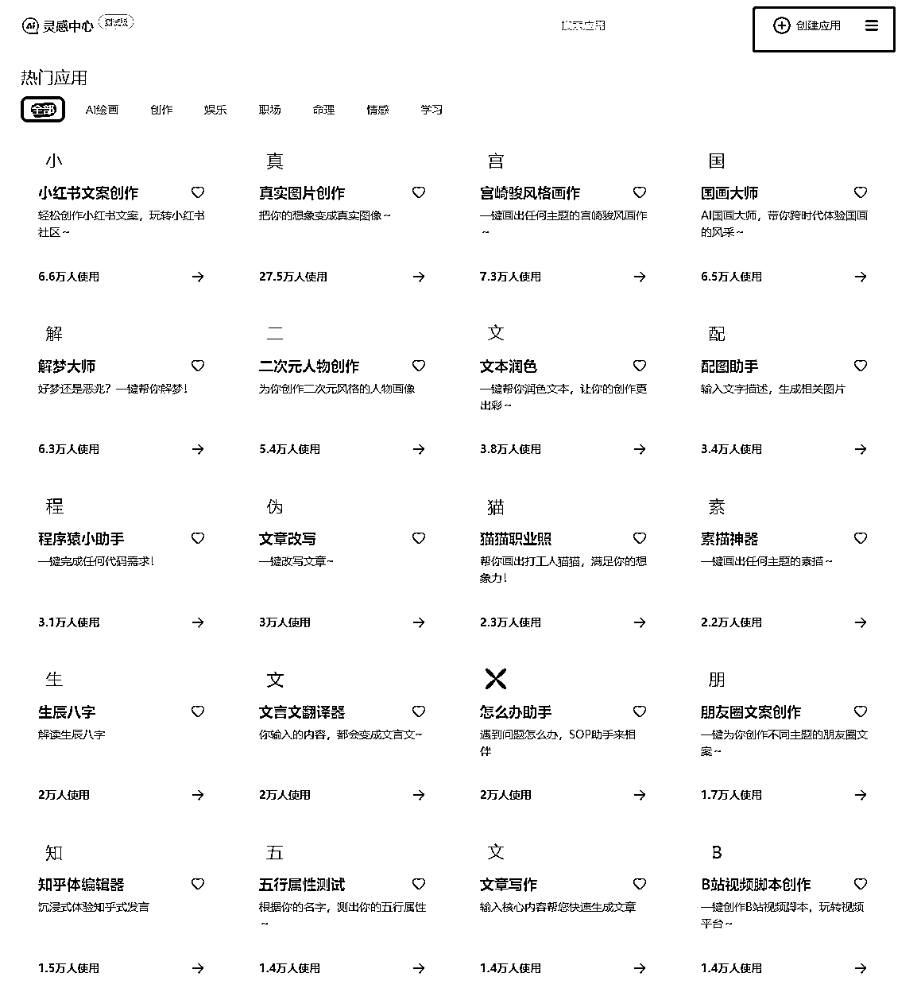
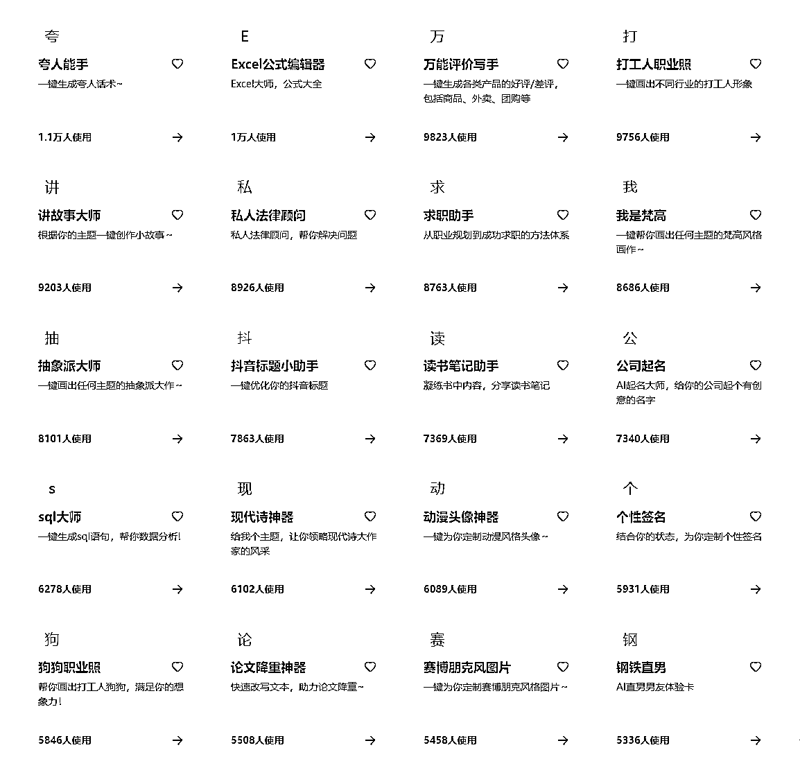
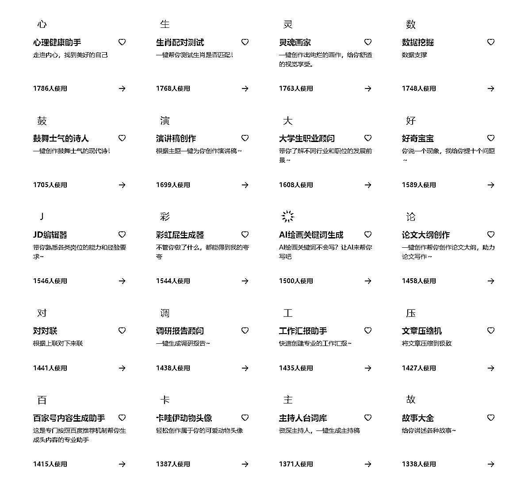
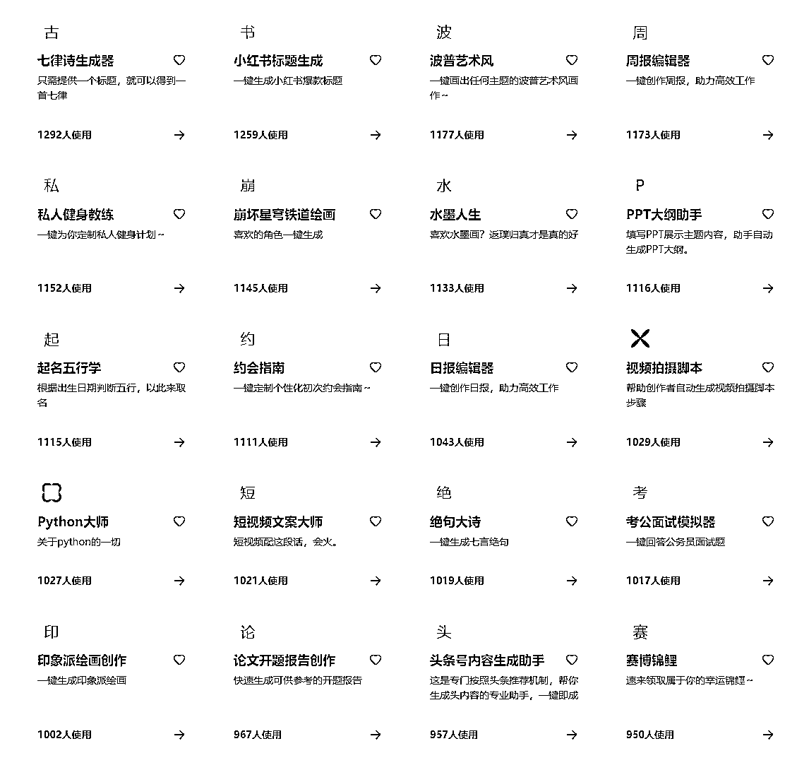

# 百度 AI 灵感中心：创造应用的机会，变现与涨粉的可能性

> 原文：[`www.yuque.com/for_lazy/xkrm14/moyqrk5p4fds0v51`](https://www.yuque.com/for_lazy/xkrm14/moyqrk5p4fds0v51)

<ne-p id="udac18db5" data-lake-id="udac18db5"><ne-text id="ube0ee442">作者： 施霖终生学习者-链接</ne-text></ne-p> <ne-p id="u3bd87c19" data-lake-id="u3bd87c19"><ne-text id="u28bfb90e">日期：2023-07-19</ne-text></ne-p> <ne-p id="ua64386ea" data-lake-id="ua64386ea"><ne-text id="ua9743942">点赞数：</ne-text><ne-text id="u046e53b8" ne-bold="true">127</ne-text></ne-p> <ne-hole id="u2443be6e" data-lake-id="u2443be6e"><ne-card data-card-name="hr" data-card-type="block" id="DRbCH" data-event-boundary="card"><ne-p id="u31aec0ce" data-lake-id="u31aec0ce"><ne-text id="u30568ad5">正文：</ne-text></ne-p> <ne-p id="u146443df" data-lake-id="u146443df"><ne-text id="ua837c88c">百度 AI 中，有个灵感中心很给力！ 今天发现，除了直接使用现成的模型！ 还可以申请创建模型， 对于程序员或者对于一些应用场景有研究的圈友， 是一个很好的机会，</ne-text> <ne-text id="u2bae28e2">可以尝试把一些做工具或者做插件的内容， 创建成应用，后续应该有变现的或者涨粉的机会！ 具体看第九涨！ 第 1-8 张是已经发布的应用， 很多比较方便！</ne-text> <ne-text id="u0af09d74">具体的还需要再研究下，祝生财有术啊！</ne-text></ne-p> <ne-p id="u25729520" data-lake-id="u25729520"><ne-card data-card-name="image" data-card-type="inline" id="M6War" data-event-boundary="card"></ne-card></ne-p> <ne-p id="u05eb4d3c" data-lake-id="u05eb4d3c"><ne-card data-card-name="image" data-card-type="inline" id="fGbA2" data-event-boundary="card"></ne-card></ne-p> <ne-p id="u7389748c" data-lake-id="u7389748c"><ne-card data-card-name="image" data-card-type="inline" id="MPX5K" data-event-boundary="card"></ne-card></ne-p> <ne-p id="ud3ea41eb" data-lake-id="ud3ea41eb"><ne-card data-card-name="image" data-card-type="inline" id="Td0mv" data-event-boundary="card"></ne-card></ne-p> <ne-p id="u01fcafb9" data-lake-id="u01fcafb9"><ne-card data-card-name="image" data-card-type="inline" id="OQUBo" data-event-boundary="card"></ne-card></ne-p> <ne-p id="u7ec56b5a" data-lake-id="u7ec56b5a"><ne-card data-card-name="image" data-card-type="inline" id="a0GRr" data-event-boundary="card"></ne-card></ne-p> <ne-p id="uda048d93" data-lake-id="uda048d93"><ne-card data-card-name="image" data-card-type="inline" id="cSaXY" data-event-boundary="card"></ne-card></ne-p> <ne-p id="uac07cc46" data-lake-id="uac07cc46"><ne-card data-card-name="image" data-card-type="inline" id="tlg1g" data-event-boundary="card"></ne-card></ne-p> <ne-p id="u8d85f6f0" data-lake-id="u8d85f6f0"><ne-card data-card-name="image" data-card-type="inline" id="cKbtn" data-event-boundary="card"></ne-card></ne-p> <ne-hole id="uaa7ea486" data-lake-id="uaa7ea486"><ne-card data-card-name="hr" data-card-type="block" id="rFgWk" data-event-boundary="card"><ne-p id="u844cb227" data-lake-id="u844cb227"><ne-text id="u6e1e945d">评论区：</ne-text></ne-p> <ne-p id="ud1263c91" data-lake-id="ud1263c91"><ne-text id="uffcd1b83">肆意 : 有网址吗</ne-text></ne-p> <ne-p id="u05733d4d" data-lake-id="u05733d4d"><ne-text id="u2b1d9757">坏孩（大学生） : 文心一言</ne-text></ne-p> <ne-p id="ud636f1a0" data-lake-id="ud636f1a0"><ne-text id="uf66ab2be">施霖终生学习者-链接 : 百度 AI 内测版，PC 端或者网页端，文心一言，</ne-text></ne-p> <ne-p id="udf473783" data-lake-id="udf473783"><ne-text id="ub5c3e3c5">施霖终生学习者-链接 : 谢谢亦仁老板，</ne-text></ne-p> <ne-hole id="u78a97a2b" data-lake-id="u78a97a2b"><ne-card data-card-name="hr" data-card-type="block" id="KwZXe" data-event-boundary="card"><ne-p id="u336c1da2" data-lake-id="u336c1da2"><ne-text id="uc23cd90b">公众号懒人找资源，懒人专属群分享</ne-text></ne-p></ne-card></ne-hole></ne-card></ne-hole></ne-card></ne-hole>