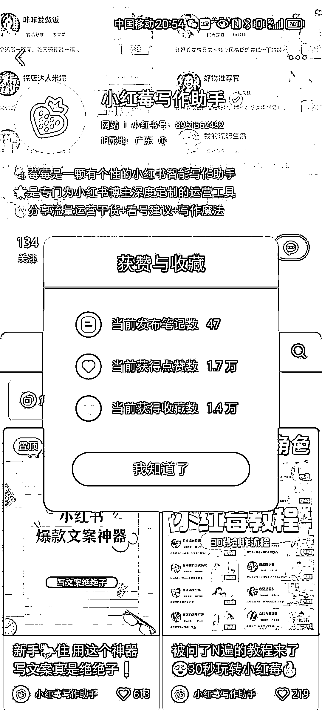
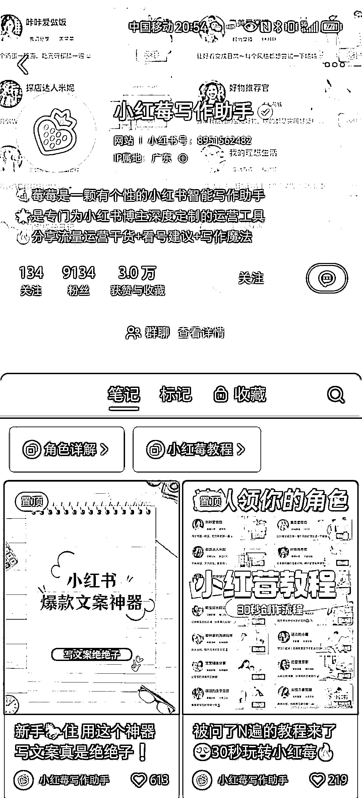

# 小红莓写作助手在小红书引流猛，推广 ai 写作小程序的参考

> 原文：[`www.yuque.com/for_lazy/xkrm14/vqlgenryue9bb20g`](https://www.yuque.com/for_lazy/xkrm14/vqlgenryue9bb20g)

作者： 右右

日期：2023-07-20

点赞数：103

<ne-hole id="u00167b03" data-lake-id="u00167b03">

正文：

在小红书上发现了这个小红莓写作助手，引流很猛。47 篇帖子 2600 人进群，推广 ai 写作小程序可以参考

<ne-hole id="ua3b472dd" data-lake-id="ua3b472dd">

评论区：

阿白 : 有刷到过

右右 : 谢谢亦仁老大

<ne-hole id="uffc466f7" data-lake-id="uffc466f7">

公众号懒人找资源，懒人专属群分享

</ne-hole></ne-hole></ne-hole>