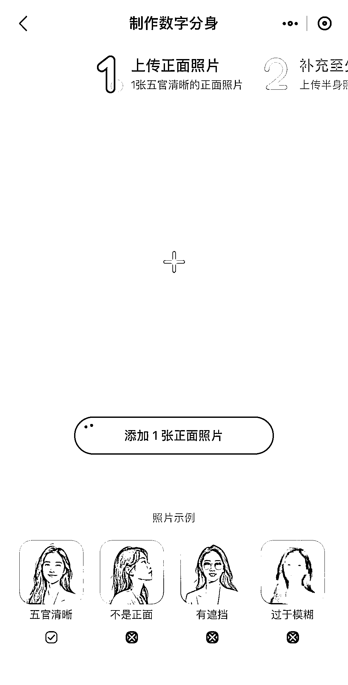
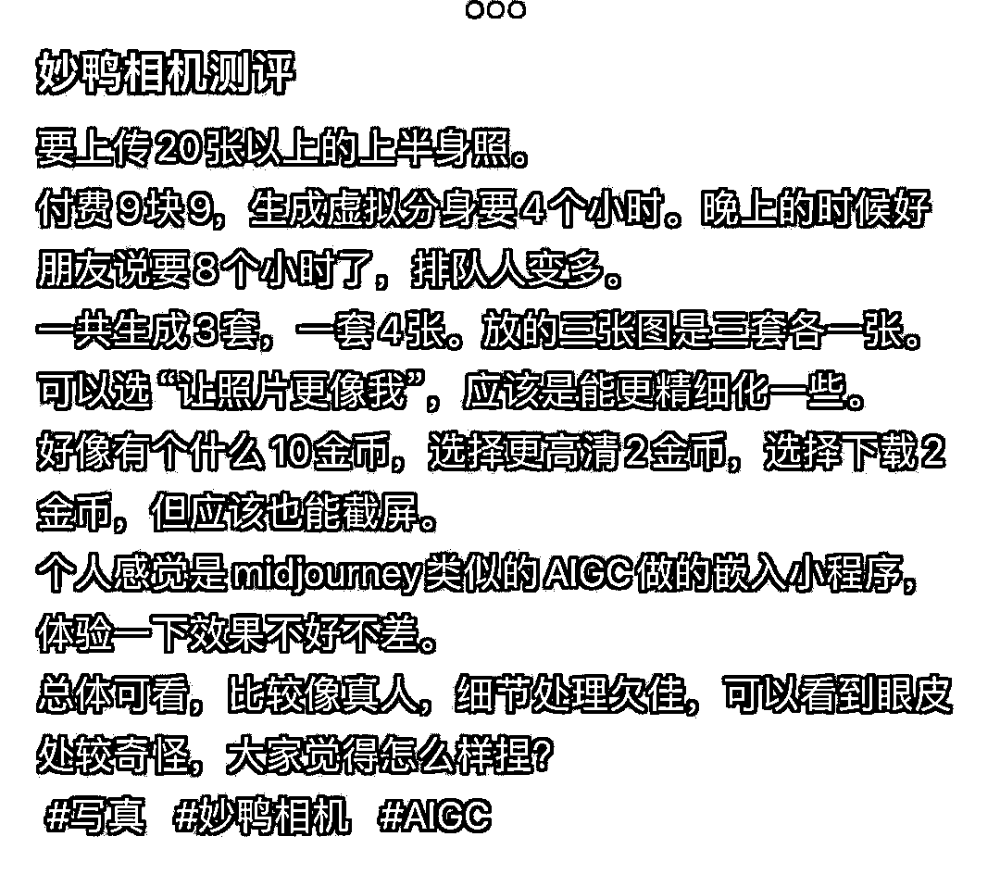

# 最新 AI 写真应用“妙鸭相机”即将刷屏，用户流程简单易用

> 原文：[`www.yuque.com/for_lazy/xkrm14/bszn1wfa4fhfg35m`](https://www.yuque.com/for_lazy/xkrm14/bszn1wfa4fhfg35m)

作者： 月起星九

日期：2023-07-20

点赞数：104

<ne-hole id="u7bcec636" data-lake-id="u7bcec636">

正文：

最新 AI 写真应用，目测接下来几天会被它刷屏，即刻上 AI 探索站刷下来全是它。 1、小程序搜“妙鸭相机” 2、先上传一张正面照，再上传 20 张半身照 3、要先关注公众号，是先用 9.9 构建数字分身，后续精修、下载写真，还需要花费点数 而且上传自己图片的时候是做了图像筛选，不是所有的图都能够上传，会自动筛掉不合适的图，自动化做的挺好，保证数据集的干净确实很重要。 20 张图，训练一个 lora 模型很足够的。 感觉这套获取用户流程以及留下用户多次付费的操作可以呀，比 B612 写真，直接给很多图（但不是很像自己）的操作要好。

<ne-hole id="u4f773568" data-lake-id="u4f773568">

评论区：

Luck : 可以当做海马体平替软件吗？[偷笑]

月起星九 : 还能当私人摄影平替呢

闫君 : 我们只能付费使用它啊？怎么利用它赚钱呢

月起星九 : 1、直接利用这个工具，给别人出写真，赚信息差，相当于黄牛，不推荐。 2、查看他的产品模式，看透他的技术路线，给你的产品提供一个技术思路和推广的思路。人家为什么能火，大家为啥能爽快的掏钱，是有很多小设计的。 3、借助它的话题，发表相关自媒体内容，踩中热点去赚流量，也许是你有相关的业务，能做得比他更好，也许你只是去赚一个流量主，都可以。 其他有什么大家可以继续补充

<ne-hole id="u20b5de27" data-lake-id="u20b5de27">

公众号懒人找资源，懒人专属群分享

</ne-hole></ne-hole></ne-hole>