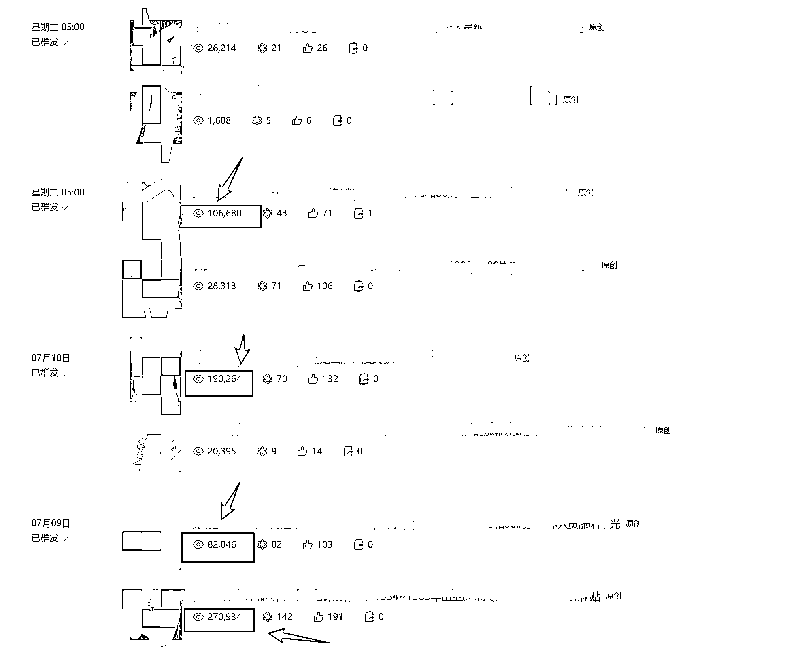
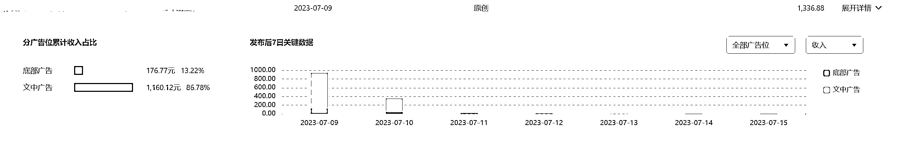

# 公众号单篇阅读量 28W+，是个什么概念？

> 原文：[`www.yuque.com/for_lazy/xkrm14/iaovexqwtg5rmsvv`](https://www.yuque.com/for_lazy/xkrm14/iaovexqwtg5rmsvv)

<ne-p id="ucced6ace" data-lake-id="ucced6ace"><ne-text id="u2b4dc131">作者： 走天涯</ne-text></ne-p> <ne-p id="uee51dd8a" data-lake-id="uee51dd8a"><ne-text id="ucd6dc5c2">日期：2023-07-17</ne-text></ne-p> <ne-p id="ua894eb07" data-lake-id="ua894eb07"><ne-text id="u7df7da7e">点赞数：</ne-text><ne-text id="ubf6f010b" ne-bold="true">131</ne-text></ne-p> <ne-hole id="u5180ed8e" data-lake-id="u5180ed8e"><ne-card data-card-name="hr" data-card-type="block" id="ap3XJ" data-event-boundary="card"><ne-p id="u5f9900a2" data-lake-id="u5f9900a2"><ne-text id="u02b0cb48">正文：</ne-text></ne-p> <ne-p id="u6514e24c" data-lake-id="u6514e24c"><ne-text id="u230a3444">#风向标 公众号单篇阅读量 28W+，是个什么概念？ 用 chatGPT 直接 10 分钟左右一篇，直接抄作业就好了</ne-text> <ne-text id="u2395dd01">实践证明，公众号+chatGPT 这个方向，真的和适合我这种 有正反馈之后，真的是铆足劲干！欢迎链接 现身说法，这个风口真的不错，希望大家也能抓住！</ne-text></ne-p> <ne-p id="u1fdbb502" data-lake-id="u1fdbb502"><ne-card data-card-name="image" data-card-type="inline" id="pkLa5" data-event-boundary="card"></ne-card></ne-p> <ne-p id="ud75fcef5" data-lake-id="ud75fcef5"><ne-card data-card-name="image" data-card-type="inline" id="cWx6z" data-event-boundary="card"></ne-card></ne-p> <ne-p id="u13202c4b" data-lake-id="u13202c4b"><ne-card data-card-name="image" data-card-type="inline" id="UOHzI" data-event-boundary="card"></ne-card></ne-p> <ne-hole id="u489a54ea" data-lake-id="u489a54ea"><ne-card data-card-name="hr" data-card-type="block" id="B4CrM" data-event-boundary="card"><ne-p id="ufb598de4" data-lake-id="ufb598de4"><ne-text id="ua2798bfc">评论区：</ne-text></ne-p> <ne-p id="u3736a725" data-lake-id="u3736a725"><ne-text id="u6aab92d2">好多达不刘 : 大佬，怎么链接到你，想试试这个[跳跳]</ne-text></ne-p> <ne-p id="ub28c6227" data-lake-id="ub28c6227"><ne-text id="u11c8f3fc">走天涯 : 看一下厚苔</ne-text></ne-p> <ne-p id="ud4fbf36b" data-lake-id="ud4fbf36b"><ne-text id="ue22064a0">伟杰 : [强]一般做哪些类目 适合新手[呲牙]</ne-text></ne-p> <ne-p id="udddefbfa" data-lake-id="udddefbfa"><ne-text id="ubddf9e0c">走天涯 : 可以看航海手册里面的，就很受用了</ne-text></ne-p> <ne-p id="u2d25d515" data-lake-id="u2d25d515"><ne-text id="ub40f12d4">枫 : 我也有一篇干了近 25 万阅读，单篇文章收入 1300 块</ne-text></ne-p> <ne-p id="u46c078e9" data-lake-id="u46c078e9"><ne-text id="u36785fdc">走天涯 : 恭喜恭喜，矩阵起来</ne-text></ne-p> <ne-p id="u16445c61" data-lake-id="u16445c61"><ne-text id="u5297bfe3">枫 : 嗯，正在摸索，目前文章爆火有一定随机性，还不能稳定持续输出</ne-text></ne-p> <ne-p id="u1511927f" data-lake-id="u1511927f"><ne-text id="u98d80719">走天涯 : 爆款可以再爆</ne-text></ne-p> <ne-hole id="ue813a2ee" data-lake-id="ue813a2ee"><ne-card data-card-name="hr" data-card-type="block" id="J2L47" data-event-boundary="card"><ne-p id="u9fbcacc0" data-lake-id="u9fbcacc0"><ne-text id="u9e790133">公众号懒人找资源，懒人专属群分享</ne-text></ne-p></ne-card></ne-hole></ne-card></ne-hole></ne-card></ne-hole>