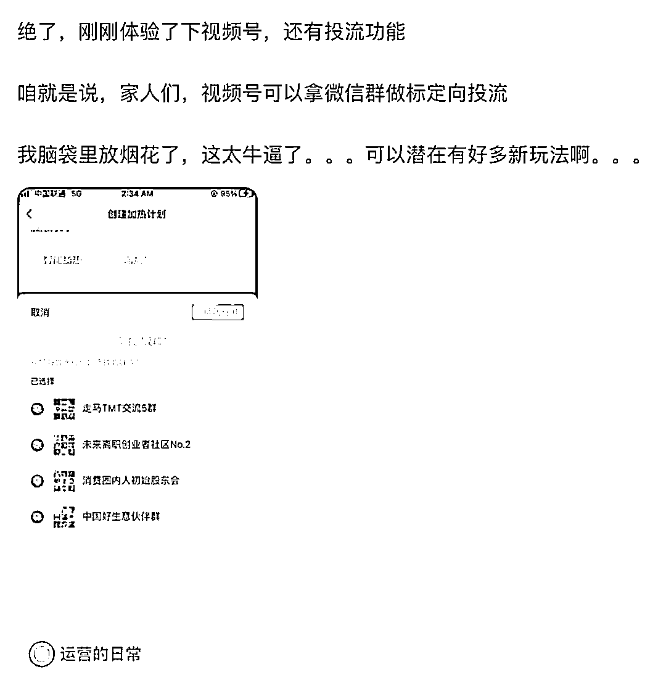

# 微信视频号利用微信群进行定向投放的新趋势

> 原文：[`www.yuque.com/for_lazy/xkrm14/mtr3dia4dbylsp8g`](https://www.yuque.com/for_lazy/xkrm14/mtr3dia4dbylsp8g)

<ne-p id="ucd4246a9" data-lake-id="ucd4246a9"><ne-text id="u6dbb1796">作者： 李厂长</ne-text></ne-p> <ne-p id="ub46183af" data-lake-id="ub46183af"><ne-text id="u1026b6d4">日期：2023-07-18</ne-text></ne-p> <ne-p id="u983f8413" data-lake-id="u983f8413"><ne-text id="u32deac6d">点赞数：</ne-text><ne-text id="ub1533248" ne-bold="true">119</ne-text></ne-p> <ne-hole id="u582e3293" data-lake-id="u582e3293"><ne-card data-card-name="hr" data-card-type="block" id="MsTRI" data-event-boundary="card"><ne-p id="ucc37a99d" data-lake-id="ucc37a99d"><ne-text id="uc1e55582">正文：</ne-text></ne-p> <ne-p id="u82bcaf77" data-lake-id="u82bcaf77"><ne-text id="u0c8ff592">微信视频号可用微信群做标定向投流</ne-text></ne-p> <ne-p id="u410f2315" data-lake-id="u410f2315"><ne-card data-card-name="image" data-card-type="inline" id="ZNaKc" data-event-boundary="card">  <ne-hole id="u942653ae" data-lake-id="u942653ae"><ne-card data-card-name="hr" data-card-type="block" id="TSjaB" data-event-boundary="card"><ne-p id="ue4e14440" data-lake-id="ue4e14440"><ne-text id="u65171249">评论区：</ne-text></ne-p> <ne-p id="u455c232d" data-lake-id="u455c232d"><ne-text id="u662b0038">周彦充 : 牛，投流看来才是流量的终局</ne-text></ne-p> <ne-p id="ubaa81056" data-lake-id="ubaa81056"><ne-text id="u64a6602a">潮州痞子蔡 : 要量必然是，但做好过滤不必要的量，包括假量</ne-text></ne-p> <ne-p id="u3d565724" data-lake-id="u3d565724"><ne-text id="ubd102234">娜娜 : 假量啥意思</ne-text></ne-p> <ne-p id="u4aa6eb21" data-lake-id="u4aa6eb21"><ne-text id="u300f037f">李彬 : 是可投自己在的微信群还是可以投别人的群?</ne-text></ne-p> <ne-p id="u75b07d24" data-lake-id="u75b07d24"><ne-text id="uf5ae5fa9">止止 : 直接发群里不就完了，何必多此一举</ne-text></ne-p> <ne-p id="u6079388c" data-lake-id="u6079388c"><ne-text id="uefa099d8">坏孩（大学生） : 这个厉害，666 进对应的圈子，投对应的流</ne-text></ne-p> <ne-p id="u2870baba" data-lake-id="u2870baba"><ne-text id="u65690041">半扇咸鱼 : 微信号微信群投流</ne-text></ne-p> <ne-hole id="ubd311d5a" data-lake-id="ubd311d5a"><ne-card data-card-name="hr" data-card-type="block" id="fgk0Q" data-event-boundary="card"><ne-p id="u12702c3c" data-lake-id="u12702c3c"><ne-text id="uae01b82d">公众号懒人找资源，懒人专属群分享</ne-text></ne-p></ne-card></ne-hole></ne-card></ne-hole></ne-card></ne-p></ne-card></ne-hole>