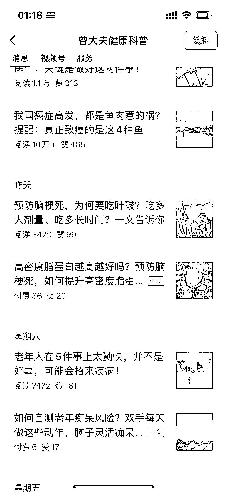

# 公众号利用免费文章流量，成功推动付费合集销售

> 原文：[`www.yuque.com/for_lazy/xkrm14/cd0mo8fl6sha3gm5`](https://www.yuque.com/for_lazy/xkrm14/cd0mo8fl6sha3gm5)

<ne-text id="uc71e64f7">作者： 北辰</ne-text>

<ne-text id="u7216a878">日期：2023-07-17</ne-text>

<ne-text id="u25f480be">点赞数：</ne-text><ne-text id="ucb936109" ne-bold="true">83</ne-text>

<ne-hole id="u82b99395" data-lake-id="u82b99395"><ne-card data-card-name="hr" data-card-type="block" id="ATiHC" data-event-boundary="card">

<ne-text id="ufe9231d1">正文：</ne-text>

<ne-text id="ud80f4d7e">公众号付费合集 讲免费爆款文章与付费文章添加到一个合集。 用免费文章的流量，带动付费合集的销售。 200 多￥的付费合集，卖了 36 份，变现 7000 多。</ne-text> <ne-text id="u43ebed3e">该公众号有多个付费合集，价格 100~200 多不等。</ne-text>

<ne-card data-card-name="image" data-card-type="inline" id="ipZ9x" data-event-boundary="card"></ne-card>

<ne-card data-card-name="image" data-card-type="inline" id="e8Tlw" data-event-boundary="card"></ne-card>

<ne-hole id="uf3dff9d4" data-lake-id="uf3dff9d4"><ne-card data-card-name="hr" data-card-type="block" id="YlWda" data-event-boundary="card">

<ne-text id="ua5f692da">评论区：</ne-text>

<ne-text id="u4fdce867">坏孩（大学生） : 这种模式好，文章的专业度需要很高吗，用 gpt 能否实现</ne-text>

<ne-text id="u5cde2f2d">北辰 : 能实现一部分 可以提升效率</ne-text>

<ne-hole id="u51d3dfe9" data-lake-id="u51d3dfe9"><ne-card data-card-name="hr" data-card-type="block" id="Ovizr" data-event-boundary="card">

<ne-text id="ud191bd0e">公众号懒人找资源，懒人专属群分享</ne-text>

</ne-card></ne-hole></ne-card></ne-hole></ne-card></ne-hole>