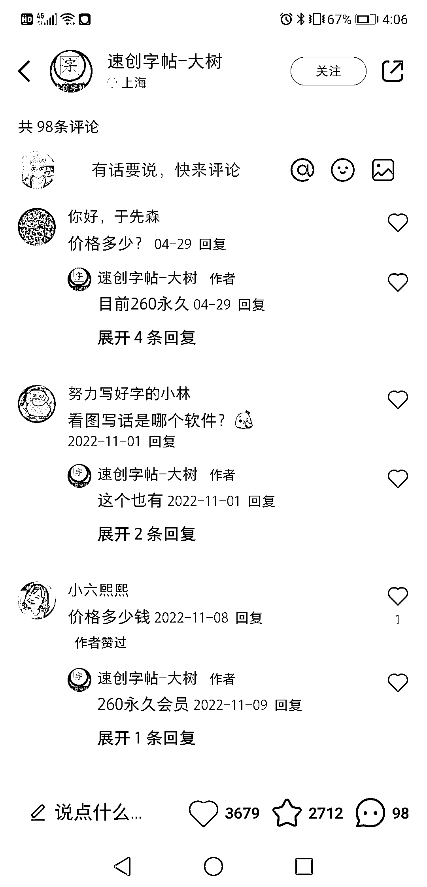
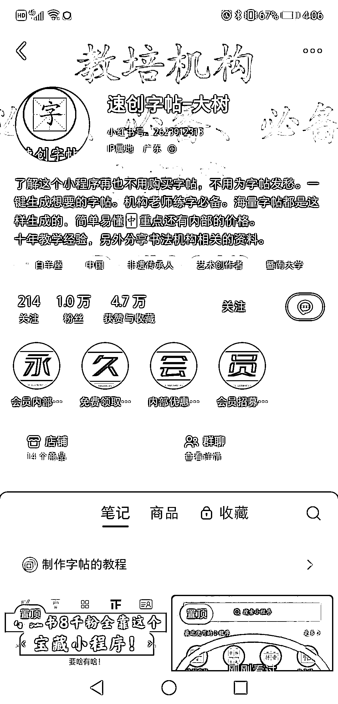
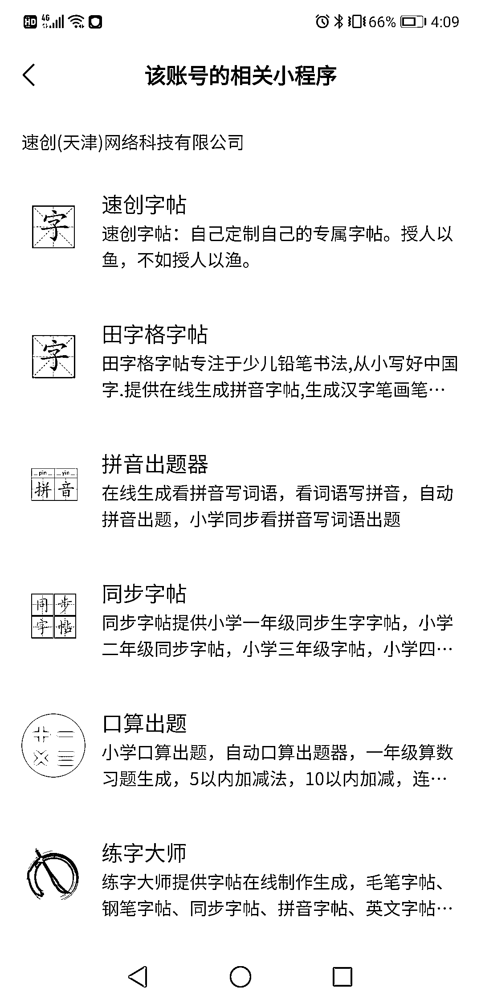

# 小红书引流字帖公司，粉丝问价格，公众号霸屏

> 原文：[`www.yuque.com/for_lazy/xkrm14/dkcmbc71ipud70pd`](https://www.yuque.com/for_lazy/xkrm14/dkcmbc71ipud70pd)

作者： GS

日期：2023-07-19

点赞数：106

<ne-hole id="u0410f1bb" data-lake-id="u0410f1bb"><ne-card data-card-name="hr" data-card-type="block" id="Zr50D" data-event-boundary="card">

正文：

字帖，这个细分垂直领域，这家公司在小红书引流，账号 1 万粉，留言都是问价格。 公众号做到霸屏，小程序做矩阵，有两个小程序日活 1 千多。 变现方式：卖会员，小程序流量主。

<ne-card data-card-name="image" data-card-type="inline" id="Fq46D" data-event-boundary="card"></ne-card>

<ne-card data-card-name="image" data-card-type="inline" id="gu64j" data-event-boundary="card"></ne-card>

<ne-card data-card-name="image" data-card-type="inline" id="agC55" data-event-boundary="card"></ne-card>

<ne-card data-card-name="image" data-card-type="inline" id="yhpVK" data-event-boundary="card"></ne-card>

<ne-card data-card-name="image" data-card-type="inline" id="VWLww" data-event-boundary="card"></ne-card>

<ne-card data-card-name="image" data-card-type="inline" id="kz2Fx" data-event-boundary="card"></ne-card>

<ne-hole id="u7eb55898" data-lake-id="u7eb55898"><ne-card data-card-name="hr" data-card-type="block" id="c9KH1" data-event-boundary="card">

评论区：

七十七 : 没看懂，是用程序生成，然后打印出来吗？

半扇咸鱼 : 会员或者广告

GS : 是的，打印就是自己想办法。打印也是需求，淘宝和拼多多关于字帖印刷销量也很大。

徐同学 : 好厉害

小白脸 : 我们对写一手好字还是永远向往的！虽然知道练不成，练不久，但是就是会时不时的练。

大王 : 可以对接在线打印，再赚一笔

一米七大个 : 小程序日活，使用的什么工具查看？

<ne-hole id="u5d536494" data-lake-id="u5d536494"><ne-card data-card-name="hr" data-card-type="block" id="Mi9Av" data-event-boundary="card">

公众号懒人找资源，懒人专属群分享

</ne-card></ne-hole></ne-card></ne-hole></ne-card></ne-hole>