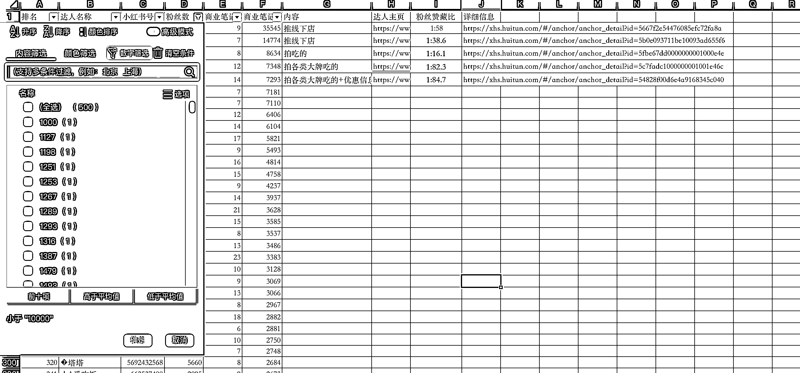

# 小红书本地图文大牌餐饮内容，商业推广潜力大

> 原文：[`www.yuque.com/for_lazy/xkrm14/ha21x79lbd1ivscx`](https://www.yuque.com/for_lazy/xkrm14/ha21x79lbd1ivscx)

作者： Brewnut

日期：2023-07-20

点赞数：62

<ne-hole id="u92d18152" data-lake-id="u92d18152">

正文：

先上结论：小红薯做本地图文大牌餐饮内容，去接商业推广有搞头。 推广榜里，美食分类底下有一些低于 1w 粉丝数量，但是互动量很高的 这类账号的特点：内容为大牌美食拍照、美食优惠信息，图文内容，且地域性强，商业笔记数量多 图片是分析过程以及具体的达人案例

<ne-hole id="u0f49ff5e" data-lake-id="u0f49ff5e">

评论区：

程序员小解 : 我有采集小红书笔记图片工具，去水印的哦

Luck : 大佬，你这个是用飞瓜软件查的数据吗？怎么看达人的接单量？

Brewnut : 我是用的灰豚，看的是商业笔记数量

Brewnut : 在想是不是大众点评取一些图片评论就能做

<ne-hole id="u78448e6f" data-lake-id="u78448e6f">

公众号懒人找资源，懒人专属群分享

</ne-hole></ne-hole></ne-hole>